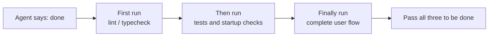
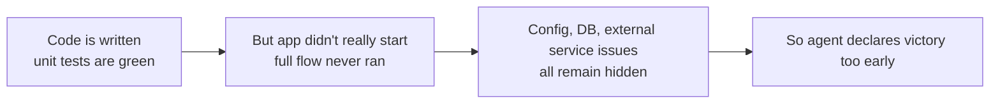

[中文版本 →](../../../zh/lectures/lecture-09-why-agents-declare-victory-too-early/)

> Code examples for this lecture: [code/](https://github.com/walkinglabs/learn-harness-engineering/blob/main/docs/en/lectures/lecture-09-why-agents-declare-victory-too-early/code/)
> Hands-on practice: [Project 05. Let the agent verify its own work](./../../projects/project-05-grounded-qa-verification/index.md)

# Lecture 9. Preventing Agents from Declaring Victory Too Early

You ask an agent to implement a "password reset" feature. It modifies the database schema, writes the API endpoint, adds the email template, runs unit tests (all pass), and then confidently tells you "it's done." When you actually try to run it—the password reset link can't be sent (missing email service config), the database migration fails halfway through (schema inconsistency), and the end-to-end flow hasn't been executed even once.

This feeling shouldn't be unfamiliar—it's like filling up the entire exam paper, confidently being the first to hand it in, only to fail when the grades come out. Just because the paper is full doesn't mean the answers are right.

This isn't an isolated incident. The classic 2017 ICML paper by Guo et al. proved: **modern neural networks are systematically overconfident**—the confidence reported by models is significantly higher than their actual accuracy. The same applies to AI coding agents: they "feel" they're done, but in reality, they're far from it. Your harness must replace the agent's "feelings" with externalized, execution-based verification.

## The Slippery Slope

Premature completion declarations almost always follow the same pattern: the code looks okay—syntax is correct, logic seems reasonable, and static analysis shows no obvious errors. But the harness doesn't enforce comprehensive execution verification, so the agent skips actually running it or only runs partial tests. It runs unit tests but skips integration tests; it runs tests but doesn't check coverage. Ultimately, "the code looks fine" is taken as evidence that "the feature is complete." And the exam paper is handed in.

Information is lost at every step. From task specifications to code implementation to runtime behavior, every transformation can introduce bias, and every skipped verification exacerbates the information asymmetry.

## Three-Layer Termination Check





## Core Concepts

- **Premature Completion Declaration**: The agent asserts the task is complete, but unmet correctness specifications still exist. The core issue: the agent judges based on local confidence at the code level, while system-level correctness requires global verification.
- **Confidence Calibration Bias**: The systematic gap between the agent's self-reported confidence in completion and the actual completion quality. For complex multi-file tasks, this bias is significantly positive—the agent is always more confident than it actually performs. Just like a student who always overestimates their score after an exam.
- **Termination Criteria**: A clear, executable set of judgment conditions defined in the harness. The agent must satisfy all conditions before declaring completion. "Done" shifts from a subjective judgment to an objective determination.
- **Verification-Validation Dual Gate**: The first verification layer checks "did the code correctly implement the specified behavior"; the second validation layer checks "does the system-level behavior meet the end-to-end requirements". Both must pass to be considered complete.
- **Runtime Feedback Signals**: Logs, process states, and health checks from program execution. This is the objective basis for the harness to judge completion quality.
- **Completion Priority Constraint**: First verify functional correctness, then handle performance, and finally address style. Refactoring is forbidden until core functionality is verified.

## Passing Unit Tests ≠ Task Complete

This is the most common trap, and the most dangerous one. The agent wrote the code, ran the unit tests, got all greens, and said "done." But the design philosophy of unit tests—isolating the tested unit and mocking dependencies—is exactly what makes them incapable of detecting cross-component issues:

**Interface Mismatch**: The file path passed by the render process to the preload script is a relative path, but the preload script expects an absolute path. Their respective unit tests both used mocks and passed. The issue is only discovered during end-to-end testing. Just like every musician in a band practicing perfectly on their own, only to realize they are in different keys when playing together.

**State Propagation Errors**: A database migration changes the table schema, but the ORM caching layer still holds cache entries for the old schema. Unit tests provide a fresh mock environment every time, which won't expose this cross-layer state inconsistency.

**Environment Dependency**: The code behaves correctly in the test environment (where everything is mocked) but fails in the real environment due to configuration differences, network latency, or service unavailability. Like singing perfectly in the rehearsal room, but encountering audio equipment issues on stage.

### "Refactoring While We're at It" is Poison to Completion Judgment

Claude Code has a common behavioral pattern: it starts refactoring code, optimizing performance, and improving style before the core functionality has passed verification. Knuth's quote, "Premature optimization is the root of all evil," takes on new meaning in the agent scenario—refactoring alters the boundary between verified and unverified code, potentially breaking previously implicitly correct code paths. It's like re-copying your multiple-choice answers for better formatting before you've finished the math essay questions—not only does it waste time, but you might copy them wrong.

### Systematic Bias in Self-Evaluation

Anthropic discovered a deeper failure pattern in their 2026 research: **when an agent is asked to evaluate its own work, it systematically provides overly positive evaluations—even when a human observer would consider the quality clearly substandard.** This is like asking a student to grade their own exam—they will always be particularly lenient with their own answers.

This issue is especially severe in subjective tasks (such as design aesthetics)—whether a "layout is exquisite" is a judgment call, and the agent reliably skews positive. Even on tasks with verifiable results, the agent's performance can be hindered by poor judgment.

The solution isn't to make the agent "more objective"—the same model generating and evaluating inherently favors being generous to itself. **The solution is to separate the "worker" from the "checker".** Just like a student shouldn't grade their own exam—you need an independent grader.

An independent evaluating agent, specifically tuned to be "picky", is far more effective than having the generating agent evaluate itself. Experimental data from Anthropic:

| Architecture | Runtime | Cost | Core Features Working? |
|--------------|---------|------|------------------------|
| Single Agent (bare run) | 20 mins | $9 | No (game entities unresponsive to input) |
| Three Agents (planner + generator + evaluator) | 6 hours | $200 | Yes (game is fully playable) |

This is the exact same model (Opus 4.5) with the exact same prompt ("build a 2D retro game editor"). The only difference is the harness—from "running bare" to "planner expands requirements → generator implements feature by feature → evaluator performs actual click testing using Playwright".

> Source: [Anthropic: Harness design for long-running application development](https://www.anthropic.com/engineering/harness-design-long-running-apps)

## How to Prevent Premature Hand-ins

### 1. Externalize Termination Judgment

The completion judgment shouldn't be made by the agent itself. The harness must independently execute termination validation, using runtime signals as input, not the agent's confidence. Write this clearly in `CLAUDE.md`:

```
## Definition of Done
- Feature complete = end-to-end verification passed, not "code is written"
- Required verification levels:
  1. Unit tests pass
  2. Integration tests pass
  3. End-to-end flow verification passes
- Do not proceed to level 2 if level 1 fails
- Do not proceed to level 3 if level 2 fails
```

### 2. Build a Three-Layer Termination Validation

- **Layer 1: Syntax and Static Analysis**. Lowest cost, least information, but must pass. This is the bare minimum check—you must spell the words right before we look at anything else.
- **Layer 2: Runtime Behavior Verification**. Test execution, app startup checks, critical path validation. This is the core evidence of completion. It's not enough to just write it; it must run.
- **Layer 3: System-Level Confirmation**. End-to-end testing, integration validation, user scenario simulation. The final line of defense against premature declarations. It's not enough to run; it must run correctly.

### 3. Design Good "Red Pen Markups" for Agents

OpenAI introduced a particularly effective pattern during their Codex practice: **error messages for agents should include fix instructions**. Don't just draw a big red cross like a lazy grader; be like a good teacher and write "here's how you should change this" in the margins. Don't use `"Test failed"`, but use `"Test failed: POST /api/reset-password returned 500. Check that the email service config exists in environment variables. The template file should be at templates/reset-email.html."` This specific, actionable feedback allows the agent to self-correct without human intervention.

### 4. Capture Runtime Signals

Effective runtime signals include:
- Did the application successfully start and reach a ready state?
- Did the critical feature paths execute successfully at runtime?
- Were database writes, file operations, and other side effects correct?
- Were temporary resources cleaned up?

## Real-World Case

**Task**: Implement user password reset functionality. Involves database operations, email sending, and API endpoint modifications.

**Premature hand-in path**: Agent modifies database schema, writes API endpoint, adds email template, runs unit tests (passes), and declares completion. The exam paper is completely filled out.

**Actual point deductions**: (1) End-to-end flow untested—the actual sending and verification of the reset link was never confirmed. (2) Database migration failed after partial execution, causing schema inconsistency. (3) Email service config was missing in the target environment.

**Harness intervention**: Termination validation enforced—(1) Start the full app to verify reset endpoint accessibility; (2) Execute the full reset flow; (3) Verify database state consistency. All defects were found within the session, saving 5-10x the cost of subsequent fixes. The independent grader found the real issues.

## Key Takeaways

- **Agents are systematically overconfident**—confidence calibration bias is an objective reality. Filling out the exam paper doesn't mean you got it right.
- **Completion judgment must be externalized**—the harness verifies independently; don't trust the agent's "feelings". Students cannot grade their own exams.
- **All three layers of validation are essential**—syntax passing, behavior passing, system passing, progressing layer by layer.
- **Error messages should be like a good teacher's red pen markup**—include specific fix steps so the agent can self-correct.
- **No refactoring until core functionality is verified**—the completion priority constraint is the key to preventing premature optimization.

## Further Reading

- [On Calibration of Modern Neural Networks - Guo et al.](https://arxiv.org/abs/1706.04599) — Proves modern deep networks are systematically overconfident
- [Building Effective Agents - Anthropic](https://www.anthropic.com/research/building-effective-agents) — The critical role of runtime evidence in completion judgment
- [Harness Engineering - OpenAI](https://openai.com/index/harness-engineering/) — Premature completion declaration is one of the main failure modes of agents
- [The Art of Software Testing - Myers](https://www.goodreads.com/book/show/137543.The_Art_of_Software_Testing) — Classic reference on testing method hierarchies and effectiveness

## Exercises

1. **Termination Validation Function Design**: Design a complete termination validation for a task involving a database migration and API modification. List the required runtime signals and the pass/fail criteria for each signal. Run it on a real task and record what hidden issues it finds.

2. **Calibration Bias Measurement**: Choose 10 different types of coding tasks, and record the agent's self-reported completion confidence vs. the actual completion quality. Calculate the bias value and analyze its relationship with task complexity.

3. **Multi-Layer Defense Experiment**: Run three configurations on the same set of tasks—(a) static analysis only, (b) add unit testing, (c) full three-layer validation. Compare the proportion of premature completion declarations and the number of uncaught defects.