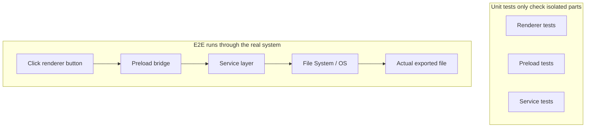
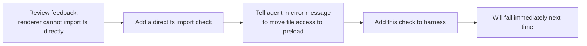

[中文版本 →](../../../zh/lectures/lecture-10-why-end-to-end-testing-changes-results/)

> Code examples for this lecture: [code/](https://github.com/walkinglabs/learn-harness-engineering/blob/main/docs/en/lectures/lecture-10-why-end-to-end-testing-changes-results/code/)
> Hands-on practice: [Project 05. Let the agent verify its own work](./../../projects/project-05-grounded-qa-verification/index.md)

# Lecture 10. Only End-to-End Testing is True Verification

You ask the agent to add a file export feature to an Electron app. It writes the render process component, the preload script, and the service layer logic. The unit tests for each component pass perfectly. The agent says, "It's done." When you actually click the export button—the file path format is wrong, the progress bar doesn't update, and exporting large files causes a memory leak. Five component boundary defects, and the unit tests didn't catch a single one.

It's like a choir rehearsal—each voice part sounds perfect when sung individually, but when they sing together, the sopranos are half a beat faster than the basses, and the accompaniment is a semitone off from the main melody. Each part is "correct" on its own, but the whole thing is out of tune.

Google's Testing Pyramid tells us: a large number of unit tests are the foundation, but if you stop there, you will systematically miss component interaction issues. For AI coding agents, this problem is even more severe—agents tend to run only the fastest tests and then declare completion. **Only end-to-end testing can prove that system-level defects don't exist.**

## The Blind Spots of Unit Testing

The design philosophy of unit testing is isolation—mocking dependencies and focusing solely on the unit under test. This philosophy makes unit testing fast and precise, but it also creates systematic blind spots. It's like having each voice part practice with headphones on during a choir rehearsal—it sounds fine to them, but the issues only emerge when they come together:

**Interface Mismatch**: The file path passed by the render process to the preload script is a relative path, but the preload script expects an absolute path. Their respective unit tests both used mocks and passed. The issue is only discovered when the end-to-end flow is executed—just like two voice parts practicing independently and feeling fine, only to realize during the ensemble that one is singing in 4/4 time and the other in 3/4 time.

**State Propagation Errors**: A database migration changes the table schema, but the ORM caching layer still holds cache entries for the old schema. Unit tests provide a completely new mock environment every time, which won't expose this cross-layer state inconsistency. It's like changing the lyrics of a song, but someone is still singing the old version.

**Resource Lifecycle Issues**: The acquisition and release of file handles, database connections, and network sockets span multiple components. Unit tests create and destroy independent resources for each test, failing to expose resource contention or leaks. It's like each voice part taking turns using the microphones during rehearsal, but when everyone goes on stage together, there aren't enough mics.

**Environment Dependency**: The code behaves correctly in the test environment (where everything is mocked) but fails in the real environment due to configuration differences, network latency, or service unavailability. Like singing perfectly in the rehearsal room, but encountering audio feedback and wind interference at an outdoor festival.

## End-to-End Testing Not Only Changes Results, It Changes Behavior

This is something many people fail to realize: when an agent knows its work will be subjected to end-to-end testing, its coding behavior changes.

1. **Considering Component Interactions**: While writing code, it will think about "how this interface connects with upstream," rather than just focusing on a single function. Just like knowing you'll eventually sing together, you'll pay attention to other voice parts during practice.
2. **Respecting Architectural Boundaries**: In systems with architectural constraints, end-to-end testing forces the agent to adhere to boundary rules. Like sheet music marked with "crescendo here," you have to follow it.
3. **Handling Error Paths**: End-to-end tests usually include failure scenarios, forcing the agent to consider exception handling. It's like simulating "what if the mic suddenly dies" during rehearsal, so you know what to do.

## Testing Pyramid and Review Feedback Promotion





In Codex engineering practices, OpenAI emphasizes: **error messages written for agents must include fix instructions.** Don't just write `"Direct filesystem access in renderer"`; write `"Direct filesystem access in renderer. All file operations must go through the preload bridge. Move this call to preload/file-ops.ts and invoke it via window.api."` This turns architectural rules into an auto-correction loop. Like a choir conductor who doesn't just say "you sang that wrong," but instead says "you were half a beat fast here, listen to the altos' rhythm, and come in at measure 32."

## Core Concepts

- **Component Boundary Defects**: Component A and B both pass their unit tests, but their interaction produces incorrect behavior. This is the type of issue end-to-end testing is best at catching—like choir parts that are individually correct but out of tune together.
- **Testing Adequacy Gradient**: Defects caught by unit tests <= defects caught by integration tests <= defects caught by end-to-end tests. Each layer up increases detection capability.
- **Architectural Boundary Enforcement Rules**: Turning rules from architecture documents (like "render process cannot access the file system directly") into executable, automated checks. From "written on paper" to "running in CI."
- **Review Feedback Promotion**: Converting repeated code review comments into automated tests. Every time a recurring issue is found, add a rule, and the harness automatically grows stronger. Like a conductor turning common rehearsal mistakes into warm-up exercises—the next time the same mistake is made, the exercise itself exposes it without the conductor needing to say a word.
- **Agent-Oriented Error Messages**: Failure messages shouldn't just state "what went wrong," but also tell the agent exactly how to fix it. This turns test failures into self-correcting feedback loops.

## How to Do It

### 0. Define Architectural Boundaries First, Then Write E2E Tests

The prerequisite for end-to-end testing is clear system boundaries. If the architecture is a plate of spaghetti, end-to-end testing will only prove "this plate of spaghetti runs," it won't tell you where design intents were violated. It's like a choir that hasn't even divided into voice parts—no amount of rehearsal will make it sound good.

OpenAI's experience: **for codebases generated by agents, architectural constraints must be early prerequisites established on day one, not something to consider when the team grows larger.** The reason is simple—agents will copy existing patterns in the repository, even if those patterns are uneven or suboptimal. Without architectural constraints, the agent will introduce more deviations in every session.

OpenAI adopted a "Layered Domain Architecture"—each business domain is divided into fixed layers: Types → Config → Repo → Service → Runtime → UI. Dependencies flow strictly forward, and cross-domain concerns enter through explicit Providers interfaces. Any other dependencies are forbidden and mechanically enforced via custom linting.

Key principle: **Enforce invariants, don't micromanage implementation.** For example, require "data is parsed at the boundary," but don't dictate which library to use. Error messages must include fix instructions—not just saying "violation," but telling the agent exactly how to change it.

> Source: [OpenAI: Harness engineering: leveraging Codex in an agent-first world](https://openai.com/index/harness-engineering/)

### 1. Harness Must Include an End-to-End Layer

Make it explicit in your validation flow: for tasks involving cross-component changes, passing end-to-end tests is a prerequisite for completion:

```
## Validation Hierarchy
- Level 1: Unit tests (Must pass)
- Level 2: Integration tests (Must pass)
- Level 3: End-to-end tests (Must pass when cross-component changes are involved)
- Skipping any required level = Not Complete
```

### 2. Turn Architectural Rules into Executable Checks

Every architectural constraint should have a corresponding test or lint rule:

```bash
# Check if the render process directly calls Node.js APIs
grep -r "require('fs')" src/renderer/ && exit 1 || echo "OK: no direct fs access in renderer"
```

### 3. Design Agent-Oriented Error Messages

Failure messages should contain three elements: what went wrong, why, and how to fix it:

```
ERROR: Found direct import of 'fs' in src/renderer/App.tsx:12
WHY: Renderer process has no access to Node.js APIs for security
FIX: Move file operations to src/preload/file-ops.ts and call via window.api.readFile()
```

### 4. Establish a Review Feedback Promotion Process

Every time a new type of agent error is found during code review, turn it into an automated check. A month later, your harness will be significantly stronger than at the start of the month. It's like rehearsal notes for a choir—recording issues found in every rehearsal so they can be checked before the next one. Over time, common errors decrease, and the music becomes more harmonious.

## Real-World Case

**Task**: Implement a file export feature in an Electron app. Involves render process UI, preload script filesystem proxy, and service layer data transformation.

**Singing parts individually (Unit tests passed)**: Render component tests (passed, file operations mocked), preload script tests (passed, filesystem mocked), service layer tests (passed, data source mocked). Agent declares completion.

**Singing together (Defects revealed by End-to-End tests)**:

| Defect | Description | Unit Test | E2E |
|--------|-------------|-----------|-----|
| Interface Mismatch | Inconsistent file path format | Missed | Caught |
| State Propagation | Export progress not sent back to UI via IPC | Missed | Caught |
| Resource Leak | Large file export handles not released | Missed | Caught |
| Permission Issue | Different permissions in packaged environment | Missed | Caught |
| Error Propagation | Service layer exceptions didn't reach UI layer | Missed | Caught |

All 5 defects were caught by end-to-end tests, while unit tests caught none. The cost was an increase in test time from 2 seconds to 15 seconds—completely acceptable in an agent workflow. No matter how well each part sings individually, it can't beat a full ensemble rehearsal.

## Key Takeaways

- **Unit tests are systematically blind to component boundary defects**—their isolation design is exactly what prevents them from detecting interaction issues. Everyone singing correctly doesn't mean the choir isn't out of tune.
- **End-to-end testing not only detects defects, it changes agent coding behavior**—making it focus more on integration and boundaries.
- **Architectural rules must be executable**—not written in a document waiting to be read, but automatically checked on every commit.
- **Error messages must be designed for agents**—including specific steps on "how to fix it" to form a self-correcting loop.
- **Review feedback promotion makes the harness automatically stronger**—every category of captured defect becomes a permanent line of defense.

## Further Reading

- [How Google Tests Software - Whittaker et al.](https://www.goodreads.com/book/show/13563030-how-google-tests-software) — The classic source of the Testing Pyramid model
- [Harness Engineering - OpenAI](https://openai.com/index/harness-engineering/) — Engineering practices for automated execution of architectural constraints
- [Chaos Engineering - Netflix (Basiri et al.)](https://ieeexplore.ieee.org/document/7466237) — Proactively injecting failures to verify system resilience
- [QuickCheck - Claessen & Hughes](https://www.cs.tufts.edu/~nr/cs257/archive/john-hughes/quick.pdf) — Property testing methodology, sitting between example testing and formal verification

## Exercises

1. **Cross-Component Defect Detection**: Pick a modification task involving at least three components. First, run only unit tests and record the results, then run end-to-end tests. Analyze which type of cross-layer interaction issue each additionally discovered defect belongs to.

2. **Architectural Rule Automation**: Pick an architectural constraint from your project and turn it into an executable check (with an agent-oriented error message). Integrate it into the harness and verify its effectiveness with a baseline task.

3. **Review Feedback Promotion**: Find a recurring comment type from your code review history and convert it into an automated check using the five-step process. Compare the frequency of the issue before and after the promotion.