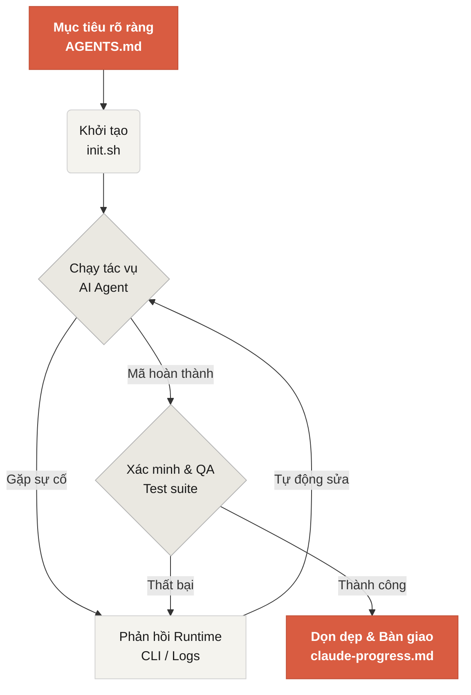

# Chào mừng đến với Learn Harness Engineering

Learn Harness Engineering là khóa học chuyên về kỹ thuật của các AI coding agent. Chúng tôi đã nghiên cứu sâu sắc và tổng hợp các lý thuyết cũng như thực tiễn về Harness Engineering tiên tiến nhất trong ngành. Các tài liệu tham khảo cốt lõi của chúng tôi bao gồm:
- [OpenAI: Harness engineering: leveraging Codex in an agent-first world](https://openai.com/index/harness-engineering/)
- [Anthropic: Effective harnesses for long-running agents](https://www.anthropic.com/engineering/effective-harnesses-for-long-running-agents)
- [Anthropic: Harness design for long-running application development](https://www.anthropic.com/engineering/harness-design-long-running-apps)
- [Awesome Harness Engineering](https://github.com/walkinglabs/awesome-harness-engineering)

Thông qua thiết kế môi trường có hệ thống, quản lý trạng thái, xác minh và hệ thống kiểm soát, khóa học này dạy bạn cách làm cho các công cụ lập trình agent như Codex và Claude Code thực sự đáng tin cậy. Nó giúp bạn xây dựng tính năng, sửa lỗi và tự động hóa các tác vụ phát triển bằng cách ràng buộc trợ lý AI của bạn bằng các quy tắc và ranh giới rõ ràng.

## Bắt đầu

Chọn lộ trình học của bạn để bắt đầu. Khóa học được chia thành các bài giảng lý thuyết, các dự án thực hành và thư viện tài nguyên sẵn sàng sao chép.

  <a href="./lectures/lecture-01-why-capable-agents-still-fail/" class="card">
    <h3>Bài giảng</h3>
    
Hiểu lý do tại sao các mô hình mạnh mẽ vẫn thất bại và tìm hiểu lý thuyết đằng sau các harness hiệu quả.

  </a>
  <a href="./projects/" class="card">
    <h3>Dự án</h3>
    
Thực hành xây dựng một môi trường agent đáng tin cậy từ đầu.

  </a>
  <a href="./resources/" class="card">
    <h3>Thư viện Tài nguyên</h3>
    
Các mẫu sao chép ngay (AGENTS.md, feature_list.json) để sử dụng trong kho lưu trữ của riêng bạn.

  </a>

## Cơ chế cốt lõi của một Harness

Một harness không "làm cho mô hình thông minh hơn"; thay vào đó, nó thiết lập một **hệ thống làm việc** vòng kín cho mô hình. Bạn có thể hiểu quy trình làm việc cốt lõi của nó qua sơ đồ đơn giản này:

## Những gì bạn sẽ học

Dưới đây là một số khái niệm chính mà bạn sẽ nắm vững:

<ul class="index-list">
  <li><strong>Ràng buộc hành vi của agent</strong> bằng các quy tắc và ranh giới rõ ràng.</li>
  <li><strong>Duy trì ngữ cảnh</strong> qua các tác vụ dài hạn, đa phiên.</li>
  <li><strong>Ngăn chặn agent</strong> khỏi việc tuyên bố thành công quá sớm.</li>
  <li><strong>Xác minh công việc</strong> bằng các bài kiểm thử toàn bộ quy trình và tự phản ánh.</li>
  <li><strong>Làm cho runtime có thể quan sát được</strong> và có thể gỡ lỗi.</li>
</ul>

## Các bước tiếp theo

Khi bạn đã hiểu các khái niệm cốt lõi, các hướng dẫn này sẽ giúp bạn đi sâu hơn:

<ul class="index-list">
  <li><a href="./lectures/lecture-01-why-capable-agents-still-fail/">Bài giảng 01: Tại sao các Agent mạnh vẫn thất bại</a>: Bắt đầu với lý thuyết đằng sau harness engineering.</li>
  <li><a href="./projects/project-01-baseline-vs-minimal-harness/">Dự án 01: Baseline vs Minimal Harness</a>: Đi qua tác vụ thực tế đầu tiên của bạn.</li>
  <li><a href="./resources/templates/">Các mẫu</a>: Lấy gói minimal harness (AGENTS.md, feature_list.json, claude-progress.md) cho các dự án của riêng bạn.</li>
</ul>
