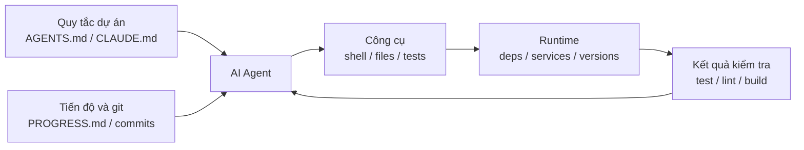

[English Version →](../../../en/lectures/lecture-02-what-a-harness-actually-is/) | [中文版本 →](../../../zh/lectures/lecture-02-what-a-harness-actually-is/)

> Ví dụ mã nguồn: [code/](https://github.com/walkinglabs/learn-harness-engineering/blob/main/docs/vi/lectures/lecture-02-what-a-harness-actually-is/code/)
> Dự án thực hành: [Dự án 01. Chỉ Prompt vs. Ưu tiên Quy tắc](./../../projects/project-01-baseline-vs-minimal-harness/index.md)

# Bài 02. Harness Thực sự Có nghĩa là Gì

Từ "harness" được nhắc đến rất nhiều trong giới AI coding agent, nhưng thành thật mà nói, hầu hết mọi người đều có nghĩa là "một tệp prompt" khi họ nói harness. Đó không phải là harness. Giống như mở nhà hàng chỉ với nguyên liệu — không có bếp, không có dao, không có công thức, không có quy trình trình bày món ăn. Đó không phải là nhà hàng. Đó là tủ lạnh.

Bài giảng này cho bạn một định nghĩa harness chính xác, có thể hành động được. Không phải sự trừu tượng học thuật, mà là một khung bạn có thể sử dụng ngay hôm nay: một harness bao gồm năm hệ thống phụ, mỗi hệ thống có trách nhiệm và tiêu chí đánh giá rõ ràng.

## Bắt đầu Bằng một Phép loại suy

Hãy tưởng tượng bạn là một kỹ sư mới được tuyển, được thả vào một dự án không có tài liệu. Không có README, không có chú thích trong mã, không ai cho bạn biết cách chạy test, cấu hình CI bị chôn vùi đâu đó. Bạn có thể viết mã tốt không? Có thể — nếu bạn đủ thông minh và kiên nhẫn. Nhưng bạn sẽ dành rất nhiều thời gian để "tìm hiểu dự án này là về cái gì" thay vì "giải quyết vấn đề."

Một AI agent đối mặt với chính xác tình huống tương tự. Và còn tệ hơn — ít nhất bạn có thể hỏi đồng nghiệp. Agent chỉ có thể nhìn thấy các tệp bạn đặt trước mặt nó và các lệnh nó có thể thực thi. Nó không thể vỗ vai ai đó và hỏi "này, phiên bản ORM nào dự án này sử dụng vậy?"

OpenAI đóng khung nguyên tắc cốt lõi là "repo LÀ spec" — tất cả ngữ cảnh cần thiết phải có trong kho lưu trữ, được truyền qua các tệp hướng dẫn có cấu trúc, lệnh xác minh rõ ràng và tổ chức thư mục rõ ràng. Tài liệu về agent chạy lâu của Anthropic nhấn mạnh tính liên tục của trạng thái, các đường phục hồi rõ ràng và theo dõi tiến độ có cấu trúc. Hai công ty tập trung vào các khía cạnh khác nhau, nhưng họ đang nói cùng một điều: **tất cả mọi thứ trong cơ sở hạ tầng kỹ thuật bên ngoài mô hình xác định mức độ năng lực của mô hình thực sự được hiện thực hóa bao nhiêu.**

Nhìn vào một số công cụ bạn đã biết:

**Claude Code** thể hiện tư duy harness. Nó đọc `CLAUDE.md` từ repo của bạn (kệ công thức), có thể chạy lệnh shell (giá dao), thực thi trong môi trường cục bộ của bạn (bếp), duy trì lịch sử phiên (bàn chuẩn bị), và có thể chạy test và xem kết quả (cửa sổ kiểm tra chất lượng). Nhưng nếu bạn không nói cho nó biết cách chạy test, cửa sổ kiểm tra chất lượng bị hỏng — không ai biết liệu món ăn đã chín chưa.

**Cursor** theo logic tương tự. Tệp `.cursorrules` của nó là kệ công thức, terminal là giá dao, nó đọc cấu trúc dự án và cấu hình lint cho bếp. Nhưng quản lý trạng thái của Cursor tương đối yếu — đóng IDE và mở lại, ngữ cảnh trước đó biến mất.

**Codex** (coding agent của OpenAI) sử dụng git worktrees để cô lập môi trường runtime của mỗi tác vụ, kết hợp với ngăn xếp quan sát cục bộ (logs, metrics, traces), vì vậy mỗi thay đổi được xác minh trong môi trường độc lập. Trong các repo có `AGENTS.md` và lệnh xác minh rõ ràng, nó hoạt động tốt hơn nhiều so với các repo "trần trụi".

**AutoGPT** là câu chuyện cảnh báo — thiếu quản lý trạng thái có cấu trúc dẫn đến tích lũy ngữ cảnh trong các tác vụ dài, và thiếu cơ chế phản hồi chính xác khiến agent lặp vòng. Nhiều người nói AutoGPT "không hoạt động," nhưng thực ra là harness của AutoGPT không hoạt động — đưa cho đầu bếp một cái bếp hỏng và ngay cả nguyên liệu tốt nhất cũng không tạo ra bữa ăn.

## Các Khái niệm Cốt lõi

- **Harness là gì**: Mọi thứ trong cơ sở hạ tầng kỹ thuật bên ngoài trọng số mô hình. OpenAI chắt lọc công việc cốt lõi của kỹ sư thành ba thứ: thiết kế môi trường, diễn đạt ý định, và xây dựng vòng phản hồi. Anthropic gọi Claude Agent SDK của họ là "harness agent đa năng."
- **Repo là nguồn sự thật duy nhất**: Bất cứ thứ gì agent không thể nhìn thấy, theo mọi nghĩa thực tế, không tồn tại. OpenAI coi repo là "hệ thống ghi chép" — tất cả ngữ cảnh cần thiết phải sống ở đó, qua các tệp có cấu trúc và tổ chức thư mục rõ ràng.
- **Đưa bản đồ, không phải cẩm nang**: Kinh nghiệm của OpenAI — `AGENTS.md` nên là một trang thư mục, không phải bách khoa toàn thư. Khoảng 100 dòng là đủ. Nếu không vừa, chia vào thư mục `docs/` và để agent đọc theo yêu cầu.
- **Ràng buộc, không vi quản lý**: Một harness tốt sử dụng các quy tắc có thể thực thi để ràng buộc agent, thay vì liệt kê hướng dẫn từng cái một. OpenAI nói "thực thi các bất biến, không vi quản lý triển khai"; Anthropic phát hiện rằng các agent tự tin khen ngợi công việc của chính mình, và giải pháp là tách "người làm việc" khỏi "người kiểm tra công việc."
- **Xóa từng thành phần một**: Để định lượng giá trị của từng thành phần harness, hãy xóa chúng từng cái một và xem cái nào bị xóa gây ra giảm hiệu suất lớn nhất. Anthropic đã sử dụng phương pháp này và phát hiện ra rằng khi các mô hình trở nên mạnh hơn, một số thành phần không còn quan trọng — nhưng các thành phần mới luôn xuất hiện.

## Mô hình Harness Năm Hệ thống Phụ

Trở lại phép loại suy nhà bếp. Một nhà bếp hoàn chỉnh có năm khu vực chức năng, và một harness có năm hệ thống phụ:



**Hệ thống phụ Hướng dẫn (kệ công thức)**: Tạo `AGENTS.md` (hoặc `CLAUDE.md`) chứa tổng quan và mục đích dự án (một câu), tech stack và phiên bản (Python 3.11, FastAPI 0.100+, PostgreSQL 15), lệnh chạy đầu tiên (`make setup`, `make test`), các ràng buộc cứng không thể thương lượng ("Tất cả API phải sử dụng OAuth 2.0"), và các liên kết đến tài liệu chi tiết hơn.

**Hệ thống phụ Công cụ (giá dao)**: Đảm bảo agent có đủ quyền truy cập công cụ. Đừng vô hiệu hóa shell vì "bảo mật" — nếu agent thậm chí không thể chạy `pip install`, làm sao nó được cho là hoạt động? Nhưng cũng đừng mở tất cả — tuân theo nguyên tắc ít đặc quyền nhất.

**Hệ thống phụ Môi trường (bếp)**: Làm cho trạng thái môi trường tự mô tả. Sử dụng `pyproject.toml` hoặc `package.json` để khóa dependencies, `.nvmrc` hoặc `.python-version` cho các phiên bản runtime, Docker hoặc devcontainers để tái tạo.

**Hệ thống phụ Trạng thái (bàn chuẩn bị)**: Các tác vụ dài cần theo dõi tiến độ. Sử dụng tệp `PROGRESS.md` đơn giản ghi lại: những gì đã xong, những gì đang tiến hành, những gì bị chặn. Cập nhật trước khi mỗi phiên kết thúc, đọc khi phiên tiếp theo bắt đầu.

**Hệ thống phụ Phản hồi (cửa sổ kiểm tra chất lượng)**: Đây là hệ thống phụ có ROI cao nhất. Liệt kê rõ ràng các lệnh xác minh trong `AGENTS.md`:
```
Lệnh xác minh:
- Test: pytest tests/ -x
- Type check: mypy src/ --strict
- Lint: ruff check src/
- Xác minh đầy đủ: make check (bao gồm tất cả những trên)
```

Thiếu bất kỳ hệ thống phụ nào cũng giống như thiếu một khu vực chức năng trong nhà bếp — bạn vẫn có thể nấu ăn, nhưng luôn gượng gạo.

**Chẩn đoán chất lượng harness**: Sử dụng "kiểm soát mô hình đẳng áp." Giữ nguyên mô hình, xóa từng hệ thống phụ một, đo xem cái nào bị xóa gây ra giảm hiệu suất lớn nhất. Đó là điểm nghẽn cổ chai của bạn — tập trung nỗ lực ở đó. Giống như tìm điểm nghẽn cổ chai trong nhà bếp: lấy kệ công thức đi và xem mọi thứ chậm lại bao nhiêu, tắt bếp và xem tác động.

## Câu chuyện Thực tế của Một Nhóm

Một nhóm sử dụng GPT-4o trên ứng dụng frontend TypeScript + React (~20,000 dòng mã). Họ trải qua bốn giai đoạn — về cơ bản là thêm thiết bị nhà bếp từng cái một:

**Giai đoạn 1 — Nhà bếp trống**: Chỉ có mô tả dự án cơ bản trong README. 1 trong 5 lần chạy thành công (20%). Lỗi chính: chọn sai package manager (npm vs yarn), không tuân theo quy ước đặt tên component, không thể chạy test.

**Giai đoạn 2 — Kệ công thức được cài đặt**: Thêm `AGENTS.md` với phiên bản tech stack, quy ước đặt tên, các quyết định kiến trúc chính. Tỷ lệ thành công tăng lên 60%. Các lỗi còn lại chủ yếu là vấn đề môi trường và thiếu xác minh.

**Giai đoạn 3 — Cửa sổ kiểm tra chất lượng được mở**: Liệt kê các lệnh xác minh trong `AGENTS.md`: `yarn test && yarn lint && yarn build`. Tỷ lệ thành công tăng lên 80%.

**Giai đoạn 4 — Bàn chuẩn bị sẵn sàng**: Giới thiệu các mẫu tệp tiến độ nơi các agent ghi lại công việc đã hoàn thành và chưa hoàn thành mỗi lần chạy. Tỷ lệ thành công ổn định ở 80-100%.

Bốn lần lặp, mô hình hoàn toàn không thay đổi, tỷ lệ thành công từ 20% lên gần 100%. Đó là sức mạnh của harness engineering. Bạn không mua nguyên liệu đắt tiền hơn — bạn chỉ tổ chức lại nhà bếp đúng cách.

## Những Điểm chính cần Nhớ

- Harness = Hướng dẫn + Công cụ + Môi trường + Trạng thái + Phản hồi. Năm hệ thống phụ, như năm khu vực chức năng của nhà bếp — tất cả đều cần thiết.
- Nếu không phải trọng số mô hình, thì đó là harness. Harness của bạn xác định mức độ năng lực mô hình được hiện thực hóa bao nhiêu.
- Trong số năm hệ thống phụ, hệ thống phụ phản hồi thường có đầu tư thấp nhất và lợi nhuận cao nhất. Đặt đúng các lệnh xác minh trước — cửa sổ kiểm tra chất lượng là bản nâng cấp đáng giá nhất.
- Sử dụng "kiểm soát mô hình đẳng áp" để định lượng đóng góp biên của mỗi hệ thống phụ — đừng dựa vào trực giác.
- Harness mục nát như mã nguồn. Kiểm tra thường xuyên, trả nợ harness như bạn trả nợ kỹ thuật.

## Đọc thêm

- [OpenAI: Harness Engineering](https://openai.com/index/harness-engineering/)
- [Anthropic: Effective Harnesses for Long-Running Agents](https://www.anthropic.com/engineering/effective-harnesses-for-long-running-agents)
- [HumanLayer: Harness Engineering for Coding Agents](https://humanlayer.dev/articles/harness-engineering-for-coding-agents/)
- [SWE-agent: Agent-Computer Interfaces](https://github.com/princeton-nlp/SWE-agent)
- [Thoughtworks: Harness Engineering on Technology Radar](https://www.thoughtworks.com/radar)

## Bài tập

1. **Kiểm toán harness năm tuple**: Lấy một dự án nơi bạn sử dụng AI agent và thực hiện kiểm toán đầy đủ bằng khung năm tuple. Chấm điểm mỗi hệ thống phụ từ 1-5. Tìm hệ thống phụ có điểm thấp nhất, dành 30 phút cải thiện nó, sau đó quan sát sự thay đổi về hiệu suất agent.

2. **Thí nghiệm kiểm soát mô hình đẳng áp**: Chọn một mô hình và một tác vụ đầy thách thức. Lần lượt xóa hướng dẫn (xóa AGENTS.md), xóa phản hồi (không cung cấp lệnh xác minh), xóa trạng thái (không có tệp tiến độ) — xóa chỉ một cái mỗi lần và đo lường giảm hiệu suất. Dựa trên kết quả, xếp hạng tầm quan trọng của hệ thống phụ cho dự án của bạn.

3. **Phân tích affordance**: Tìm một tình huống mà agent trong dự án của bạn "muốn làm gì đó nhưng không thể" (ví dụ: biết nó nên sử dụng các truy vấn được tham số hóa nhưng không biết các mẫu ORM của dự án của bạn). Phân tích liệu đây là Gulf of Execution (không biết làm thế nào) hay Gulf of Evaluation (không biết có đúng không), sau đó thiết kế một cải tiến harness để thu hẹp khoảng cách đó.
