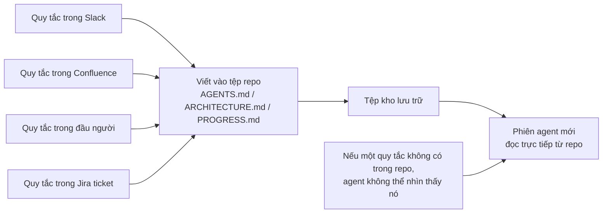
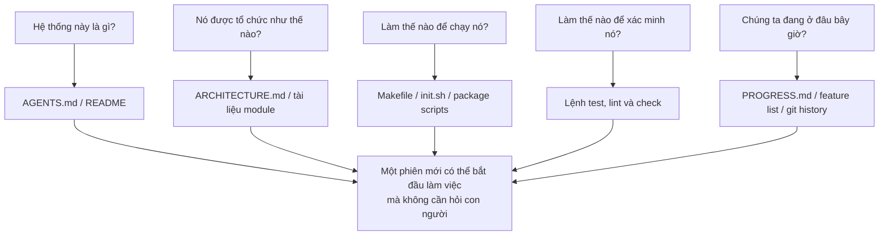

[English Version →](../../../en/lectures/lecture-03-why-the-repository-must-become-the-system-of-record/) | [中文版本 →](../../../zh/lectures/lecture-03-why-the-repository-must-become-the-system-of-record/)

> Ví dụ mã nguồn: [code/](https://github.com/walkinglabs/learn-harness-engineering/blob/main/docs/vi/lectures/lecture-03-why-the-repository-must-become-the-system-of-record/code/)
> Dự án thực hành: [Dự án 02. Không gian làm việc Agent đọc được](./../../projects/project-02-agent-readable-workspace/index.md)

# Bài 03. Biến Kho lưu trữ Thành Nguồn Sự thật Duy nhất

Các quyết định kiến trúc của nhóm bạn rải rác khắp Confluence, Slack, Jira, và một vài cái đầu của các kỹ sư cấp cao. Đối với con người, điều này hoạt động gượng gạo — bạn có thể hỏi đồng nghiệp, tìm kiếm lịch sử chat, đào qua tài liệu. Nếu thất bại, bạn có thể chặn ai đó ở căng tin. Nhưng đối với AI agent, thông tin không có trong kho lưu trữ đơn giản là không tồn tại.

Đây không phải phóng đại. Hãy nghĩ về các đầu vào thực sự của agent là gì: system prompt và mô tả tác vụ, nội dung tệp từ kho lưu trữ, và kết quả thực thi công cụ. Chỉ vậy thôi. Lịch sử Slack, ticket Jira, trang Confluence, và quyết định kiến trúc bạn thảo luận với đồng nghiệp qua cà phê vào chiều thứ Sáu — agent không thể thấy bất cứ điều nào trong số này. Nó không thể "đi hỏi ai đó" hoặc "tìm kiếm lịch sử chat." Nó là một kỹ sư bị nhốt bên trong kho lưu trữ — tất cả những gì bên ngoài, nó không biết gì cả.

Vậy câu hỏi trở thành: bạn có định đưa cho kỹ sư này một bản đồ tốt không?

## Những Gì Thuộc Về Bản Đồ

OpenAI nói thẳng: **thông tin không tồn tại trong repo, không tồn tại với agent.** Họ gọi đây là nguyên tắc "repo là spec" — bản thân kho lưu trữ là tài liệu đặc tả có thẩm quyền cao nhất.

Tài liệu về agent chạy lâu của Anthropic phản ánh điều này: trạng thái liên tục là điều kiện cần thiết cho tính liên tục của tác vụ dài. Khả năng phục hồi kiến thức xuyên phiên trực tiếp xác định tỷ lệ thành công của tác vụ. Và trạng thái này phải tồn tại trong kho lưu trữ — vì đó là bộ lưu trữ ổn định, có thể truy cập duy nhất mà agent có.

Bạn có thể nghĩ: "Nhóm chúng tôi nhỏ, kiến thức nằm trong đầu mọi người, và nó vẫn hoạt động tốt." Chắc chắn, đối với con người. Nhưng nếu bạn đang sử dụng agent, hãy chấp nhận sự thật này: agent không thể hỏi người. Mọi thứ nó cần biết phải được viết xuống và đặt ở nơi nó có thể tìm thấy.

Đây không phải về "viết nhiều tài liệu hơn." Mà là về "đặt thông tin quyết định vào đúng chỗ." Một `ARCHITECTURE.md` 50 dòng trong thư mục `src/api/` hữu ích hơn mười nghìn lần so với một tài liệu thiết kế 500 trang trong Confluence mà không ai bảo trì. Giống như bản đồ văn phòng vẽ tay dán trên bàn làm việc của bạn so với bản vẽ kiến trúc đẹp bị khóa trong tủ hồ sơ — cái trước có sẵn ngay khi bạn cần; cái sau về mặt kỹ thuật ưu việt hơn nhưng vô dụng trong thời điểm đó.

## Khả năng Hiển thị Kiến thức



Làm thế nào để kiểm tra xem bản đồ của bạn có đủ tốt không? Chạy "bài kiểm tra khởi động lạnh (cold-start test)": mở một phiên agent hoàn toàn mới chỉ sử dụng nội dung repo, và xem nó có thể trả lời năm câu hỏi cơ bản không:



Nếu nó không thể trả lời, bản đồ có những chỗ trống. Nơi bản đồ trống, agent đoán — đoán sai trở thành lỗi, đoán quá nhiều lãng phí ngữ cảnh. Và mỗi phiên mới lại đoán lại. Chi phí đoán luôn cao hơn chi phí vẽ bản đồ đúng cách ngay từ đầu.

## Các Khái niệm Cốt lõi

- **Khoảng cách Hiển thị Kiến thức (Knowledge Visibility Gap)**: Tỷ lệ tổng kiến thức dự án KHÔNG có trong kho lưu trữ. Khoảng cách càng lớn, tỷ lệ thất bại của agent càng cao. Bao nhiêu kiến thức ẩn về dự án này sống trong đầu bạn? Đếm tất cả, sau đó xem bao nhiêu đã vào repo — sự khác biệt là khoảng cách hiển thị của bạn.
- **Hệ thống Ghi chép (System of Record)**: Kho lưu trữ mã là nguồn có thẩm quyền cho các quyết định dự án, ràng buộc kiến trúc, trạng thái thực thi và tiêu chuẩn xác minh. Repo có tiếng nói cuối cùng, không nơi nào khác có giá trị. Giống như bản đồ có ghi "đường đóng cửa" — bạn sẽ không đi theo con đường đó. Nhưng nếu thông tin đó chỉ tồn tại trong đầu của Anh Nam, bạn phải hỏi Anh Nam mỗi lần.
- **Bài kiểm tra Khởi động Lạnh (Cold-Start Test)**: Năm câu hỏi ở trên. Nó có thể trả lời bao nhiêu thì bản đồ của bạn hoàn chỉnh bấy nhiêu.
- **Chi phí Khám phá (Discovery Cost)**: Ngân sách ngữ cảnh agent đốt cháy để tìm một thông tin quan trọng trong repo. Thông tin càng ẩn, chi phí khám phá càng cao, và ngân sách còn lại cho tác vụ thực tế càng ít. Ẩn thông tin quan trọng trong README sâu mười cấp thư mục giống như khóa bình chữa cháy trong két an toàn tầng hầm — nó tồn tại, nhưng bạn không thể tìm thấy khi cần.
- **Tốc độ Suy giảm Kiến thức (Knowledge Decay Rate)**: Tỷ lệ các mục kiến thức trở nên lỗi thời theo đơn vị thời gian. Tài liệu không đồng bộ với mã là kẻ thù lớn nhất — tệ hơn không có tài liệu nào cả.
- **Phép loại suy ACID**: Áp dụng các nguyên tắc giao dịch cơ sở dữ liệu (Tính nguyên tử, Nhất quán, Cô lập, Bền vững) vào quản lý trạng thái agent. Chúng ta sẽ mở rộng điều này dưới đây.

## Cách Vẽ Bản Đồ Tốt

**Nguyên tắc 1: Kiến thức sống gần mã.** Một quy tắc về xác thực API endpoint thuộc về gần mã API, không bị chôn vùi trong một tài liệu toàn cục khổng lồ. Đặt một tài liệu ngắn trong mỗi thư mục module giải thích trách nhiệm, giao diện và các ràng buộc đặc biệt của module đó. Giống như nhãn kệ thư viện — bạn muốn sách lịch sử, đi thẳng đến kệ ghi nhãn "Lịch sử." Không cần tìm kiếm toàn bộ thư viện.

**Nguyên tắc 2: Sử dụng tệp đầu vào được chuẩn hóa.** `AGENTS.md` (hoặc `CLAUDE.md`) là "trang đích" của agent. Nó không cần chứa tất cả thông tin, nhưng phải để agent nhanh chóng trả lời ba câu hỏi: "Dự án này là gì," "Làm thế nào để chạy nó," và "Làm thế nào để xác minh nó." 50-100 dòng là đủ.

**Nguyên tắc 3: Tối giản nhưng đầy đủ.** Mỗi mảnh kiến thức nên có trường hợp sử dụng rõ ràng. Nếu xóa một quy tắc không ảnh hưởng đến chất lượng quyết định của agent, quy tắc đó không nên tồn tại. Nhưng mỗi câu hỏi từ bài kiểm tra khởi động lạnh phải có câu trả lời. Đây là sự cân bằng tế nhị — không quá nhiều, không quá ít, vừa đủ.

**Nguyên tắc 4: Cập nhật cùng mã.** Ràng buộc cập nhật kiến thức với thay đổi mã. Cách tiếp cận đơn giản nhất: đặt tài liệu kiến trúc trong thư mục module tương ứng. Khi bạn sửa đổi mã, bạn tự nhiên nhìn thấy tài liệu. Sau khi thay đổi mã, CI có thể nhắc nhở bạn kiểm tra xem tài liệu có cần cập nhật không.

**Cấu trúc repo cụ thể**:

```
project/
├── AGENTS.md              # Đầu vào: tổng quan dự án, lệnh chạy, ràng buộc cứng
├── src/
│   ├── api/
│   │   ├── ARCHITECTURE.md  # Quyết định kiến trúc lớp API
│   │   └── ...
│   ├── db/
│   │   ├── CONSTRAINTS.md   # Ràng buộc cứng của hoạt động cơ sở dữ liệu
│   │   └── ...
│   └── ...
├── PROGRESS.md             # Tiến độ hiện tại: xong, đang thực hiện, bị chặn
└── Makefile                # Lệnh chuẩn hóa: setup, test, lint, check
```

## Quản lý Trạng thái Agent với Nguyên tắc ACID

Phép loại suy này đến từ quản lý giao dịch cơ sở dữ liệu — bạn có thể nghĩ nó đang phức tạp hóa quá mức, nhưng nó thực sự cung cấp cho bạn một khung rất thực tế:

- **Tính nguyên tử (Atomicity)**: Mỗi "hoạt động logic" (ví dụ: "thêm endpoint mới và cập nhật test") nhận một git commit. Nếu thất bại giữa chừng, `git stash` để khôi phục. Tất cả hoặc không có gì — không có "làm được một nửa."
- **Nhất quán (Consistency)**: Xác định các vị từ xác minh "trạng thái nhất quán" — tất cả test qua, lint báo cáo không có lỗi. Agent chạy xác minh sau mỗi hoạt động; các trạng thái trung gian không nhất quán không được commit. Giống như chuyển khoản ngân hàng — bạn không thể ghi nợ mà không ghi có.
- **Cô lập (Isolation)**: Khi nhiều agent hoạt động đồng thời, thiết kế các tệp trạng thái để tránh race condition. Cách tiếp cận đơn giản: mỗi agent sử dụng tệp tiến độ riêng, hoặc sử dụng git branch để cô lập. Hai đầu bếp không thể nêm cùng một nồi đồng thời — ai chịu trách nhiệm khi bị mặn quá?
- **Bền vững (Durability)**: Kiến thức dự án quan trọng sống trong các tệp được theo dõi bởi git. Trạng thái tạm thời có thể ở lại trong bộ nhớ phiên, nhưng kiến thức xuyên phiên phải được lưu trữ vào tệp. Những gì trong đầu bạn không tính — chỉ những gì trên giấy mới tính.

## Câu chuyện Chuyển đổi Thực tế

Một nhóm duy trì một nền tảng thương mại điện tử với ~30 microservices. Các quyết định kiến trúc (giao thức giao tiếp giữa các dịch vụ, chiến lược nhất quán dữ liệu, quy tắc phiên bản API) bị rải rác khắp: Confluence (một phần lỗi thời), Slack (khó tìm kiếm), một vài đầu của các kỹ sư cấp cao (không có khả năng mở rộng), và các chú thích mã rải rác (không có hệ thống).

Sau khi giới thiệu AI agent, 70% tác vụ yêu cầu can thiệp của con người. Gần như mọi lỗi đều liên quan đến agent vi phạm một số ràng buộc ẩn "mọi người biết nhưng không ai viết xuống." Giống như nhân viên mới mà không ai nói với họ "bạn cần đăng lệnh ăn trưa trong nhóm chat" — họ đoán sai, bị mắng, nhưng sau khi bị mắng vẫn không ai nói với họ quy tắc.

Nhóm đã thực hiện một cuộc chuyển đổi:
1. Tạo `AGENTS.md` trong thư mục gốc repo với tổng quan dự án, phiên bản tech stack và các ràng buộc cứng toàn cục
2. Thêm `ARCHITECTURE.md` trong mỗi thư mục microservice mô tả trách nhiệm, giao diện và phụ thuộc
3. Tạo `CONSTRAINTS.md` tập trung với các ràng buộc cứng bằng ngôn ngữ "PHẢI/KHÔNG ĐƯỢC" rõ ràng
4. Thêm `PROGRESS.md` trong mỗi thư mục dịch vụ theo dõi trạng thái công việc hiện tại

Sau chuyển đổi: cùng agent có thể trả lời tất cả các câu hỏi dự án quan trọng khi khởi động lạnh, và chất lượng hoàn thành tác vụ cải thiện đáng kể.

## Những Điểm chính cần Nhớ

- Kiến thức không có trong repo không tồn tại với agent. Đặt các quyết định quan trọng vào repo là đầu tư harness cơ bản nhất — vẽ bản đồ tốt để không bị lạc.
- Sử dụng "bài kiểm tra khởi động lạnh" để đánh giá chất lượng repo: một phiên mới có thể trả lời năm câu hỏi cơ bản chỉ sử dụng nội dung repo không?
- Kiến thức phải ở gần mã, tối giản nhưng đầy đủ, và cập nhật cùng mã. Không phải về viết nhiều tài liệu hơn — mà là đặt thông tin vào đúng chỗ.
- Sử dụng nguyên tắc ACID cho trạng thái agent: commit nguyên tử, xác minh nhất quán, cô lập đồng thời, kiến thức quan trọng bền vững.
- Suy giảm kiến thức là kẻ thù lớn nhất. Tài liệu không đồng bộ với mã nguy hiểm hơn không có tài liệu — nó đưa agent đi theo hướng sai trong khi nghĩ rằng mình đúng.

## Đọc thêm

- [OpenAI: Harness Engineering](https://openai.com/index/harness-engineering/)
- [Anthropic: Effective Harnesses for Long-Running Agents](https://www.anthropic.com/engineering/effective-harnesses-for-long-running-agents)
- [Infrastructure as Code — Martin Fowler](https://martinfowler.com/bliki/InfrastructureAsCode.html)
- [ADR: Architecture Decision Records](https://adr.github.io/)
- [The Twelve-Factor App](https://12factor.net/)

## Bài tập

1. **Bài kiểm tra khởi động lạnh**: Mở một phiên agent hoàn toàn mới trong dự án của bạn (không có ngữ cảnh lời nói, chỉ nội dung repo). Hỏi nó năm câu hỏi: Hệ thống này là gì? Nó được tổ chức như thế nào? Làm thế nào để chạy nó? Làm thế nào để xác minh nó? Tiến độ hiện tại là gì? Ghi lại những gì nó không thể trả lời, sau đó cải thiện repo cho đến khi nó có thể.

2. **Định lượng ngoại hóa kiến thức**: Liệt kê tất cả các quyết định và ràng buộc quan trọng cho công việc phát triển trong dự án của bạn. Đánh dấu mỗi cái là có trong hoặc ngoài repo. Tính khoảng cách hiển thị kiến thức của bạn (tỷ lệ ngoài repo). Lập kế hoạch để đưa nó xuống dưới 10%.

3. **Đánh giá ACID**: Đánh giá quản lý trạng thái dự án của bạn bằng phép loại suy ACID của bài giảng này. Tính nguyên tử — các hoạt động agent có thể được khôi phục sạch không? Nhất quán — có xác minh "trạng thái nhất quán" không? Cô lập — các agent đồng thời có giẫm lên nhau không? Bền vững — tất cả kiến thức xuyên phiên có được lưu trữ không?
