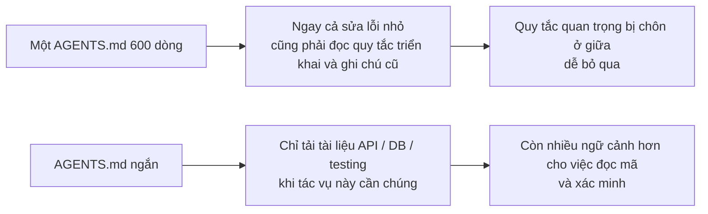
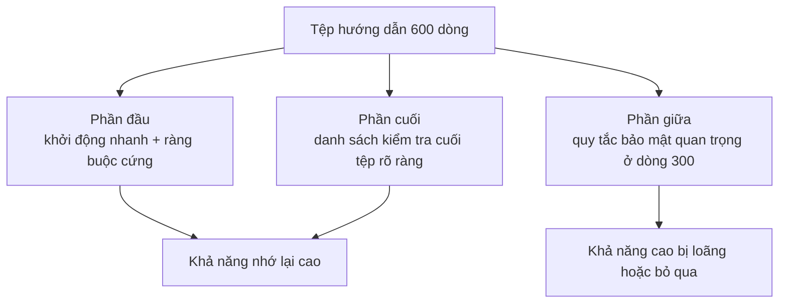

[English Version →](../../../en/lectures/lecture-04-why-one-giant-instruction-file-fails/) | [中文版本 →](../../../zh/lectures/lecture-04-why-one-giant-instruction-file-fails/)

> Ví dụ mã nguồn: [code/](https://github.com/walkinglabs/learn-harness-engineering/blob/main/docs/vi/lectures/lecture-04-why-one-giant-instruction-file-fails/code/)
> Dự án thực hành: [Dự án 02. Không gian làm việc Agent đọc được](./../../projects/project-02-agent-readable-workspace/index.md)

# Bài 04. Chia Hướng dẫn Ra Thành Nhiều Tệp

Bạn đã nghiêm túc với harness engineering — tốt lắm. Bạn đã tạo `AGENTS.md` và nhét mọi quy tắc, ràng buộc và bài học kinh nghiệm mà bạn có thể nghĩ ra vào đó. Một tháng sau, tệp phình lên 300 dòng, hai tháng 450 dòng, ba tháng 600 dòng. Rồi bạn nhận ra hiệu suất của agent thực sự đang kém hơn — trên một sửa lỗi đơn giản, agent đốt cháy rất nhiều ngữ cảnh để xử lý các hướng dẫn triển khai không liên quan; một ràng buộc bảo mật quan trọng bị chôn ở dòng 300 bị bỏ qua hoàn toàn; ba quy tắc phong cách mã mâu thuẫn có nghĩa là agent chọn một cái ngẫu nhiên mỗi lần.

Đây là bẫy "tệp hướng dẫn khổng lồ." Giống như nhồi quá nhiều vào vali — mọi thứ có vẻ hữu ích, vì vậy bạn nhét tất cả vào cho đến khi khóa kéo sắp nổ tung. Tìm đồ lót của bạn có nghĩa là đổ toàn bộ túi. Bạn mang một chiếc vali đầy, nhưng thực ra bạn chỉ dùng khoảng một phần ba những gì bên trong.

## Vòng lặp Vicious Tại Gốc rễ

Vòng lặp vicious phổ biến nhất diễn ra như thế này: agent mắc lỗi, bạn nói "thêm quy tắc để ngăn điều này," thêm nó vào AGENTS.md, nó hoạt động tạm thời, agent mắc lỗi khác, thêm quy tắc khác, lặp lại, tệp phình ra ngoài tầm kiểm soát.

Đây không phải lỗi của bạn. Đây là một phản ứng rất tự nhiên — "thêm quy tắc" mỗi khi có sự cố cảm thấy hợp lý, giống như tống thêm thứ gì đó vào túi mỗi khi bạn ra khỏi nhà "đề phòng bất trắc." Nhưng hiệu ứng tích lũy là thảm khốc. Hãy xem cụ thể những gì đi sai.

**Ngân sách ngữ cảnh bị ăn mòn.** Cửa sổ ngữ cảnh của agent là hữu hạn. Giả sử agent của bạn có cửa sổ 200K token (tiêu chuẩn của Claude). Một tệp hướng dẫn phình to có thể ăn 10-20K token. Có vẻ vẫn còn nhiều chỗ? Nhưng một tác vụ phức tạp có thể cần đọc hàng chục tệp nguồn, kết quả thực thi công cụ cũng chiếm ngữ cảnh, và lịch sử hội thoại tích lũy. Đến khi agent cần hiểu mã, ngân sách đã chật chội — giống như một chiếc vali quá đầy đến mức không còn chỗ cho laptop của bạn.

**Lạc giữa đường.** Bài báo "Lost in the Middle" (Liu et al., 2023) đã chứng minh rõ ràng rằng LLM sử dụng thông tin ở giữa các văn bản dài kém hiệu quả hơn đáng kể so với đầu hoặc cuối. AGENTS.md của bạn có 600 dòng, và dòng 300 nói "tất cả các truy vấn cơ sở dữ liệu phải sử dụng truy vấn được tham số hóa" — đó là ràng buộc cứng bảo mật. Nhưng nó bị chôn ở giữa, và agent gần như chắc chắn sẽ bỏ qua nó. Giống như chai kem chống nắng ở đáy chiếc vali quá đầy của bạn — bạn biết nó ở đó, bạn đào ba lần, không tìm thấy, cuối cùng mua cái khác.

**Xung đột ưu tiên.** Tệp trộn lẫn các ràng buộc cứng không thể thương lượng ("không bao giờ sử dụng eval()"), các hướng dẫn thiết kế quan trọng ("ưu tiên phong cách hàm"), và một bài học lịch sử cụ thể ("đã sửa rò rỉ bộ nhớ WebSocket tuần trước, chú ý đến các mẫu tương tự"). Ba quy tắc này có mức độ quan trọng hoàn toàn khác nhau, nhưng chúng trông giống hệt nhau trong tệp. Agent không có tín hiệu đáng tin cậy để phân biệt — giống như hộ chiếu và dây sạc bị lẫn lộn trong vali, không cách nào biết cái nào cấp bách hơn.

**Suy giảm bảo trì.** Các tệp lớn vốn dĩ khó bảo trì. Các hướng dẫn lỗi thời hiếm khi bị xóa — vì hậu quả của việc xóa là không chắc chắn ("có lẽ thứ gì đó khác phụ thuộc vào quy tắc này?"), trong khi thêm hướng dẫn mới có vẻ miễn phí. Kết quả: tệp chỉ tăng, không bao giờ giảm, và tỷ lệ tín hiệu/nhiễu liên tục giảm. Đây chính xác giống như tích lũy nợ kỹ thuật trong phần mềm.

**Tích lũy mâu thuẫn.** Các hướng dẫn được thêm vào các thời điểm khác nhau bắt đầu mâu thuẫn nhau — một cái nói "sử dụng TypeScript strict mode," một cái khác nói "một số tệp legacy cho phép any types." Agent chọn ngẫu nhiên một cái để tuân theo mỗi lần. Giống như mẹ bạn nói "mặc thêm ấm" và bố bạn nói "đừng mặc quá nhiều," và bạn đứng ở cửa không biết lắng nghe ai.

## Các Khái niệm Cốt lõi

- **Phình Hướng dẫn (Instruction Bloat)**: Khi một tệp hướng dẫn chiếm hơn 10-15% cửa sổ ngữ cảnh, nó bắt đầu lấn át ngân sách để đọc mã và lý luận tác vụ. Một `AGENTS.md` 600 dòng có thể tiêu thụ 10,000-20,000 token — đó là 8-15% cửa sổ 128K bị ăn hết trước khi agent thậm chí bắt đầu.
- **Hiệu ứng Lạc Giữa Đường (Lost in the Middle Effect)**: Nghiên cứu năm 2023 của Liu et al. đã chứng minh rằng LLM sử dụng thông tin ở giữa các văn bản dài kém hiệu quả hơn đáng kể so với thông tin ở đầu hoặc cuối. Một ràng buộc quan trọng bị chôn ở dòng 300 của tệp 600 dòng có xác suất rất cao bị bỏ qua thực tế.
- **Tỷ lệ Tín hiệu/Nhiễu Hướng dẫn (Instruction SNR)**: Tỷ lệ hướng dẫn trong một tệp liên quan đến tác vụ hiện tại. Bị buộc phải đọc 50 dòng hướng dẫn triển khai trong khi sửa lỗi — đó là SNR thấp.
- **Tệp Định tuyến (Routing File)**: Một tệp đầu vào ngắn có chức năng cốt lõi là chỉ agent đến các tài liệu chi tiết hơn, không chứa tất cả mọi thứ trong chính nó. 50-200 dòng là đủ.
- **Tiết lộ Tiến triển (Progressive Disclosure)**: Đưa thông tin tổng quan trước, thông tin chi tiết khi cần. Thiết kế harness tốt giống như thiết kế UI tốt — đừng đổ tất cả các tùy chọn lên người dùng cùng một lúc.
- **Mơ hồ Ưu tiên (Priority Ambiguity)**: Khi tất cả hướng dẫn xuất hiện ở cùng định dạng và vị trí, agent không thể phân biệt các ràng buộc cứng không thể thương lượng với các hướng dẫn mềm mang tính gợi ý.

## Kiến trúc Hướng dẫn





## Cách Chia

Nguyên tắc cốt lõi: giữ thông tin thường cần ở tầm tay, cất thông tin thỉnh thoảng cần, và bỏ lại những gì bạn sẽ không bao giờ dùng.

Tệp đầu vào `AGENTS.md` duy trì ở 50-200 dòng, chỉ chứa các mục được sử dụng thường xuyên nhất — tổng quan dự án (một hoặc hai câu), lệnh chạy đầu tiên (`make setup && make test`), các ràng buộc cứng toàn cục (không quá 15 quy tắc không thể thương lượng), và liên kết đến các tài liệu chủ đề (mô tả một dòng + điều kiện áp dụng).

```markdown
# AGENTS.md

## Tổng quan Dự án
Backend FastAPI Python 3.11, cơ sở dữ liệu PostgreSQL 15.

## Khởi động Nhanh
- Cài đặt: `make setup`
- Test: `make test`
- Xác minh đầy đủ: `make check`

## Ràng buộc Cứng
- Tất cả API phải sử dụng xác thực OAuth 2.0
- Tất cả truy vấn cơ sở dữ liệu phải sử dụng cú pháp SQLAlchemy 2.0
- Tất cả PR phải vượt qua pytest + mypy --strict + ruff check

## Tài liệu Chủ đề
- [Mẫu Thiết kế API](docs/api-patterns.md) — Đọc bắt buộc khi thêm endpoint
- [Quy tắc Cơ sở dữ liệu](docs/database-rules.md) — Bắt buộc khi sửa đổi hoạt động cơ sở dữ liệu
- [Tiêu chuẩn Testing](docs/testing-standards.md) — Tham khảo khi viết test
```

Mỗi tài liệu chủ đề có 50-150 dòng, được tổ chức theo chủ đề trong thư mục `docs/` hoặc cạnh module tương ứng. Agent chỉ đọc chúng khi cần. Giống như túi đựng đồ trong vali — đồ lót một túi, đồ vệ sinh một túi, dây sạc một túi. Tìm đồ không cần đổ toàn bộ túi.

Một số thông tin được đặt tốt hơn trực tiếp trong mã — định nghĩa type, chú thích giao diện, giải thích trong tệp cấu hình. Agent tự nhiên thấy những điều này khi đọc mã, không cần sao chép trong hướng dẫn.

Mỗi hướng dẫn nên có nguồn gốc ("tại sao quy tắc này được thêm?"), điều kiện áp dụng ("khi nào quy tắc này cần?"), và điều kiện hết hạn ("trong hoàn cảnh nào quy tắc này có thể được xóa?"). Kiểm tra thường xuyên, xóa các mục lỗi thời, dư thừa và mâu thuẫn. Quản lý hướng dẫn của bạn như bạn quản lý các phụ thuộc mã — các phụ thuộc không dùng nên được xóa, nếu không chúng chỉ làm chậm hệ thống.

Nếu một hướng dẫn phải có trong tệp đầu vào, hãy đặt nó ở đầu hoặc cuối — không bao giờ ở giữa. Hiệu ứng "lạc giữa đường" cho chúng ta biết rằng LLM sử dụng thông tin ở các cực đoan tốt hơn đáng kể so với trung tâm. Nhưng cách tiếp cận tốt hơn là di chuyển hướng dẫn sang các tài liệu chủ đề để tải theo yêu cầu.

Cả OpenAI và Anthropic đều ngầm hỗ trợ cách tiếp cận chia nhỏ. OpenAI nói các tệp đầu vào nên "ngắn và hướng định tuyến," Anthropic nói thông tin kiểm soát agent chạy lâu nên "súc tích và ưu tiên cao." Cả hai đều nói cùng một điều: đừng nhồi nhét mọi thứ vào một tệp. Vali cần được tổ chức, không phải nhồi nhét thô bạo.

## Ví dụ Thực tế

Một nhóm SaaS có `AGENTS.md` phình từ 50 dòng lên 600. Nội dung trộn lẫn phiên bản tech stack, tiêu chuẩn mã hóa, ghi chú sửa lỗi lịch sử, hướng dẫn sử dụng API, quy trình triển khai và sở thích cá nhân của các thành viên nhóm — toàn bộ chiếc vali sắp nổ tung.

Hiệu suất agent bắt đầu giảm rõ rệt: trong khi sửa lỗi đơn giản, agent dành nhiều ngữ cảnh để xử lý các hướng dẫn triển khai không liên quan; ràng buộc bảo mật "tất cả truy vấn cơ sở dữ liệu phải sử dụng truy vấn được tham số hóa" bị chôn ở dòng 300 và thường xuyên bị bỏ qua; ba quy tắc phong cách mã mâu thuẫn gây ra hành vi agent ngẫu nhiên.

Nhóm đã thực hiện "tái tổ chức vali":
1. `AGENTS.md` được cắt xuống còn 80 dòng: chỉ tổng quan dự án, lệnh chạy và 15 ràng buộc cứng toàn cục
2. Tạo các tài liệu chủ đề: `docs/api-patterns.md` (120 dòng), `docs/database-rules.md` (60 dòng), `docs/testing-standards.md` (80 dòng)
3. Thêm liên kết tài liệu chủ đề trong tệp định tuyến
4. Các ghi chú lịch sử được chuyển đổi thành test case hoặc bị xóa

Sau tái cấu trúc: tỷ lệ thành công cùng bộ tác vụ tăng từ 45% lên 72%. Tuân thủ ràng buộc bảo mật tăng từ 60% lên 95% — vì nó di chuyển từ giữa tệp lên đầu tệp định tuyến, không còn "lạc giữa đường" nữa.

## Những Điểm chính cần Nhớ

- "Thêm quy tắc" là giảm đau ngắn hạn, thuốc độc dài hạn. Trước khi thêm quy tắc, hãy hỏi: quy tắc này có tốt hơn trong một tài liệu chủ đề không? Đừng cứ tiếp tục nhồi nhét vào vali.
- Tệp đầu vào là bộ định tuyến, không phải bách khoa toàn thư. 50-200 dòng chỉ với tổng quan, ràng buộc cứng và liên kết.
- Tận dụng hiệu ứng "lạc giữa đường": thông tin quan trọng đặt ở đầu hoặc cuối; thông tin không quan trọng di chuyển sang tài liệu chủ đề.
- Quản lý phình hướng dẫn như nợ kỹ thuật. Kiểm tra thường xuyên, mỗi hướng dẫn cần nguồn gốc, điều kiện áp dụng và điều kiện hết hạn.
- Sau khi chia, SNR cải thiện và agent dành nhiều ngân sách ngữ cảnh hơn cho các tác vụ thực tế thay vì xử lý các hướng dẫn không liên quan.

## Đọc thêm

- [OpenAI: Harness Engineering](https://openai.com/index/harness-engineering/)
- [Anthropic: Effective Harnesses for Long-Running Agents](https://www.anthropic.com/engineering/effective-harnesses-for-long-running-agents)
- [Lost in the Middle: How Language Models Use Long Contexts](https://arxiv.org/abs/2307.03172)
- [HumanLayer: Harness Engineering for Coding Agents](https://humanlayer.dev/articles/harness-engineering-for-coding-agents/)
- [Nielsen Norman Group: Progressive Disclosure](https://www.nngroup.com/articles/progressive-disclosure/)

## Bài tập

1. **Kiểm toán SNR**: Lấy tệp hướng dẫn đầu vào hiện tại của bạn và liệt kê tất cả các mục hướng dẫn. Chọn 5 loại tác vụ thông thường khác nhau và đánh dấu liệu mỗi hướng dẫn có liên quan đến tác vụ đó không. Tính SNR cho mỗi loại tác vụ. Các hướng dẫn là nhiễu cho hầu hết các tác vụ nên di chuyển sang tài liệu chủ đề.

2. **Tái cấu trúc tiết lộ tiến triển**: Nếu bạn có tệp hướng dẫn trên 300 dòng, hãy chia nó thành: (a) tệp định tuyến dưới 100 dòng, (b) 3-5 tài liệu chủ đề. Chạy cùng bộ tác vụ (ít nhất 5) trước và sau, so sánh tỷ lệ thành công.

3. **Xác minh lạc giữa đường**: Trong một tệp hướng dẫn dài, đặt một ràng buộc quan trọng ở đầu, giữa và cuối lần lượt, chạy cùng bộ tác vụ mỗi lần (ít nhất 5 lần mỗi vị trí). Xem có sự khác biệt về tỷ lệ tuân thủ không. Bạn có thể ngạc nhiên về mức độ mạnh của hiệu ứng vị trí.
