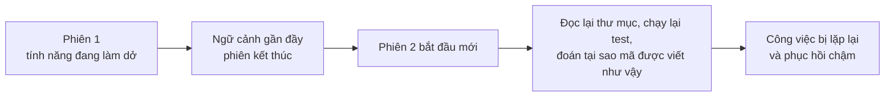
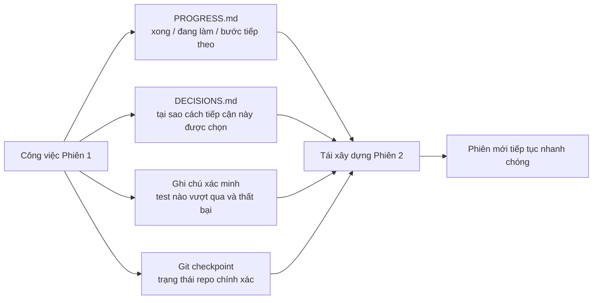

[English Version →](../../../en/lectures/lecture-05-why-long-running-tasks-lose-continuity/) | [中文版本 →](../../../zh/lectures/lecture-05-why-long-running-tasks-lose-continuity/)

> Ví dụ mã nguồn: [code/](https://github.com/walkinglabs/learn-harness-engineering/blob/main/docs/vi/lectures/lecture-05-why-long-running-tasks-lose-continuity/code/)
> Dự án thực hành: [Dự án 03. Tính liên tục đa phiên](./../../projects/project-03-multi-session-continuity/index.md)

# Bài 05. Duy trì Ngữ cảnh Qua Các Phiên

Bạn yêu cầu Claude Code triển khai một tính năng hoàn chỉnh. Nó chạy 30 phút, thực hiện hầu hết công việc, nhưng ngữ cảnh đang cạn kiệt. Bạn bắt đầu một phiên mới để tiếp tục — và khám phá rằng nó không nhớ những quyết định nào đã được đưa ra lần trước, tại sao lại chọn phương án A thay vì phương án B, những tệp nào đã được sửa đổi, hay trạng thái của các bài test là gì. Nó dành 15 phút để khám phá lại dự án, và có thể không nhất quán với cách tiếp cận trước.

Hãy tưởng tượng bạn là một thợ thủ công quên hết mọi thứ mỗi buổi sáng khi thức dậy. Bạn phải làm quen lại với toàn bộ công trường — bức tường nào đang xây dở, tại sao lại chọn gạch đỏ thay vì gạch xanh, đường ống nước đã chạy đến đâu. Tệ hơn nữa, bạn có thể tháo ra một cửa sổ đã được lắp vào ngày hôm qua, đơn giản vì bạn không nhớ nó đã xong.

Đây chính xác là tình huống khó khăn mà các AI coding agent phải đối mặt trong các tác vụ xuyên phiên. Bài giảng này giải thích tại sao các agent "mất ký ức" trong các tác vụ dài, và cách lưu trữ trạng thái có cấu trúc có thể làm cho chúng giống như một thợ thủ công giữ nhật ký đáng tin cậy hàng ngày — vẫn bị mất ký ức, nhưng nhật ký nhớ mọi thứ.

## Cửa sổ Ngữ cảnh: Không Vô hạn

Cửa sổ ngữ cảnh là hữu hạn. Điều này không thể giải quyết bằng nâng cấp mô hình — ngay cả khi kích thước cửa sổ tăng lên 1M token, các tác vụ phức tạp vẫn sẽ tiêu hao chúng. Vì các agent không chỉ tạo ra mã; họ hiểu codebase, theo dõi lịch sử quyết định của chính mình, xử lý kết quả công cụ và duy trì ngữ cảnh hội thoại. Tất cả thông tin này tăng trưởng nhanh hơn sự mở rộng cửa sổ.

Một vấn đề sâu hơn: thông tin mà agent tạo ra không đồng đều về mức độ quan trọng. Các bước lý luận trung gian chứa "tại sao" của các quyết định — tại sao chọn phương án B thay vì A, tại sao thư viện này thay vì kia, tại sao một tối ưu hóa cụ thể bị bỏ qua. Kết quả cuối cùng chỉ chứa "cái gì" — bản thân mã. Các chiến lược nén thường bảo tồn cái sau nhưng mất cái trước. Phiên tiếp theo thấy mã nhưng không biết tại sao nó được viết như vậy, và có thể "tối ưu hóa" đi một quyết định thiết kế cố ý.

Anthropic đã phát hiện ra điều hấp dẫn trong nghiên cứu về agent chạy lâu của họ: khi các agent cảm thấy ngữ cảnh đang cạn kiệt, chúng thể hiện hành vi "hội tụ sớm" — vội vàng hoàn thành công việc hiện tại, bỏ qua các bước xác minh, hoặc chọn giải pháp đơn giản thay vì giải pháp tối ưu. Giống như nhận ra thời gian sắp hết trong bài thi và nhanh chóng đoán các câu hỏi trắc nghiệm còn lại. Anthropic gọi đây là "lo lắng ngữ cảnh."

## Luồng Tính Liên tục Phiên

Không có các artifact tính liên tục, mọi phiên mới là một thảm họa:



Với các artifact tính liên tục, các phiên mới có thể tiếp tục nhanh chóng:



## Các Khái niệm Cốt lõi

- **Cửa sổ ngữ cảnh là hữu hạn**: Bất kể kích thước cửa sổ nào được tuyên bố (128K, 200K, 1M), các tác vụ dài cuối cùng sẽ tiêu hao chúng. Sau khi tiêu hao, cần phải nén (mất thông tin) hoặc đặt lại (phiên mới). Cả hai đều mất điều gì đó.
- **Artifact tính liên tục (Continuity Artifacts)**: Các tệp trạng thái được lưu trữ cho phép phiên mới tiếp tục không mơ hồ từ nơi phiên cuối kết thúc. Dạng cơ bản: nhật ký tiến độ + bản ghi xác minh + các hành động tiếp theo. Nhật ký của thợ thủ công đó.
- **Chi phí Tái xây dựng (Rebuild Cost)**: Thời gian phiên mới cần để đạt đến trạng thái có thể thực thi. Harness tốt có thể nén chi phí tái xây dựng từ 15 phút xuống còn 3 phút.
- **Trôi dạt (Drift)**: Khoảng cách giữa sự hiểu biết của agent và trạng thái thực tế của kho lưu trữ mã. Mỗi ranh giới phiên tạo ra trôi dạt; nếu không kiểm soát, nó sẽ tích lũy.
- **Lo lắng ngữ cảnh (Context Anxiety)**: Hiện tượng được Anthropic quan sát — các agent thể hiện hành vi hội tụ sớm khi tiếp cận giới hạn ngữ cảnh nhận thức, kết thúc tác vụ sớm để tránh mất thông tin. Đó là sự lo lắng tài nguyên phi lý.
- **Nén vs. Đặt lại (Compaction vs. Reset)**: Nén tóm tắt ngữ cảnh trong cùng phiên (giữ "cái gì," có thể mất "tại sao"); đặt lại mở phiên mới tái xây dựng từ trạng thái được lưu trữ (sạch nhưng phụ thuộc vào tính hoàn chỉnh của artifact).

## Điều Gì Xảy ra Khi Tính Liên tục Bị Phá vỡ

Phiên trước đã dành ngân sách ngữ cảnh đáng kể để phân tích ba cách tiếp cận và chọn phương án B. Phiên này của agent không biết về phân tích đó và có thể quyết định lại dựa trên thông tin không đầy đủ — có thể chọn phương án A. Giống như thợ thủ công mất ký ức không nhớ tại sao gạch đỏ được chọn, nhìn vào gạch xanh ngày hôm nay và nghĩ chúng đẹp hơn, và tháo bức tường của ngày hôm qua để xây lại.

Thậm chí còn tệ hơn là công việc trùng lặp. Agent không chắc chắn liệu một số công việc đã hoàn thành chưa và làm lại. Hoặc tệ hơn — làm một nửa, phát hiện ra xung đột với triển khai hiện có, và phải làm lại. Trên công trường, hai đội không thể xây cùng một bức tường đồng thời — nhưng không có bản ghi tiến độ, đội mới không biết có ai đó đang làm việc đó rồi.

Qua nhiều phiên, hướng triển khai có thể đã âm thầm trôi xa khỏi yêu cầu ban đầu. Mỗi phiên mới có sự hiểu biết hơi khác nhau về mục tiêu dự án. Giống như trò chơi truyền tin — sau mười người truyền tin, "đón tôi một ly cà phê" có thể trở thành "mua cho tôi máy pha cà phê."

Cũng có khoảng cách xác minh. Kết quả xác minh của phiên trước (test nào vượt qua, test nào thất bại, tại sao thất bại) không được ghi lại. Phiên mới phải chạy lại tất cả xác minh để hiểu trạng thái hiện tại. Mỗi phiên chẩn đoán lại từ đầu, mỗi lần lãng phí ngữ cảnh quý báu.

Cả OpenAI và Anthropic đều nhấn mạnh lưu trữ trạng thái có cấu trúc trong tài liệu của họ. Bài viết về harness engineering của OpenAI coi kho lưu trữ là "bản ghi hoạt động" — kết quả của mỗi hoạt động phải để lại bằng chứng có thể truy vết trong repo. Tài liệu về agent chạy lâu của Anthropic đặc biệt khuyến nghị "tệp bàn giao" — các tài liệu có cấu trúc chứa trạng thái hiện tại, các vấn đề đã biết và các hành động tiếp theo.

## Nhật ký Cho Thợ thủ công Mất Ký ức

Cách tiếp cận cốt lõi: **Đối xử với agent như một kỹ sư tài giỏi bị mất ký ức.** Trước khi nó "tan ca," nó phải ghi lại thông tin quan trọng để agent "ca tiếp theo" có thể tiếp tục nhanh chóng.

**Công cụ 1: Tệp tiến độ (PROGRESS.md).** Artifact tính liên tục cơ bản nhất — cốt lõi của nhật ký:

```markdown
# Tiến độ Dự án

## Trạng thái Hiện tại
- Commit mới nhất: abc1234 (feat: add user preferences endpoint)
- Trạng thái test: 42/43 vượt qua (test_pagination_edge_case thất bại)
- Lint: vượt qua

## Đã Hoàn thành
- [x] User model và database migration
- [x] Các endpoint CRUD cơ bản
- [x] Tích hợp auth middleware

## Đang Thực hiện
- [ ] Tính năng phân trang (90% - edge case test thất bại)

## Vấn đề Đã biết
- test_pagination_edge_case trả về 500 trên result sets trống
- Cần xác nhận liệu người dùng đã xóa có nên xuất hiện trong danh sách không

## Các Bước Tiếp theo
1. Sửa lỗi edge case phân trang
2. Thêm tham số truy vấn "include deleted users"
3. Cập nhật tài liệu API
```

**Công cụ 2: Nhật ký quyết định (DECISIONS.md).** Ghi lại các quyết định thiết kế quan trọng và lý do. Không cần tài liệu thiết kế chi tiết — chỉ cần "quyết định gì, tại sao, khi nào" — các ghi chú trong nhật ký:

```markdown
# Các Quyết định Thiết kế

## 2024-01-15: Sử dụng Redis để cache tùy chọn người dùng
- Lý do: Tần suất đọc cao (mỗi lần gọi API), kích thước dữ liệu nhỏ
- Phương án bị từ chối: PostgreSQL materialized view (tần suất thay đổi cao làm chi phí bảo trì không xứng đáng)
- Ràng buộc: Cache TTL 5 phút, vô hiệu hóa chủ động khi ghi
```

**Công cụ 3: Git commit như checkpoint.** Commit sau khi hoàn thành mỗi đơn vị công việc nguyên tử. Commit message phải giải thích những gì đã được thực hiện và tại sao. Đây là các snapshot trạng thái miễn phí, được phiên bản hóa tự động.

**Công cụ 4: init.sh hoặc luồng khởi tạo harness.** Chỉ định trong `AGENTS.md` các thói quen "bắt đầu ca" và "kết thúc ca":

```markdown
## Khi bắt đầu phiên (bắt đầu ca)
1. Đọc PROGRESS.md để biết trạng thái hiện tại
2. Đọc DECISIONS.md để biết các quyết định quan trọng
3. Chạy make check để xác nhận repo ở trạng thái nhất quán
4. Tiếp tục từ phần "Các Bước Tiếp theo" của PROGRESS.md

## Trước khi kết thúc phiên (kết thúc ca)
1. Cập nhật PROGRESS.md
2. Chạy make check để xác nhận trạng thái nhất quán
3. Commit tất cả công việc đã hoàn thành
```

**Chiến lược hỗn hợp**: Không phải mọi tác vụ đều cần đặt lại ngữ cảnh. Các tác vụ ngắn (dưới 30 phút) có thể hoàn thành trong một phiên. Các tác vụ dài (trải dài qua các phiên) phải sử dụng tệp tiến độ và nhật ký quyết định để tính liên tục. Tiêu chí quyết định: nếu một tác vụ cần hơn 60% cửa sổ, hãy bắt đầu chuẩn bị bàn giao.

### Tìm hiểu Sâu hơn về Lo lắng Ngữ cảnh

Nghiên cứu tháng 3 năm 2026 của Anthropic tiếp tục tiết lộ các biểu hiện cụ thể của lo lắng ngữ cảnh: trên Sonnet 4.5, khi ngữ cảnh tiếp cận giới hạn cửa sổ, agent thể hiện hành vi "hội tụ sớm" mạnh. Giống như nhận ra thời gian gần hết trong bài thi và nhanh chóng điền câu trả lời ngẫu nhiên vào các câu trắc nghiệm.

Hai chiến lược giải quyết điều này:

**Nén (Compaction)**: Tóm tắt hội thoại đầu trong cùng phiên. Ưu điểm: duy trì tính liên tục, agent có thể thấy "cái gì." Nhược điểm: "tại sao" thường bị mất trong các bản tóm tắt — tại sao phương án B được chọn thay vì A, tại sao một tối ưu hóa cụ thể bị bỏ qua. Quan trọng hơn, nén không loại bỏ lo lắng ngữ cảnh — agent biết ngữ cảnh từng lớn, và về mặt tâm lý vẫn có xu hướng vội vàng kết thúc.

**Đặt lại ngữ cảnh (Context Reset)**: Xóa hoàn toàn ngữ cảnh, mở phiên mới, tái xây dựng từ các artifact được lưu trữ. Ưu điểm: trạng thái tâm trí sạch — phiên mới không có lo lắng "tôi sắp hết thời gian." Nhược điểm: phụ thuộc vào tính hoàn chỉnh của artifact bàn giao. Nếu nhật ký thiếu thông tin quan trọng, phiên mới có thể lãng phí thời gian đi theo hướng sai.

Dữ liệu thực tế của Anthropic: đối với Sonnet 4.5, lo lắng ngữ cảnh đủ nghiêm trọng đến mức nén một mình không đủ — đặt lại ngữ cảnh trở thành thành phần quan trọng của thiết kế harness. Nhưng đối với Opus 4.5, hành vi này giảm đáng kể, và nén có thể quản lý ngữ cảnh mà không cần dựa vào đặt lại. Điều này có nghĩa là: **thiết kế harness cần sự hiểu biết cụ thể về mô hình mục tiêu, không phải một mẫu chung cho tất cả.**

> Nguồn: [Anthropic: Harness design for long-running application development](https://www.anthropic.com/engineering/harness-design-long-running-apps)

## Ví dụ Thực tế

Một agent được giao nhiệm vụ triển khai hệ thống blog với xác thực người dùng — 12 điểm tính năng, ước tính cần 5 phiên.

**Không có nhật ký**: Phiên 1 triển khai user model và các route cơ bản. Phiên 2 bắt đầu mà agent không nhớ hợp đồng giao diện của auth middleware, dành ~15 phút để suy ra ý định thiết kế trước. Đến phiên 3, trôi dạt tích lũy khiến agent bắt đầu triển khai lại các tính năng đã hoàn thành. Đến phiên 5, repo chứa nhiều mã dư thừa nhưng tính năng auth cốt lõi vẫn chưa vượt qua test end-to-end. Chỉ 7 trong 12 điểm tính năng hoàn thành, 3 có vấn đề tính đúng đắn ẩn. Giống như thợ thủ công không bao giờ ghi nhật ký — đến ngày thứ năm, công trường là hỗn loạn, một số bức tường được xây hai lần, một số lẽ ra phải được xây nhưng chưa bao giờ bắt đầu.

**Với nhật ký**: Sử dụng tệp tiến độ, nhật ký quyết định, bản ghi xác minh và git checkpoint. Báo cáo trạng thái được cập nhật tự động ở cuối mỗi phiên. Chi phí tái xây dựng của phiên 2 giảm xuống còn ~3 phút. Đến phiên 5, tất cả 12 điểm tính năng hoàn thành và được xác minh.

So sánh định lượng: thời gian tái xây dựng giảm ~78%, tỷ lệ hoàn thành tính năng từ 58% lên 100%, tỷ lệ lỗi ẩn từ 43% xuống còn 8%. Thợ thủ công vẫn mất ký ức, nhưng với nhật ký, mỗi ngày bắt đầu từ nơi ngày hôm qua dừng lại, không phải từ đầu.

## Những Điểm chính cần Nhớ

- Cửa sổ ngữ cảnh là tài nguyên hữu hạn. Các tác vụ dài sẽ trải dài qua nhiều phiên, và các phiên sẽ mất thông tin — giống như thợ thủ công quên mỗi ngày, đây là thực tế khách quan.
- Giải pháp không phải là cửa sổ lớn hơn — mà là lưu trữ trạng thái tốt hơn. Tệp tiến độ + nhật ký quyết định + git checkpoint — đưa cho thợ thủ công mất ký ức một cuốn nhật ký đáng tin cậy.
- Đối xử với agent như kỹ sư bị mất ký ức: trước khi "tan ca," hãy ghi lại những gì đã làm, tại sao, và tiếp theo là gì.
- Chi phí tái xây dựng là chỉ số chính. Harness tốt phải đưa các phiên mới đến trạng thái có thể thực thi trong vòng 3 phút.
- Chiến lược hỗn hợp: các tác vụ ngắn trong phiên, các tác vụ dài với artifact có cấu trúc để tính liên tục.

## Đọc thêm

- [Anthropic: Effective Harnesses for Long-Running Agents](https://www.anthropic.com/engineering/effective-harnesses-for-long-running-agents)
- [OpenAI: Harness Engineering](https://openai.com/index/harness-engineering/)
- [Lost in the Middle: How Language Models Use Long Contexts](https://arxiv.org/abs/2307.03172)
- [Claude Code Documentation](https://docs.anthropic.com/en/docs/claude-code)
- [HumanLayer: Harness Engineering for Coding Agents](https://humanlayer.dev/articles/harness-engineering-for-coding-agents/)

## Bài tập

1. **Đo lường mất tính liên tục**: Chọn một tác vụ phát triển cần ít nhất 3 phiên. Không cung cấp bất kỳ artifact tính liên tục nào, ghi lại ở mỗi lần bắt đầu phiên xem agent dành bao nhiêu ngữ cảnh để "tìm hiểu chuyện gì đã xảy ra lần trước." Sau mỗi phiên, tạo một tệp tiến độ và để phiên tiếp theo bắt đầu từ đó. So sánh chi phí tái xây dựng có và không có tệp tiến độ.

2. **Thiết kế mẫu bàn giao**: Thiết kế một mẫu bàn giao tối giản với bốn trường: trạng thái repo (hash commit), trạng thái runtime (tỷ lệ vượt qua test), các chướng ngại vật, các hành động tiếp theo. Để một phiên agent hoàn toàn mới phục hồi trạng thái dự án chỉ sử dụng mẫu này. Ghi lại các điểm mơ hồ gặp phải trong quá trình phục hồi, cải tiến mẫu lặp đi lặp lại.

3. **Thí nghiệm chiến lược hỗn hợp**: Trong một tác vụ phát triển 5 phiên, so sánh ba chiến lược: (a) luôn bắt đầu phiên mới + tệp tiến độ, (b) làm càng nhiều càng tốt trong một phiên (nén ngữ cảnh), (c) chiến lược hỗn hợp (tác vụ ngắn trong phiên, tác vụ dài xuyên phiên + tệp tiến độ). So sánh thời gian tái xây dựng, tỷ lệ hoàn thành tính năng và tính nhất quán của quyết định.
