[English Version →](../../../en/lectures/lecture-06-why-initialization-needs-its-own-phase/) | [中文版本 →](../../../zh/lectures/lecture-06-why-initialization-needs-its-own-phase/)

> Ví dụ mã nguồn: [code/](https://github.com/walkinglabs/learn-harness-engineering/blob/main/docs/vi/lectures/lecture-06-why-initialization-needs-its-own-phase/code/)
> Dự án thực hành: [Dự án 03. Tính liên tục đa phiên](./../../projects/project-03-multi-session-continuity/index.md)

# Bài 06. Khởi tạo Trước Mỗi Phiên Agent

Bạn bắt đầu một phiên agent mới và nói "thêm tính năng tìm kiếm." Nó nhảy thẳng vào việc lập trình — sự nhiệt tình đáng ngưỡng mộ. Sau 20 phút, nó phát hiện ra khung test chưa được cấu hình đúng, dành thêm 10 phút để sửa cái đó, sau đó định dạng script migration cơ sở dữ liệu sai, loay hoay thêm. Tính năng tìm kiếm cuối cùng được thêm vào, nhưng toàn bộ phiên không hiệu quả — hầu hết thời gian dành cho "tìm hiểu dự án này hoạt động như thế nào" thay vì viết tính năng tìm kiếm.

Cách tiếp cận tốt hơn: trước khi để agent bắt đầu làm việc, sử dụng một giai đoạn riêng để chuẩn bị môi trường cơ sở, các lệnh xác minh vượt qua, và cấu trúc dự án được hiểu. Giống như xây nhà — bạn không đổ móng và dựng tường cùng một lúc. Nếu bạn làm vậy, tường dựng lên trước khi móng đã đông cứng, và cả tòa nhà phải bị phá đi và bắt đầu lại. Đổ móng trước, để móng đông cứng, rồi xây tường — sạch sẽ và hiệu quả.

Bài giảng này giải thích tại sao khởi tạo phải là một giai đoạn riêng, không được trộn lẫn với triển khai.

## Móng và Tường: Hai Công việc Khác Nhau Về Bản chất

Khởi tạo và triển khai có mục tiêu tối ưu hóa hoàn toàn khác nhau. Giai đoạn triển khai tối ưu hóa cho: tối đa hóa số lượng và chất lượng của các tính năng được xác minh. Giai đoạn khởi tạo tối ưu hóa cho: tối đa hóa độ tin cậy và hiệu quả của tất cả các triển khai tiếp theo.

Khi bạn trộn khởi tạo và triển khai, agent đối mặt với bài toán tối ưu hóa đa mục tiêu — đồng thời xây dựng cơ sở hạ tầng và viết mã tính năng. Không có cài đặt ưu tiên rõ ràng, agent tự nhiên nghiêng về viết mã (vì đó là kết quả có thể nhìn thấy trực tiếp) trong khi hy sinh cơ sở hạ tầng (vì giá trị của nó chỉ hiện ra trong các phiên sau). Giống như nói với đội xây dựng đồng thời đổ móng và xây tường — họ có thể sẽ vội vàng xây tường vì tường có thể nhìn thấy và trình diễn được. Nhưng một ngôi nhà có móng tệ có vấn đề hệ thống về sau.

## Vòng đời Khởi tạo

```mermaid
flowchart TB
    subgraph Wrong["Phiên hỗn hợp (sai)"]
        W1["Bắt đầu ngay vào công việc tính năng"] --> W2["Phát hiện các khoảng trống env và test giữa tác vụ"]
        W2 --> W3["Tích lũy mã chưa được xác minh"]
        W3 --> W4["Phiên tiếp theo phải khám phá lại trạng thái dự án"]
    end

    subgraph Right["Khởi tạo riêng biệt (đúng)"]
        R1["Phiên 1: môi trường có thể chạy"] --> R2["Test mẫu vượt qua"]
        R2 --> R3["Bootstrap contract + danh sách tác vụ được viết"]
        R3 --> R4["Checkpoint sạch được commit"]
        R4 --> R5["Các phiên sau bắt đầu trực tiếp trên các tác vụ đã xác minh"]
    end
```



## Điều Gì Xảy ra Khi Bạn Trộn Chúng

Vấn đề trực tiếp nhất: móng không đông cứng đúng cách. Agent dành 80% công sức cho mã tính năng và 20% tùy tiện thiết lập một số cơ sở hạ tầng. Khung test được cấu hình nhưng không bao giờ được xác minh, quy tắc lint được thiết lập nhưng quá lỏng, không có tệp tiến độ được tạo. Những khiếm khuyết này không rõ ràng trong phiên đầu tiên (vì agent vẫn nhớ những gì nó đã làm), nhưng chúng nổi lên trong phiên thứ hai — agent mới không biết cách chạy, test, hoặc mọi thứ đang ở đâu. Móng cẩu thả, tòa nhà lung lay.

Một chi phí ẩn hơn là "tích lũy chưa xác minh" — mã tính năng được viết trước khi khung test được cấu hình là mã không có xác minh. Khi bạn cuối cùng quay lại thêm test cho mã đó, bạn có thể phát hiện ra thiết kế ngay từ đầu đã sai — nếu biết trước, bạn đã triển khai khác đi. Giống như lát gạch lên bê tông ướt — khi bạn phát hiện ra sàn không phẳng, tất cả gạch phải được cạy lên và làm lại.

Ngân sách phiên cũng đang bị lãng phí. Công việc khởi tạo (cấu hình môi trường, thiết lập test, hiểu cấu trúc dự án) tiêu thụ ngân sách đáng kể, để lại ít hơn cho việc triển khai tính năng thực tế. Kết quả: phiên đầu chỉ hoàn thành một nửa tính năng, và phiên thứ hai phải bắt đầu lại hiểu dự án. Ngân sách dành cho móng, nhưng móng cũng không vững — không mục tiêu nào đạt được.

Vấn đề dễ bị bỏ qua nhất là bẫy giả định ẩn. Các quyết định mà agent đưa ra trong quá trình khởi tạo (khung test nào, cách tổ chức thư mục, quản lý phụ thuộc) — nếu không được ghi lại rõ ràng, các phiên sau không thể hiểu những lựa chọn này. Tệ hơn, các phiên sau có thể đưa ra các lựa chọn mâu thuẫn. Đội xây dựng đầu tiên dùng móng bê tông, đội thứ hai không biết và đóng cọc gỗ vào đó — móng nứt.

Nghiên cứu phát triển ứng dụng chạy lâu của Anthropic đặc biệt khuyến nghị tách khởi tạo khỏi triển khai. Dữ liệu thực nghiệm của họ: các dự án sử dụng giai đoạn khởi tạo riêng biệt cho thấy tỷ lệ hoàn thành tính năng cao hơn 31% trong các kịch bản đa phiên so với các cách tiếp cận hỗn hợp. Hiểu biết chính — thời gian đầu tư vào giai đoạn khởi tạo được thu hồi hoàn toàn trong 3-4 phiên tiếp theo. Móng càng vững, tường xây càng nhanh.

Hướng dẫn harness engineering Codex của OpenAI cũng nhấn mạnh nguyên tắc "kho lưu trữ là bản ghi hoạt động" — thiết lập cấu trúc hoạt động rõ ràng từ lần chạy đầu tiên, hoặc mọi phiên mới phải suy ra lại các quy ước dự án.

## Các Khái niệm Cốt lõi

- **Giai đoạn Khởi tạo**: Giai đoạn đầu tiên trong vòng đời của agent — không triển khai tính năng, chỉ thiết lập các điều kiện tiên quyết cho tất cả các giai đoạn triển khai tiếp theo. Kết quả không phải là mã, mà là cơ sở hạ tầng.
- **Bootstrap Contract**: Các điều kiện mà một dự án có thể được vận hành không mơ hồ bởi một phiên agent mới — có thể bắt đầu, có thể test, có thể thấy tiến độ, có thể chọn bước tiếp theo. Bốn điều kiện, tất cả đều cần thiết.
- **Khởi động Lạnh vs. Khởi động Ấm (Cold Start vs. Warm Start)**: Khởi động lạnh là từ một thư mục trống nơi agent phải đoán cấu trúc dự án; khởi động ấm là từ một mẫu hoặc dự án hiện có nơi cơ sở hạ tầng đã có sẵn. Khởi động ấm vượt trội hơn nhiều so với khởi động lạnh — giống như bắt đầu làm việc trên công trường có nước chạy và điện so với bắt đầu từ vùng đất hoang.
- **Sẵn sàng Bàn giao (Handoff Readiness)**: Dự án ở trạng thái tại bất kỳ thời điểm nào mà một agent mới có thể tiếp quản. Không cần giải thích bằng lời — chỉ cần nội dung repo.
- **Thời gian Đến Xác minh Đầu tiên (Time to First Verification)**: Thời gian từ khi bắt đầu dự án đến khi điểm tính năng đầu tiên vượt qua xác minh. Đây là chỉ số cốt lõi để đo hiệu quả khởi tạo.
- **Khả năng Sử dụng Downstream**: Thước đo tốt nhất về chất lượng khởi tạo — tỷ lệ các phiên tiếp theo có thể thực thi thành công các tác vụ mà không cần dựa vào kiến thức ẩn.

## Cách Khởi tạo Đúng

**Coi khởi tạo là một giai đoạn riêng biệt.** Phiên đầu tiên chỉ làm khởi tạo — hoàn toàn không có mã tính năng kinh doanh. Khởi tạo tạo ra:

**1. Môi trường có thể chạy.** Dự án khởi động, dependencies được cài đặt, không có vấn đề môi trường. Móng được đổ, không có vết nứt.

**2. Khung test có thể xác minh.** Ít nhất một test mẫu vượt qua. Điều này chứng minh bản thân khung test được cấu hình đúng — giống như đứng một cột trên móng để chứng minh nó có thể chịu được trọng lượng.

**3. Tài liệu bootstrap contract.** Một tài liệu rõ ràng cho các phiên sau:
```markdown
# Khởi tạo Contract

## Lệnh Khởi động
- Cài đặt dependencies: `make setup`
- Khởi động dev server: `make dev`
- Chạy test: `make test`
- Xác minh đầy đủ: `make check`

## Trạng thái Hiện tại
- Tất cả dependencies đã được cài đặt và khóa
- Khung test được cấu hình (Vitest + React Testing Library)
- Test mẫu vượt qua (1/1)
- Quy tắc lint được cấu hình (ESLint + Prettier)

## Cấu trúc Dự án
- src/ — Mã nguồn
- src/components/ — React components
- src/api/ — API client
- tests/ — Tệp test
```

**4. Phân chia tác vụ.** Chia toàn bộ dự án thành danh sách tác vụ có thứ tự, mỗi tác vụ có tiêu chí chấp nhận rõ ràng:
```markdown
# Phân chia Tác vụ

## Tác vụ 1: Xác thực Người dùng Cơ bản
- Triển khai JWT auth middleware
- Thêm endpoint đăng nhập/đăng ký
- Chấp nhận: pytest tests/test_auth.py tất cả vượt qua

## Tác vụ 2: Trang Hồ sơ Người dùng
- Triển khai CRUD hồ sơ người dùng
- Thêm form chỉnh sửa hồ sơ
- Chấp nhận: pytest tests/test_profile.py tất cả vượt qua

## Tác vụ 3: Tính năng Tìm kiếm
- ...
```

**5. Git commit như checkpoint.** Sau khi khởi tạo hoàn thành, commit một checkpoint sạch. Tất cả công việc tiếp theo bắt đầu từ checkpoint này.

**Chiến lược khởi động ấm**: Đừng bắt đầu từ một thư mục trống. Sử dụng mẫu dự án (create-react-app, fastapi-template, v.v.) để đặt trước cấu trúc thư mục chuẩn, cấu hình phụ thuộc và khung test. Nướng các bước khởi tạo thông thường vào mẫu, chỉ để lại công việc khởi tạo cụ thể cho dự án. Giống như bắt đầu làm việc trên công trường có nước chạy và điện — tốt hơn mười nghìn lần so với bắt đầu từ vùng đất hoang.

**Tiêu chí hoàn thành khởi tạo**: Không phải "bao nhiêu mã đã được viết," mà là liệu bốn điều kiện của bootstrap contract có được đáp ứng không — có thể bắt đầu, có thể test, có thể thấy tiến độ, có thể chọn bước tiếp theo. Sử dụng danh sách kiểm tra này để xác nhận khởi tạo:

```markdown
## Danh sách Kiểm tra Chấp nhận Khởi tạo
- [ ] `make setup` thành công từ đầu
- [ ] `make test` có ít nhất một test vượt qua
- [ ] Một phiên agent mới có thể trả lời "làm thế nào để chạy" và "làm thế nào để test" chỉ từ nội dung repo
- [ ] Tệp phân chia tác vụ tồn tại với ít nhất 3 tác vụ
- [ ] Mọi thứ đã được commit vào git
```

## Ví dụ Thực tế

Hai cách tiếp cận khởi tạo cho một dự án frontend React:

**Cách tiếp cận hỗn hợp (đồng thời đổ móng và xây tường)**: Agent đồng thời tạo scaffolding dự án và triển khai tính năng đầu tiên trong phiên 1. Ở cuối phiên, repo có mã có thể chạy nhưng: không có tài liệu lệnh bắt đầu/test rõ ràng, không có tệp theo dõi tiến độ, không có phân chia tác vụ. Phiên 2 dành ~20 phút để suy ra cấu trúc dự án, khung test và quy trình build — giống như đội xây dựng mới đến công trường, không biết móng đã chạy đến đâu hoặc đường ống nước ở đâu, phải đào lỗ từng chỗ để tìm ra.

**Khởi tạo riêng biệt (móng trước)**: Phiên 1 chỉ làm khởi tạo — tạo cấu trúc thư mục từ mẫu, cấu hình khung test (Vitest + React Testing Library), viết và xác minh một test mẫu, tạo tài liệu bootstrap contract và tệp phân chia tác vụ, commit checkpoint ban đầu. Chi phí tái xây dựng của phiên 2 dưới 3 phút, và nó bắt đầu làm việc trực tiếp từ danh sách tác vụ — đội đến, nhìn vào bản vẽ, và biết chính xác nơi cần tiếp tục.

So sánh chu kỳ dự án đầy đủ: tổng thời gian tái xây dựng (qua tất cả các phiên) của cách tiếp cận hỗn hợp cao hơn ~60% so với cách tiếp cận khởi tạo riêng biệt. 20 phút thêm dành cho khởi tạo được thu hồi nhiều lần trong các phiên tiếp theo. Giống như móng vững giúp tường xây nhanh hơn — chậm là nhanh.

## Những Điểm chính cần Nhớ

- Khởi tạo và triển khai có mục tiêu tối ưu hóa khác nhau — trộn lẫn chúng chỉ kéo cả hai xuống. Đổ móng trước, rồi xây tường.
- Kết quả của khởi tạo không phải là mã, mà là cơ sở hạ tầng: môi trường có thể chạy, test có thể xác minh, bootstrap contract, phân chia tác vụ.
- Xác nhận khởi tạo bằng bốn điều kiện của bootstrap contract: có thể bắt đầu, có thể test, có thể thấy tiến độ, có thể chọn bước tiếp theo.
- Khởi động ấm tốt hơn khởi động lạnh. Sử dụng mẫu dự án để đặt trước cơ sở hạ tầng chuẩn hóa.
- Thời gian đầu tư vào khởi tạo được thu hồi hoàn toàn trong 3-4 phiên tiếp theo. Đây không phải chi phí thêm — đó là đầu tư trước. Móng càng vững, tòa nhà xây càng nhanh.

## Đọc thêm

- [Anthropic: Effective Harnesses for Long-Running Agents](https://www.anthropic.com/engineering/effective-harnesses-for-long-running-agents)
- [OpenAI: Harness Engineering](https://openai.com/index/harness-engineering/)
- [HumanLayer: Harness Engineering for Coding Agents](https://humanlayer.dev/articles/harness-engineering-for-coding-agents/)
- [Infrastructure as Code — Martin Fowler](https://martinfowler.com/bliki/InfrastructureAsCode.html)
- [SWE-agent: Agent-Computer Interfaces](https://github.com/princeton-nlp/SWE-agent)

## Bài tập

1. **Thiết kế bootstrap contract**: Viết một bootstrap contract hoàn chỉnh cho một dự án bạn đang phát triển. Sau đó mở một phiên agent hoàn toàn mới, chỉ hiển thị nội dung repo (không có ngữ cảnh lời nói), và để nó thử bắt đầu dự án, chạy test và hiểu tiến độ hiện tại. Ghi lại mọi vấn đề gặp phải — mỗi vấn đề tương ứng với một điều khoản còn thiếu trong bootstrap contract của bạn.

2. **Thí nghiệm so sánh**: Chọn một dự án mới cỡ vừa. Cách A: để agent đồng thời khởi tạo và thực hiện triển khai đầu tiên. Cách B: dành một phiên cho khởi tạo riêng biệt, bắt đầu triển khai trong phiên 2. Sau 4 phiên, so sánh: thời gian đến xác minh đầu tiên, chi phí tái xây dựng, tỷ lệ hoàn thành tính năng.

3. **Danh sách kiểm tra chấp nhận khởi tạo**: Thiết kế một danh sách kiểm tra chấp nhận khởi tạo cho dự án của bạn. Để một phiên agent mới thực thi từng mục trong danh sách kiểm tra và ghi lại cái nào vượt qua và cái nào thất bại. Các mục thất bại là nơi harness của bạn cần được tăng cường.
