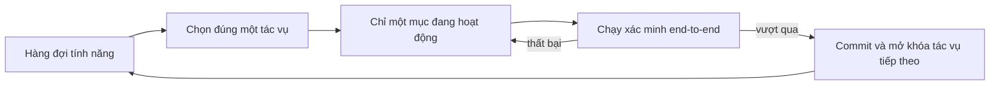
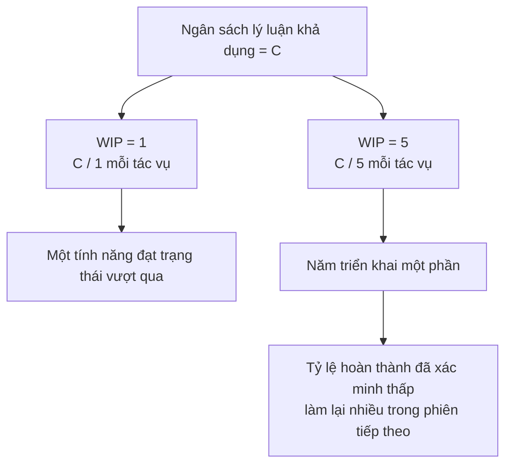

[English Version →](../../../en/lectures/lecture-07-why-agents-overreach-and-under-finish/) | [中文版本 →](../../../zh/lectures/lecture-07-why-agents-overreach-and-under-finish/)

> Ví dụ mã nguồn: [code/](https://github.com/walkinglabs/learn-harness-engineering/blob/main/docs/vi/lectures/lecture-07-why-agents-overreach-and-under-finish/code/)
> Dự án thực hành: [Dự án 04. Phản hồi Runtime và Kiểm soát Phạm vi](./../../projects/project-04-incremental-indexing/index.md)

# Bài 07. Vạch Ranh giới Tác vụ Rõ ràng cho Agent

Bạn nói với Claude Code "thêm xác thực người dùng vào dự án này," và nó bắt đầu sửa đổi database schema, viết route, thay đổi frontend component, và — nhân tiện — tái cấu trúc error-handling middleware. Hai giờ sau bạn kiểm tra: 12 tệp được sửa đổi, 800 dòng mã mới, và không có một tính năng nào hoạt động end-to-end.

Bạn không thể ăn vội nuốt tươi — câu nói này áp dụng đặc biệt cho AI agent. Agent vốn có xung lực "làm thêm một chút" — chúng thấy những thứ liên quan và chỉ xử lý chúng luôn, giống như người đi siêu thị mua một chai nước tương mà ra về đẩy cả xe hàng đầy. Vấn đề là, con người mua quá nhiều chỉ lãng phí tiền; agent làm quá nhiều thứ đồng thời có nghĩa là không cái nào được làm đúng.

Blog kỹ thuật "Effective harnesses for long-running agents" của Anthropic nói rõ ràng: khi các prompt quá rộng, các agent có xu hướng "bắt đầu nhiều thứ cùng một lúc" thay vì "hoàn thành một thứ trước." Các thực hành kỹ thuật Codex của OpenAI cũng thấy điều tương tự — các tác vụ không có kiểm soát phạm vi rõ ràng thấy tỷ lệ hoàn thành giảm mạnh. Đây không phải vấn đề mô hình — đây là vấn đề harness. Bạn chưa vạch ranh giới.

## Sự Chú ý là Tài nguyên Hữu hạn

Đây không phải phép ẩn dụ — đây là toán học. Giả sử năng lực ngữ cảnh của agent là C và nó kích hoạt k tác vụ đồng thời. Mỗi tác vụ nhận được trung bình C/k tài nguyên lý luận. Khi C/k giảm xuống dưới ngưỡng tối thiểu cần thiết để hoàn thành một tác vụ duy nhất, không cái nào trong số chúng được hoàn thành. Bụng bạn chỉ có giới hạn — nhét mười cái bánh bao cùng một lúc và bạn sẽ không tiêu hóa hết tất cả, bạn chỉ bị khó tiêu mười lần.

Hành vi thực tế của Claude Code rất rõ ràng. Yêu cầu nó "thêm đăng ký người dùng" và nó có thể:

1. Tạo User model
2. Viết route đăng ký
3. Nhận thấy cần xác minh email, vậy thêm mail service
4. Thấy mật khẩu cần được hash, vậy mang vào bcrypt
5. Nhận thấy error handling không nhất quán, vậy tái cấu trúc global error middleware
6. Thấy cấu trúc tệp test lộn xộn, vậy sắp xếp lại thư mục

Sau sáu bước, mỗi cái đang làm dở. Không có xác minh end-to-end, mã nửa vời phức tạp cộng lẫn nhau, và phiên tiếp theo để dọn dẹp sẽ hoàn toàn bị lạc. Giống như ai đó đang nấu sáu món đồng thời — mỗi món đều đang trong chảo nhưng chưa cái nào được bày ra đĩa. Tất cả đều cháy.

Dữ liệu thực nghiệm của Anthropic trực tiếp hỗ trợ điều này: các agent sử dụng chiến lược "bước tiếp theo nhỏ" (tương đương WIP=1) cho thấy tỷ lệ hoàn thành tác vụ cao hơn 37% so với các agent sử dụng các prompt rộng. Thú vị hơn, số dòng mã được tạo ra bởi agent tương quan âm yếu với tỷ lệ hoàn thành tính năng thực tế — viết nhiều mã hơn, hoàn thành ít tính năng hơn. Không thể ăn vội nuốt tươi, được chứng minh bằng dữ liệu.

## Luồng Công việc WIP=1





## Các Khái niệm Cốt lõi

- **Vượt phạm vi (Overreach)**: Agent kích hoạt nhiều tác vụ hơn mức tối ưu trong một phiên. Có thể định lượng được — làm 5 tính năng với 0 cái vượt qua end-to-end là vượt phạm vi.
- **Dưới mức hoàn thành (Under-finish)**: Tỷ lệ tác vụ vượt qua xác minh end-to-end, trong tổng số tác vụ được kích hoạt, giảm xuống dưới ngưỡng. Mã được viết nhưng test không vượt qua là dưới mức hoàn thành.
- **Giới hạn WIP (Work-in-Progress Limit)**: Từ phương pháp Kanban. Ý tưởng cốt lõi: giới hạn số lượng tác vụ đang tiến hành cùng một lúc. Đối với agent, WIP=1 là giá trị mặc định an toàn nhất — hoàn thành một cái trước khi bắt đầu cái tiếp theo. Giống như buffet — đừng chồng đĩa, hoàn thành một đĩa rồi quay lại lấy thêm.
- **Bằng chứng Hoàn thành (Completion Evidence)**: Điều kiện có thể xác minh mà một tác vụ phải thỏa mãn để chuyển từ "đang thực hiện" sang "xong." Không có điều này, agent thay thế "mã trông có vẻ ổn" cho "hành vi vượt qua test."
- **Bề mặt Phạm vi (Scope Surface)**: Cấu trúc DAG nơi mỗi nút là một đơn vị công việc và cạnh là các phụ thuộc. Trạng thái giới hạn ở bốn: not_started, active, blocked, passing.
- **Áp lực Hoàn thành (Completion Pressure)**: Lực ràng buộc mà harness tác dụng thông qua giới hạn WIP và yêu cầu bằng chứng hoàn thành, buộc agent hoàn thành tác vụ hiện tại trước khi bắt đầu một cái mới.

## Vượt Phạm vi và Dưới mức Hoàn thành là Cộng sinh

Hai vấn đề này không độc lập — chúng khuếch đại lẫn nhau. Vượt phạm vi làm loãng sự chú ý, sự chú ý bị loãng gây dưới mức hoàn thành, và mã nửa vời còn lại tăng độ phức tạp hệ thống, điều này tiếp tục thúc đẩy vượt phạm vi trong tác vụ tiếp theo. Một vòng lặp vicious.

Theo thuật ngữ Kanban: Định luật Little cho chúng ta biết L = lambda * W. Nếu công việc đang tiến hành L quá cao (làm quá nhiều thứ cùng một lúc), thời gian thực hiện W cho mỗi tác vụ tất yếu tăng lên. Đối với agent, điều này có nghĩa là mỗi tính năng mất nhiều thời gian hơn từ bắt đầu đến hoàn thành đã xác minh, và xác suất thất bại tăng lên.

Đây cũng là một vấn đề cũ trong thế giới con người — Steve McConnell đã ghi lại trong *Rapid Development* rằng scope creep là nguyên nhân hàng đầu gây thất bại dự án. Nhưng con người ít nhất có trực giác "tôi đã làm đủ rồi." Agent thì không. Tạo ra ý tưởng tiếp theo tốn mô hình gần như không có token thêm — viết "để tôi sửa cái này luôn" hầu như không đáng kể — nhưng mỗi sửa đổi bổ sung làm loãng sự chú ý của agent. Giống như buffet nơi mỗi đĩa thêm có chi phí biên gần bằng không, nhưng bụng bạn chỉ có giới hạn.

## Cách Làm Đúng

### 1. Thực thi WIP=1

Đây là phương pháp trực tiếp và hiệu quả nhất. Trong harness của bạn, hãy nói rõ ràng với agent: **chỉ một tác vụ được phép ở trạng thái "active" tại bất kỳ thời điểm nào.** Trong CLAUDE.md của Claude Code hoặc AGENTS.md của Codex, hãy viết:

```
## Quy tắc Làm việc
- Làm việc trên một tính năng tại một thời điểm
- Chỉ bắt đầu tính năng tiếp theo sau khi tính năng hiện tại vượt qua xác minh end-to-end
- Đừng "cũng tái cấu trúc" tính năng B trong khi triển khai tính năng A
```

Giống như ăn buffet — một đĩa mỗi lần, hoàn thành nó trước khi quay lại lấy thêm.

### 2. Định nghĩa Bằng chứng Hoàn thành Rõ ràng cho Mỗi Tác vụ

Xong không phải là "mã được viết" — mà là "xác minh hành vi vượt qua." Trong feature list của bạn, mỗi mục cần một lệnh xác minh:

```
F01: Đăng ký Người dùng
  Xác minh: curl -X POST /api/register -d '{"email":"test@example.com","password":"123456"}' | jq .status == 201
  Trạng thái: passing
```

### 3. Ngoại hóa Bề mặt Phạm vi

Sử dụng tệp có thể đọc bởi máy (JSON hoặc Markdown) để ghi lại tất cả trạng thái tác vụ. Bất kỳ phiên mới nào cũng có thể đọc tệp này và biết ngay: tác vụ nào đang hoạt động? Hành vi nào được coi là xong? Xác minh nào đã vượt qua?

### 4. Theo dõi Tỷ lệ Hoàn thành Đã xác minh

Harness nên liên tục theo dõi VCR (Verified Completion Rate) = tác vụ đã xác minh / tác vụ được kích hoạt. Chặn kích hoạt tác vụ mới khi VCR < 1.0.

## Trường hợp Thực tế

Một dự án REST API với 8 tính năng, hai chiến lược được so sánh:

**Chế độ buffet (không có ràng buộc)**: Agent kích hoạt 5 tính năng đồng thời trong phiên 1. Tạo ra ~800 dòng trên 12 tệp. Tỷ lệ vượt qua test end-to-end: 20% — chỉ đăng ký người dùng hoạt động. 4 tính năng còn lại: database schema được tạo nhưng thiếu logic xác thực, route được định nghĩa nhưng trả về định dạng phản hồi sai. Giống như ai đó nấu sáu món cùng một lúc, chỉ có một món tạm ăn được. Đến cuối phiên 3, chỉ 3 trong 8 tính năng hoàn thành.

**Chế độ một đĩa (WIP=1)**: Agent chỉ làm việc trên đăng ký người dùng trong phiên 1. Tạo ra ~200 dòng trên 4 tệp. Test end-to-end: 100% vượt qua. Commit một triển khai sạch, đã xác minh. Đến cuối phiên 4, 7 trong 8 tính năng hoàn thành (cái thứ 8 bị chặn bởi phụ thuộc bên ngoài).

Kết quả: tổng mã ít hơn (800 vs 1200 dòng) nhưng mã hiệu quả hơn. Tỷ lệ hoàn thành: 87.5% vs 37.5%. Ăn từng miếng một, và bạn thực sự ăn được nhiều hơn.

## Những Điểm chính cần Nhớ

- **WIP=1 là cài đặt an toàn mặc định cho harness agent** — hoàn thành một cái, rồi bắt đầu cái tiếp theo; đừng cố song song hóa. Bạn không thể béo lên trong một bữa ăn.
- **Bằng chứng hoàn thành phải có thể thực thi** — "mã trông có vẻ ổn" không tính; "curl trả về 201" mới tính.
- **Bề mặt phạm vi phải được ngoại hóa như một tệp** — không chỉ đề cập trong hội thoại, mà được ghi lại ở định dạng có thể đọc bởi máy trong repo.
- **Vượt phạm vi và dưới mức hoàn thành là cộng sinh** — giải quyết một cái giải quyết cái kia.
- **"Làm ít nhưng hoàn thành" luôn tốt hơn "làm nhiều nhưng để lại một nửa"** — dòng mã agent và tỷ lệ hoàn thành tính năng tương quan âm. Chất lượng luôn tốt hơn số lượng.

## Đọc thêm

- [Effective harnesses for long-running agents - Anthropic](https://www.anthropic.com/engineering/effective-harnesses-for-long-running-agents) — Blog kỹ thuật của Anthropic, thảo luận chi tiết về chiến lược "bước tiếp theo nhỏ"
- [Harness Engineering - OpenAI](https://openai.com/index/harness-engineering/) — Xử lý đầy đủ về harness engineering của OpenAI
- [Kanban: Successful Evolutionary Change - David Anderson](https://www.goodreads.com/book/show/1070822.Kanban) — Nguồn kinh điển về giới hạn WIP
- [Rapid Development - Steve McConnell](https://www.goodreads.com/book/show/125171.Rapid_Development) — Dữ liệu thực nghiệm về scope creep là nguyên nhân hàng đầu gây thất bại dự án

## Bài tập

1. **Nguyên tử hóa tác vụ**: Chọn một yêu cầu rộng (ví dụ: "triển khai hệ thống quản lý người dùng") và chia thành ít nhất 5 đơn vị công việc nguyên tử. Cho mỗi đơn vị, chỉ định: (a) mô tả hành vi đơn, (b) lệnh xác minh có thể thực thi, (c) các phụ thuộc. Kiểm tra liệu việc phân chia có thỏa mãn ràng buộc WIP=1 không.

2. **Thí nghiệm So sánh**: Chạy cùng dự án hai lần — một lần không có ràng buộc, một lần với WIP=1 được thực thi. So sánh: tỷ lệ hoàn thành đã xác minh, tổng số dòng mã, tỷ lệ mã hiệu quả.

3. **Kiểm toán Bằng chứng Hoàn thành**: Xem xét kết quả của một lần chạy agent gần đây, phân loại từng thay đổi mã là "hành vi đã hoàn thành," "hành vi chưa hoàn thành" hoặc "scaffolding." Thêm các lệnh xác minh còn thiếu cho mỗi hành vi chưa hoàn thành.
