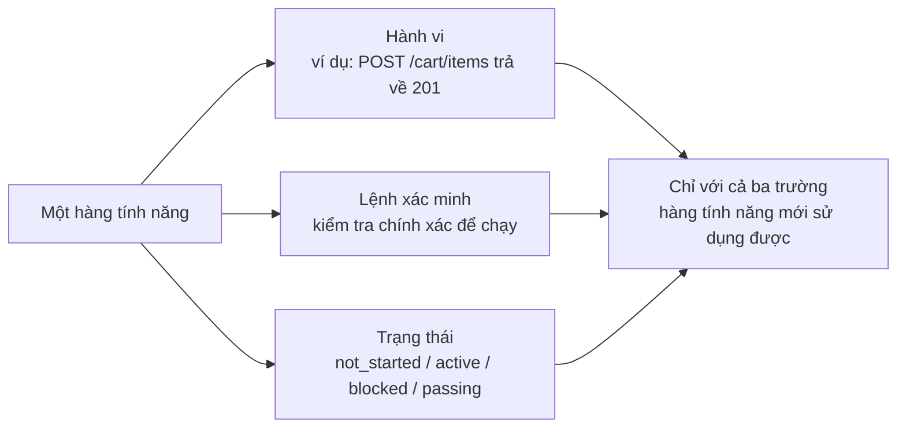
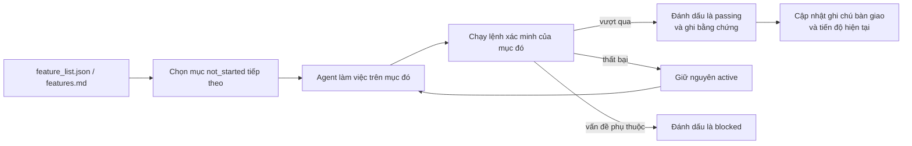

[English Version →](../../../en/lectures/lecture-08-why-feature-lists-are-harness-primitives/) | [中文版本 →](../../../zh/lectures/lecture-08-why-feature-lists-are-harness-primitives/)

> Ví dụ mã nguồn: [code/](https://github.com/walkinglabs/learn-harness-engineering/blob/main/docs/vi/lectures/lecture-08-why-feature-lists-are-harness-primitives/code/)
> Dự án thực hành: [Dự án 04. Phản hồi Runtime và Kiểm soát Phạm vi](./../../projects/project-04-incremental-indexing/index.md)

# Bài 08. Sử dụng Feature List để Ràng buộc những gì Agent Làm

Bạn yêu cầu một agent xây dựng một trang web thương mại điện tử. Sau khi nó hoàn thành, nó nói với bạn "xong." Bạn nhìn vào mã — xác thực người dùng hoạt động, nhưng nút thanh toán trong giỏ hàng không làm gì cả, và luồng thanh toán hoàn toàn không được kết nối. Vấn đề: bạn không bao giờ nói với nó "xong" có nghĩa là gì, vì vậy nó đã sử dụng tiêu chuẩn của riêng mình — "tôi đã viết nhiều mã và nó trông khá đầy đủ."

Feature list, theo mắt nhiều người, chỉ là một ghi chú nhắc nhở — viết mọi thứ xuống để không quên, sau đó để sang một bên. Nhưng trong thế giới harness, feature list không phải là ghi chú cho con người — nó là xương sống của toàn bộ harness. Bộ lập lịch phụ thuộc vào nó để chọn tác vụ, bộ xác minh phụ thuộc vào nó để đánh giá hoàn thành, trình báo cáo bàn giao phụ thuộc vào nó để tạo tóm tắt. Phá vỡ xương sống và toàn bộ cơ thể bị tê liệt.

Cả Anthropic và OpenAI đều nhấn mạnh: **các artifact phải được ngoại hóa.** Trạng thái tính năng phải sống trong một tệp có thể đọc bởi máy trong repo, không phải trong văn bản hội thoại không có cấu trúc.

## Agent Không Biết "Xong" Có nghĩa là Gì

Cả Claude Code lẫn Codex đều không tự động biết ý bạn là gì khi nói "xong." Bạn nói "thêm tính năng giỏ hàng," và sự diễn giải của mô hình có thể là "viết một Cart component và một addToCart method." Nhưng ý bạn là "người dùng có thể duyệt sản phẩm, thêm vào giỏ hàng, và hoàn thành thanh toán end-to-end." Khoảng cách hiểu biết này tồn tại mãi mà không có feature list. Agent sử dụng tiêu chuẩn ẩn của riêng mình — thường là "mã không có lỗi cú pháp rõ ràng." Những gì bạn cần là xác minh hành vi end-to-end. Giống như nhờ bạn mua hoa quả — bạn nói "lấy vài thứ hoa quả" và họ về với chanh. Hoa quả của họ và hoa quả của bạn không phải là cùng loại hoa quả.

Nhìn vào ghi chú tiến độ phổ biến này:

```
Đã làm xác thực người dùng, giỏ hàng hầu như xong, vẫn cần thanh toán
```
Một phiên agent mới có thể trả lời những câu hỏi này từ ghi chú này không? "Hầu như xong" có nghĩa là gì? Test nào giỏ hàng đã vượt qua? Điều gì đang chặn thanh toán? Câu trả lời cho tất cả là "không ai biết." Giống như nói với bác sĩ "bụng tôi đau, gần đây ổn hơn" — họ có thể kê thuốc gì?

Kết quả: phiên mới dành 20 phút để suy ra trạng thái dự án, và có thể triển khai lại các tính năng đã hoàn thành. Dữ liệu kỹ thuật của Anthropic cho thấy bản ghi tiến độ tốt giảm thời gian chẩn đoán khởi động phiên 60-80%.

## Máy trạng thái Tính năng





## Các Khái niệm Cốt lõi

- **Feature list là nguyên lý cơ bản của harness**: Không phải "công cụ lập kế hoạch tùy chọn," mà là cấu trúc dữ liệu nền tảng mà tất cả các thành phần harness khác phụ thuộc vào. Giống như cấu trúc bảng cơ sở dữ liệu — bạn không thể nói "hãy bỏ qua khóa chính."
- **Cấu trúc ba yếu tố**: Mỗi mục tính năng là một bộ ba `(mô tả hành vi, lệnh xác minh, trạng thái hiện tại)`. Thiếu bất kỳ yếu tố nào làm cho mục không đầy đủ.
- **Mô hình máy trạng thái**: Mỗi mục tính năng có bốn trạng thái — `not_started`, `active`, `blocked`, `passing`. Chuyển đổi trạng thái được kiểm soát bởi harness, không được thay đổi tự do bởi agent.
- **Gating trạng thái vượt qua (Pass-state gating)**: Cách duy nhất một tính năng chuyển từ `active` sang `passing` là thực thi thành công lệnh xác minh. Điều này không thể đảo ngược — một khi `passing`, nó không thể quay lại. Giống như vượt qua bài thi có nghĩa là bạn đã qua, bạn không thể hồi tố thay đổi điểm.
- **Nguồn sự thật duy nhất**: Tất cả thông tin về "những gì cần làm" phải bắt nguồn từ một feature list. Không có mâu thuẫn giữa feature list và lịch sử hội thoại.
- **Áp lực ngược (Back-pressure)**: Số lượng tính năng chưa vượt qua là áp lực mà harness tác dụng lên agent. Áp lực bằng không = dự án hoàn thành.

## Tại sao Feature List Phải là "Nguyên lý Cơ bản"

Tài liệu là để con người đọc; nguyên lý cơ bản là để hệ thống thực thi. Tài liệu có thể bị bỏ qua; nguyên lý cơ bản không thể bị vượt qua.

Nghĩ về nó như ràng buộc trigger cơ sở dữ liệu vs. kiểm tra lớp ứng dụng: cái trước được thực thi bởi engine cơ sở dữ liệu, không có SQL nào có thể bỏ qua nó; cái sau phụ thuộc vào tính đúng đắn của mã ứng dụng và có thể vô tình bị vượt qua. Feature list như nguyên lý cơ bản harness phục vụ bốn thành phần harness cụ thể:

1. **Bộ lập lịch (Scheduler)**: Đọc trạng thái, chọn tính năng `not_started` tiếp theo. Giống như hệ thống lập kế hoạch sản xuất nhà máy.
2. **Bộ xác minh (Verifier)**: Thực thi lệnh xác minh, quyết định có cho phép chuyển đổi trạng thái không. Giống như kiểm tra chất lượng.
3. **Trình báo cáo bàn giao (Handoff Reporter)**: Tự động tạo tóm tắt bàn giao phiên từ feature list. Giống như báo cáo ca tự động.
4. **Trình theo dõi tiến độ (Progress Tracker)**: Đếm phân phối trạng thái, cung cấp số liệu sức khỏe dự án. Giống như dashboard.

## Cách Làm Đúng

### 1. Định nghĩa Định dạng Feature List Tối giản

Bạn không cần một hệ thống phức tạp — một tệp Markdown hoặc JSON có cấu trúc là đủ. Điều quan trọng là mỗi mục phải có bộ ba:

```json
{
  "id": "F03",
  "behavior": "POST /cart/items với {product_id, quantity} trả về 201",
  "verification": "curl -X POST http://localhost:3000/api/cart/items -H 'Content-Type: application/json' -d '{\"product_id\":1,\"quantity\":2}' | jq .status == 201",
  "state": "passing",
  "evidence": "commit abc123, test output log"
}
```

### 2. Để Harness Kiểm soát Chuyển đổi Trạng thái

Agent không thể trực tiếp thay đổi trạng thái của tính năng thành `passing`. Nó chỉ có thể gửi yêu cầu xác minh; harness thực thi lệnh xác minh và quyết định có cho phép chuyển đổi không. Đây là "pass-state gating."

### 3. Viết Quy tắc trong CLAUDE.md

```
## Quy tắc Feature List
- Tệp feature list: /docs/features.md
- Chỉ một tính năng active tại một thời điểm
- Lệnh xác minh phải vượt qua trước khi đánh dấu là passing
- Đừng tự mình sửa đổi trạng thái feature list — script xác minh cập nhật chúng tự động
```

### 4. Hiệu chỉnh Độ hạt

Mỗi mục tính năng phải có phạm vi "có thể hoàn thành trong một phiên." Quá rộng thì không xong; quá hẹp thì overhead quản lý tăng lên. "Người dùng có thể thêm mục vào giỏ hàng" là độ hạt tốt. "Triển khai giỏ hàng" là quá rộng. "Tạo trường tên trên Cart model" là quá hẹp. Giống như cắt bít tết — không phải cả miếng, và cũng không phải thịt băm.

## Trường hợp Thực tế

Một nền tảng thương mại điện tử với 10 tính năng. Hai cách tiếp cận theo dõi được so sánh:

**Chế độ ghi chú nhắc nhở**: Agent sử dụng ghi chú không có cấu trúc. Sau 3 phiên, ghi chú trở thành "đã làm xác thực người dùng và danh sách sản phẩm, giỏ hàng hầu như xong nhưng có lỗi, thanh toán chưa bắt đầu." Phiên mới cần 20 phút để suy ra trạng thái, cuối cùng triển khai lại các tính năng đã hoàn thành. Giống như danh sách mua sắm của bạn nói "sữa, bánh mì và cái đó" — ở cửa hàng, bạn vẫn không biết mua gì.

**Chế độ xương sống**: Mỗi tính năng có trạng thái và lệnh xác minh rõ ràng. Phiên mới đọc feature list và trong 3 phút biết: F01-F05 là `passing`, F06 là `active`, F07-F10 là `not_started`. Tiếp tục từ F06 trực tiếp, không có làm lại nào.

Kết quả định lượng: các dự án sử dụng feature list có cấu trúc cho thấy tỷ lệ hoàn thành tính năng cao hơn 45% so với theo dõi tự do, với zero triển khai trùng lặp.

## Những Điểm chính cần Nhớ

- **Feature list là xương sống của harness**, không phải ghi chú cho con người. Bộ lập lịch, bộ xác minh và trình báo cáo bàn giao đều phụ thuộc vào chúng.
- **Mỗi mục tính năng phải có bộ ba**: mô tả hành vi + lệnh xác minh + trạng thái hiện tại. Thiếu một yếu tố thì không đầy đủ — giống như ghế ba chân thiếu một chân.
- **Chuyển đổi trạng thái được kiểm soát bởi harness** — agent không thể tự mình thay đổi trạng thái. Vượt qua xác minh = con đường nâng cấp duy nhất.
- **Feature list là nguồn sự thật duy nhất của dự án** — tất cả thông tin "phải làm gì" đều bắt nguồn từ một danh sách.
- **Hiệu chỉnh độ hạt thành "có thể hoàn thành trong một phiên."**

## Đọc thêm

- [Building Effective Agents - Anthropic](https://www.anthropic.com/research/building-effective-agents) — Xác định rõ ràng feature list là "cấu trúc dữ liệu cốt lõi" để kiểm soát phạm vi agent
- [Harness Engineering - OpenAI](https://openai.com/index/harness-engineering/) — Nhấn mạnh nguyên tắc "ngoại hóa artifact"
- [Design by Contract - Bertrand Meyer](https://www.goodreads.com/book/show/130439.Object_Oriented_Software_Construction) — Nguyên tắc thiết kế hợp đồng, nền tảng lý thuyết của feature list
- [How Google Tests Software](https://www.goodreads.com/book/show/13563030-how-google-tests-software) — Tháp kiểm thử và thực hành kỹ thuật đặc tả hành vi

## Bài tập

1. **Thiết kế Feature List**: Định nghĩa một JSON schema feature list tối giản. Bao gồm: id, mô tả hành vi, lệnh xác minh, trạng thái hiện tại, tham chiếu bằng chứng. Sử dụng nó để mô tả một dự án thực tế với 5 tính năng.

2. **So sánh Độ khắt khe Xác minh**: Chọn 3 tính năng và thiết kế cả xác minh "lỏng" (ví dụ: "mã không có lỗi cú pháp") và xác minh "nghiêm" (ví dụ: "test end-to-end vượt qua"). So sánh tỷ lệ dương tính giả dưới mỗi cách tiếp cận.

3. **Kiểm toán Nguyên tắc Nguồn duy nhất**: Xem xét một dự án agent hiện có và kiểm tra thông tin phạm vi mâu thuẫn với feature list (yêu cầu ẩn trong hội thoại, chú thích TODO trong mã, v.v.). Thiết kế kế hoạch để hợp nhất tất cả thông tin vào feature list.
