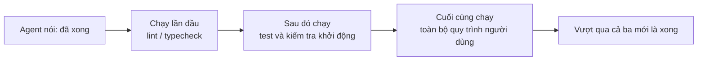
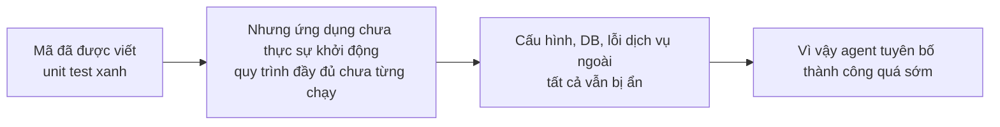

[English Version →](../../../en/lectures/lecture-09-why-agents-declare-victory-too-early/) | [中文版本 →](../../../zh/lectures/lecture-09-why-agents-declare-victory-too-early/)

> Mã nguồn ví dụ cho bài giảng này: [code/](https://github.com/walkinglabs/learn-harness-engineering/blob/main/docs/vi/lectures/lecture-09-why-agents-declare-victory-too-early/code/)
> Thực hành: [Dự án 05. Để agent tự xác minh công việc của mình](./../../projects/project-05-grounded-qa-verification/index.md)

# Bài 9. Ngăn chặn Agent Tuyên bố Thành công Quá sớm

Bạn yêu cầu một agent thực hiện tính năng "đặt lại mật khẩu". Nó sửa đổi cấu trúc cơ sở dữ liệu, viết API endpoint, thêm mẫu email, chạy unit test (tất cả đều qua), và sau đó tự tin nói với bạn rằng "đã xong." Nhưng khi bạn thực sự thử chạy nó—liên kết đặt lại mật khẩu không thể gửi được (thiếu cấu hình dịch vụ email), quá trình di chuyển cơ sở dữ liệu bị lỗi giữa chừng (không nhất quán cấu trúc), và toàn bộ quy trình chưa được thực thi thực tế dù chỉ một lần.

Cảm giác này không có gì lạ—giống như việc điền kín toàn bộ bài thi, tự tin nộp bài đầu tiên, chỉ để trượt khi có điểm. Chỉ vì bài thi được viết kín không có nghĩa là các câu trả lời đều đúng.

Đây không phải là một sự cố cá biệt. Bài báo ICML kinh điển năm 2017 của Guo và cộng sự đã chứng minh: **các mạng nơ-ron hiện đại thường quá tự tin một cách có hệ thống**—độ tự tin mà các mô hình báo cáo cao hơn đáng kể so với độ chính xác thực tế của chúng. Điều này cũng đúng với các AI coding agent: chúng "cảm thấy" chúng đã xong, nhưng thực tế, chúng còn lâu mới xong. Harness của bạn phải thay thế "cảm giác" của agent bằng sự xác minh dựa trên thực thi bên ngoài.

## Con dốc trơn trượt

Các tuyên bố hoàn thành sớm hầu như luôn theo cùng một khuôn mẫu: mã trông có vẻ ổn—cú pháp đúng, logic có vẻ hợp lý và phân tích tĩnh không cho thấy lỗi rõ ràng. Nhưng harness không bắt buộc xác minh thực thi toàn diện, do đó agent bỏ qua việc thực sự chạy mã hoặc chỉ chạy các bài kiểm thử một phần. Nó chạy unit test nhưng bỏ qua integration test; nó chạy test nhưng không kiểm tra độ phủ (coverage). Cuối cùng, "mã trông có vẻ ổn" được coi là bằng chứng cho "tính năng đã hoàn thành." Và bài thi được nộp.

Thông tin bị mất đi ở mỗi bước. Từ thông số kỹ thuật tác vụ đến triển khai mã rồi đến hành vi runtime, mọi sự chuyển đổi đều có thể đưa vào sự sai lệch, và mỗi bước xác minh bị bỏ qua đều làm trầm trọng thêm sự bất đối xứng thông tin.

## Kiểm tra Kết thúc Ba Lớp





## Các Khái niệm Cốt lõi

- **Tuyên bố Hoàn thành Sớm**: Agent khẳng định tác vụ đã hoàn thành, nhưng vẫn tồn tại các thông số kỹ thuật chưa được đáp ứng. Vấn đề cốt lõi: agent đánh giá dựa trên sự tự tin cục bộ ở cấp độ mã nguồn, trong khi tính đúng đắn ở cấp độ hệ thống đòi hỏi xác minh tổng thể.
- **Sai lệch Hiệu chuẩn Độ Tự tin**: Khoảng cách có hệ thống giữa độ tự tin hoàn thành tự báo cáo của agent và chất lượng hoàn thành thực tế. Đối với các tác vụ đa tệp phức tạp, độ lệch này rất dương—agent luôn tự tin hơn so với khả năng thực hiện thực tế. Giống như một học sinh luôn đánh giá quá cao điểm số của mình sau kỳ thi.
- **Tiêu chí Kết thúc**: Một tập hợp các điều kiện đánh giá rõ ràng, có thể thực thi được xác định trong harness. Agent phải thỏa mãn tất cả các điều kiện trước khi tuyên bố hoàn thành. "Đã xong" chuyển từ một đánh giá chủ quan sang một xác định khách quan.
- **Cổng Kép Xác minh-Xác nhận (Verification-Validation)**: Lớp xác minh đầu tiên kiểm tra "mã có triển khai chính xác hành vi được chỉ định không"; lớp xác nhận thứ hai kiểm tra "hành vi cấp hệ thống có đáp ứng các yêu cầu end-to-end không". Cả hai đều phải qua để được coi là hoàn thành.
- **Tín hiệu Phản hồi Runtime**: Nhật ký (logs), trạng thái tiến trình và kiểm tra tình trạng (health checks) từ việc thực thi chương trình. Đây là cơ sở khách quan để harness đánh giá chất lượng hoàn thành.
- **Ràng buộc Ưu tiên Hoàn thành**: Đầu tiên xác minh tính đúng đắn của chức năng, sau đó xử lý hiệu suất, và cuối cùng giải quyết phong cách. Việc tái cấu trúc (refactoring) bị cấm cho đến khi chức năng cốt lõi được xác minh.

## Vượt qua Unit Test ≠ Tác vụ Hoàn thành

Đây là cạm bẫy phổ biến nhất và cũng nguy hiểm nhất. Agent đã viết mã, chạy unit test, tất cả đều xanh và nói "đã xong." Nhưng triết lý thiết kế của unit test—cô lập đơn vị được kiểm tra và giả lập (mocking) các phụ thuộc—chính xác là điều làm cho chúng không có khả năng phát hiện các vấn đề xuyên thành phần:

**Không khớp Giao diện (Interface Mismatch)**: Đường dẫn tệp được chuyển bởi quá trình render cho preload script là đường dẫn tương đối, nhưng preload script mong đợi đường dẫn tuyệt đối. Cả hai bài kiểm tra đơn vị tương ứng của chúng đều sử dụng mock và đã vượt qua. Vấn đề chỉ được phát hiện trong quá trình kiểm tra end-to-end. Giống như mỗi nhạc công trong một ban nhạc thực hành hoàn hảo khi chơi một mình, nhưng lại nhận ra họ đang chơi ở các tông khác nhau khi chơi cùng nhau.

**Lỗi Truyền Trạng thái (State Propagation Errors)**: Một quá trình migration cơ sở dữ liệu thay đổi cấu trúc bảng, nhưng lớp bộ nhớ cache ORM vẫn giữ các mục cache cho cấu trúc cũ. Unit test cung cấp một môi trường mock mới mỗi lần, điều này sẽ không để lộ sự không nhất quán trạng thái xuyên lớp này.

**Phụ thuộc Môi trường (Environment Dependency)**: Mã hoạt động chính xác trong môi trường test (nơi mọi thứ được mock) nhưng thất bại trong môi trường thực do sự khác biệt về cấu hình, độ trễ mạng hoặc dịch vụ không khả dụng. Giống như hát hoàn hảo trong phòng tập, nhưng gặp sự cố thiết bị âm thanh trên sân khấu.

### "Nhân tiện Tái cấu trúc luôn" là Thuốc độc đối với việc Đánh giá Hoàn thành

Claude Code có một kiểu hành vi phổ biến: nó bắt đầu tái cấu trúc mã, tối ưu hóa hiệu suất và cải thiện phong cách trước khi chức năng cốt lõi vượt qua xác minh. Câu nói của Knuth, "Tối ưu hóa sớm là nguồn gốc của mọi tội lỗi," có một ý nghĩa mới trong kịch bản agent—việc tái cấu trúc làm thay đổi ranh giới giữa mã đã được xác minh và chưa được xác minh, có khả năng phá vỡ các luồng mã trước đó đã ngầm định là đúng. Giống như việc bạn chép lại các câu trả lời trắc nghiệm của mình để có định dạng đẹp hơn trước khi bạn hoàn thành các câu hỏi tự luận toán—không chỉ lãng phí thời gian mà bạn còn có thể chép sai.

### Sự Sai lệch có Hệ thống trong Tự đánh giá

Anthropic đã phát hiện ra một mô hình lỗi sâu sắc hơn trong nghiên cứu năm 2026 của họ: **khi một agent được yêu cầu đánh giá công việc của chính nó, nó sẽ đưa ra các đánh giá quá tích cực một cách có hệ thống—ngay cả khi một người quan sát con người sẽ coi chất lượng rõ ràng là dưới tiêu chuẩn.** Điều này giống như yêu cầu một học sinh tự chấm điểm bài thi của mình—họ sẽ luôn đặc biệt khoan dung với câu trả lời của chính họ.

Vấn đề này đặc biệt nghiêm trọng trong các tác vụ mang tính chủ quan (chẳng hạn như thẩm mỹ thiết kế)—việc liệu một "bố cục có tinh tế hay không" là một cuộc gọi phán đoán, và agent có xu hướng đáng tin cậy về phía tích cực. Ngay cả đối với các tác vụ có thể xác minh kết quả, hiệu suất của agent cũng có thể bị cản trở bởi khả năng phán đoán kém.

Giải pháp không phải là làm cho agent "khách quan hơn"—cùng một mô hình tạo ra và đánh giá vốn có xu hướng hào phóng với chính nó. **Giải pháp là tách "người làm" khỏi "người kiểm tra".** Giống như một học sinh không nên tự chấm bài thi của mình—bạn cần một người chấm điểm độc lập.

Một agent đánh giá độc lập, được tinh chỉnh đặc biệt để "kén chọn", hiệu quả hơn nhiều so với việc để agent tạo tự đánh giá. Dữ liệu thực nghiệm từ Anthropic:

| Kiến trúc | Thời gian chạy | Chi phí | Chức năng Cốt lõi Hoạt động? |
|--------------|---------|------|------------------------|
| Agent Đơn lẻ (chạy trần) | 20 phút | $9 | Không (các thực thể trò chơi không phản hồi với đầu vào) |
| Ba Agent (planner + generator + evaluator) | 6 giờ | $200 | Có (trò chơi có thể chơi hoàn toàn) |

Đây là cùng một mô hình (Opus 4.5) với cùng một prompt ("xây dựng một trình chỉnh sửa trò chơi retro 2D"). Sự khác biệt duy nhất là harness—từ "chạy trần" đến "planner mở rộng yêu cầu → generator thực hiện từng tính năng → evaluator thực hiện kiểm tra nhấp chuột thực tế bằng Playwright".

> Nguồn: [Anthropic: Harness design for long-running application development](https://www.anthropic.com/engineering/harness-design-long-running-apps)

## Cách Ngăn chặn Việc Nộp bài Sớm

### 1. Ngoại hóa việc Đánh giá Kết thúc

Việc đánh giá hoàn thành không nên do chính agent thực hiện. Harness phải thực hiện xác nhận kết thúc một cách độc lập, sử dụng các tín hiệu runtime làm đầu vào chứ không phải sự tự tin của agent. Viết rõ điều này trong `CLAUDE.md`:

```
## Định nghĩa Hoàn thành (Definition of Done)
- Tính năng hoàn thành = xác minh end-to-end đã qua, không phải "mã đã được viết"
- Các cấp độ xác minh bắt buộc:
  1. Unit tests pass
  2. Integration tests pass
  3. End-to-end flow verification passes
- Không chuyển sang cấp độ 2 nếu cấp độ 1 thất bại
- Không chuyển sang cấp độ 3 nếu cấp độ 2 thất bại
```

### 2. Xây dựng Xác nhận Kết thúc Ba Lớp

- **Lớp 1: Cú pháp và Phân tích Tĩnh**. Chi phí thấp nhất, ít thông tin nhất, nhưng phải vượt qua. Đây là mức kiểm tra tối thiểu—bạn phải đánh vần đúng các từ trước khi chúng ta xem xét bất cứ thứ gì khác.
- **Lớp 2: Xác minh Hành vi Runtime**. Thực thi test, kiểm tra khởi động ứng dụng, xác nhận đường dẫn quan trọng. Đây là bằng chứng cốt lõi của sự hoàn thành. Chỉ viết ra thôi là chưa đủ; nó phải chạy được.
- **Lớp 3: Xác nhận Cấp Hệ thống**. Kiểm thử end-to-end, xác nhận tích hợp, mô phỏng kịch bản người dùng. Tuyến phòng thủ cuối cùng chống lại các tuyên bố sớm. Nó không chỉ phải chạy; nó phải chạy chính xác.

### 3. Thiết kế "Bút đỏ Đánh dấu" Tốt cho Agents

OpenAI đã giới thiệu một mẫu đặc biệt hiệu quả trong quá trình thực hành Codex của họ: **các thông báo lỗi cho agent phải bao gồm các hướng dẫn sửa chữa**. Đừng chỉ vẽ một dấu chéo đỏ lớn như một người chấm điểm lười biếng; hãy giống như một giáo viên giỏi và viết "đây là cách bạn nên thay đổi điều này" ở lề. Đừng sử dụng `"Test failed"`, mà hãy sử dụng `"Test failed: POST /api/reset-password returned 500. Check that the email service config exists in environment variables. The template file should be at templates/reset-email.html."` Phản hồi cụ thể, có thể hành động này cho phép agent tự sửa lỗi mà không cần sự can thiệp của con người.

### 4. Nắm bắt các Tín hiệu Runtime

Các tín hiệu runtime hiệu quả bao gồm:
- Ứng dụng có khởi động thành công và đạt đến trạng thái sẵn sàng không?
- Các đường dẫn tính năng quan trọng có thực thi thành công trong runtime không?
- Các thao tác ghi cơ sở dữ liệu, hoạt động tệp và các hiệu ứng phụ khác có chính xác không?
- Các tài nguyên tạm thời có được dọn dẹp không?

## Trường hợp Thực tế

**Tác vụ**: Triển khai chức năng đặt lại mật khẩu người dùng. Bao gồm hoạt động cơ sở dữ liệu, gửi email và sửa đổi API endpoint.

**Đường dẫn nộp bài sớm**: Agent sửa đổi cấu trúc cơ sở dữ liệu, viết API endpoint, thêm mẫu email, chạy unit test (qua) và tuyên bố hoàn thành. Bài kiểm tra đã được điền đầy đủ.

**Các điểm trừ thực tế**: (1) Luồng end-to-end chưa được kiểm tra—việc gửi và xác minh thực tế liên kết đặt lại chưa bao giờ được xác nhận. (2) Quá trình migration cơ sở dữ liệu thất bại sau khi thực thi một phần, gây ra sự không nhất quán cấu trúc. (3) Cấu hình dịch vụ email bị thiếu trong môi trường đích.

**Sự can thiệp của Harness**: Xác nhận kết thúc bị bắt buộc—(1) Khởi động toàn bộ ứng dụng để xác minh khả năng truy cập endpoint đặt lại; (2) Thực thi toàn bộ quy trình đặt lại; (3) Xác minh tính nhất quán của trạng thái cơ sở dữ liệu. Tất cả các khiếm khuyết đã được tìm thấy trong phiên, tiết kiệm 5-10 lần chi phí của các bản sửa lỗi sau này. Người chấm điểm độc lập đã tìm ra các vấn đề thực sự.

## Những Điểm chính cần Nhớ

- **Các Agent thường quá tự tin một cách có hệ thống**—sai lệch hiệu chuẩn độ tự tin là một thực tế khách quan. Điền kín bài kiểm tra không có nghĩa là bạn đã làm đúng.
- **Đánh giá hoàn thành phải được ngoại hóa**—harness tự xác minh một cách độc lập; đừng tin vào "cảm giác" của agent. Học sinh không thể tự chấm bài thi của mình.
- **Cả ba lớp xác nhận đều rất cần thiết**—qua được cú pháp, qua được hành vi, qua được hệ thống, tiến triển từng lớp một.
- **Các thông báo lỗi nên giống như việc dùng bút đỏ đánh dấu của một giáo viên giỏi**—bao gồm các bước sửa chữa cụ thể để agent có thể tự sửa đổi.
- **Không tái cấu trúc (refactoring) cho đến khi chức năng cốt lõi được xác minh**—ràng buộc ưu tiên hoàn thành là chìa khóa để ngăn chặn tối ưu hóa sớm.

## Đọc thêm

- [On Calibration of Modern Neural Networks - Guo et al.](https://arxiv.org/abs/1706.04599) — Chứng minh các mạng sâu hiện đại thường quá tự tin một cách có hệ thống
- [Building Effective Agents - Anthropic](https://www.anthropic.com/research/building-effective-agents) — Vai trò quan trọng của bằng chứng runtime trong việc đánh giá hoàn thành
- [Harness Engineering - OpenAI](https://openai.com/index/harness-engineering/) — Tuyên bố hoàn thành sớm là một trong những chế độ lỗi chính của các agent
- [The Art of Software Testing - Myers](https://www.goodreads.com/book/show/137543.The_Art_of_Software_Testing) — Tài liệu tham khảo kinh điển về phân cấp và hiệu quả của phương pháp kiểm thử

## Bài tập

1. **Thiết kế Hàm Xác nhận Kết thúc**: Thiết kế một quy trình xác nhận kết thúc hoàn chỉnh cho một tác vụ liên quan đến việc di chuyển cơ sở dữ liệu và sửa đổi API. Liệt kê các tín hiệu runtime cần thiết và các tiêu chí đạt/trượt (pass/fail) cho từng tín hiệu. Chạy nó trên một tác vụ thực tế và ghi lại những vấn đề tiềm ẩn mà nó tìm thấy.

2. **Đo lường Sai lệch Hiệu chuẩn**: Chọn 10 loại tác vụ lập trình khác nhau và ghi lại độ tự tin hoàn thành tự báo cáo của agent so với chất lượng hoàn thành thực tế. Tính toán giá trị sai lệch và phân tích mối quan hệ của nó với độ phức tạp của tác vụ.

3. **Thử nghiệm Phòng thủ Đa Lớp**: Chạy ba cấu hình trên cùng một bộ tác vụ—(a) chỉ phân tích tĩnh, (b) thêm unit testing, (c) xác nhận đầy đủ ba lớp. So sánh tỷ lệ các tuyên bố hoàn thành sớm và số lượng các khiếm khuyết không bị phát hiện.