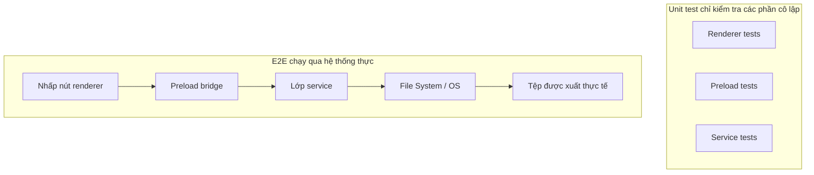
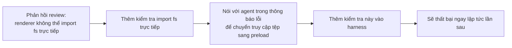

[English Version →](../../../en/lectures/lecture-10-why-end-to-end-testing-changes-results/) | [中文版本 →](../../../zh/lectures/lecture-10-why-end-to-end-testing-changes-results/)

> Ví dụ mã nguồn cho bài giảng này: [code/](https://github.com/walkinglabs/learn-harness-engineering/blob/main/docs/vi/lectures/lecture-10-why-end-to-end-testing-changes-results/code/)
> Thực hành: [Dự án 05. Để agent xác minh công việc của chính nó](./../../projects/project-05-grounded-qa-verification/index.md)

# Bài 10. Chỉ Testing End-to-End mới là Xác minh Thực sự

Bạn yêu cầu agent thêm tính năng xuất tệp vào ứng dụng Electron. Nó viết component render process, preload script và logic lớp service. Unit test cho từng component vượt qua hoàn hảo. Agent nói, "Xong rồi." Khi bạn thực sự nhấp vào nút xuất — định dạng đường dẫn tệp sai, thanh tiến trình không cập nhật, và xuất tệp lớn gây rò rỉ bộ nhớ. Năm lỗi ranh giới component, và unit test không bắt được một cái nào.

Giống như buổi tập hợp xướng — từng bè tiếng nghe hoàn hảo khi hát riêng, nhưng khi hát cùng nhau, bè soprano nhanh hơn nửa nhịp so với bè bass, và phần đệm lạc một nửa cung so với giai điệu chính. Từng phần "đúng" riêng lẻ, nhưng tổng thể lại không đồng điệu.

Tháp kiểm thử của Google cho chúng ta biết: số lượng lớn unit test là nền tảng, nhưng nếu dừng lại ở đó, bạn sẽ bỏ lỡ có hệ thống các vấn đề tương tác component. Đối với AI coding agent, vấn đề này còn nghiêm trọng hơn — các agent có xu hướng chỉ chạy các test nhanh nhất và sau đó tuyên bố hoàn thành. **Chỉ testing end-to-end mới có thể chứng minh rằng các lỗi cấp hệ thống không tồn tại.**

## Điểm Mù của Unit Testing

Triết lý thiết kế của unit testing là cô lập — mock các phụ thuộc và chỉ tập trung vào đơn vị đang được test. Triết lý này làm cho unit testing nhanh và chính xác, nhưng nó cũng tạo ra các điểm mù có hệ thống. Giống như từng bè tiếng tập với tai nghe trong buổi tập hợp xướng — nghe ổn với họ, nhưng các vấn đề chỉ xuất hiện khi họ hát cùng nhau:

**Không khớp giao diện**: Đường dẫn tệp được truyền bởi render process cho preload script là đường dẫn tương đối, nhưng preload script mong đợi đường dẫn tuyệt đối. Unit test tương ứng của chúng đều sử dụng mock và vượt qua. Vấn đề chỉ được phát hiện khi luồng end-to-end được thực thi — giống như hai bè tiếng tập độc lập và cảm thấy ổn, chỉ để nhận ra trong buổi hòa tấu rằng một bè đang hát nhịp 4/4 và cái kia nhịp 3/4.

**Lỗi Truyền trạng thái**: Một database migration thay đổi schema bảng, nhưng lớp caching ORM vẫn giữ các cache entry cho schema cũ. Unit test cung cấp một môi trường mock hoàn toàn mới mỗi lần, điều này sẽ không làm lộ ra sự không nhất quán trạng thái xuyên lớp này. Giống như thay lời bài hát, nhưng ai đó vẫn đang hát phiên bản cũ.

**Vấn đề Vòng đời Tài nguyên**: Việc thu thập và giải phóng file handle, database connection và network socket trải dài trên nhiều component. Unit test tạo và hủy tài nguyên độc lập cho mỗi test, không thể làm lộ ra tranh chấp hoặc rò rỉ tài nguyên. Giống như từng bè tiếng lần lượt sử dụng microphone trong buổi tập, nhưng khi tất cả lên sân khấu cùng nhau, không đủ mic cho tất cả.

**Phụ thuộc Môi trường**: Mã hoạt động đúng trong môi trường test (nơi mọi thứ được mock) nhưng thất bại trong môi trường thực do sự khác biệt cấu hình, độ trễ mạng, hoặc dịch vụ không khả dụng. Giống như hát hoàn hảo trong phòng tập, nhưng gặp phản hồi âm thanh và can thiệp gió ở một lễ hội ngoài trời.

## Testing End-to-End Không Chỉ Thay đổi Kết quả, Nó Thay đổi Hành vi

Đây là điều mà nhiều người không nhận ra: khi một agent biết công việc của nó sẽ được đưa qua testing end-to-end, hành vi lập trình của nó thay đổi.

1. **Cân nhắc Tương tác Component**: Trong khi viết mã, nó sẽ nghĩ về "cách giao diện này kết nối với upstream," thay vì chỉ tập trung vào một hàm duy nhất. Giống như biết cuối cùng bạn sẽ hát cùng nhau, bạn sẽ chú ý đến các bè khác trong khi tập.
2. **Tôn trọng Ranh giới Kiến trúc**: Trong các hệ thống có ràng buộc kiến trúc, testing end-to-end buộc agent phải tuân thủ các quy tắc ranh giới. Giống như bản nhạc được ghi chú "tăng âm lượng ở đây," bạn phải tuân theo.
3. **Xử lý Đường dẫn Lỗi**: Test end-to-end thường bao gồm các kịch bản thất bại, buộc agent phải xem xét xử lý ngoại lệ. Giống như mô phỏng "điều gì sẽ xảy ra nếu mic đột nhiên tắt" trong buổi tập, để bạn biết phải làm gì.

## Tháp Kiểm thử và Đẩy Phản hồi Review Lên Cấp cao hơn





Trong các thực hành kỹ thuật Codex, OpenAI nhấn mạnh: **các thông báo lỗi được viết cho agent phải bao gồm hướng dẫn sửa chữa.** Đừng chỉ viết `"Direct filesystem access in renderer"`; viết `"Direct filesystem access in renderer. All file operations must go through the preload bridge. Move this call to preload/file-ops.ts and invoke it via window.api."` Điều này biến các quy tắc kiến trúc thành một vòng lặp tự sửa chữa. Giống như người chỉ huy hợp xướng không chỉ nói "bạn hát sai rồi," mà còn nói "bạn nhanh hơn nửa nhịp ở đây, hãy nghe nhịp của bè alto, và vào ở nhịp 32."

## Các Khái niệm Cốt lõi

- **Lỗi Ranh giới Component**: Component A và B đều vượt qua unit test của chúng, nhưng tương tác của chúng tạo ra hành vi không đúng. Đây là loại vấn đề mà testing end-to-end giỏi bắt nhất — giống như các bè hợp xướng đúng riêng lẻ nhưng không đồng điệu cùng nhau.
- **Gradient Đủ kiểm thử (Testing Adequacy Gradient)**: Lỗi được bắt bởi unit test <= lỗi được bắt bởi integration test <= lỗi được bắt bởi test end-to-end. Mỗi lớp lên cao hơn tăng khả năng phát hiện.
- **Quy tắc Thực thi Ranh giới Kiến trúc**: Biến các quy tắc từ tài liệu kiến trúc (như "render process không thể truy cập trực tiếp hệ thống tệp") thành các kiểm tra tự động có thể thực thi. Từ "viết trên giấy" thành "chạy trong CI."
- **Đẩy Phản hồi Review (Review Feedback Promotion)**: Chuyển đổi các nhận xét review mã lặp đi lặp lại thành test tự động. Mỗi lần một vấn đề lặp lại được tìm thấy, thêm một quy tắc, và harness tự động trở nên mạnh hơn. Giống như người chỉ huy biến các lỗi tập phổ biến thành bài tập khởi động — lần sau khi mắc cùng lỗi, bài tập tự nó làm lộ ra mà người chỉ huy không cần nói gì.
- **Thông báo Lỗi Hướng Agent**: Thông báo lỗi không chỉ nên nêu "điều gì đã sai," mà còn nói với agent chính xác cách sửa nó. Điều này biến lỗi test thành vòng phản hồi tự sửa chữa.

## Cách Thực hiện

### 0. Định nghĩa Ranh giới Kiến trúc Trước, Sau đó Viết Test E2E

Điều kiện tiên quyết để testing end-to-end là ranh giới hệ thống rõ ràng. Nếu kiến trúc là một đĩa mì spaghetti, testing end-to-end chỉ chứng minh "đĩa mì spaghetti này chạy được," nó sẽ không nói cho bạn biết ý định thiết kế ở đâu bị vi phạm. Giống như hợp xướng chưa thậm chí chia thành các bè — không có lượng tập nào sẽ làm cho nó nghe hay.

Kinh nghiệm của OpenAI: **đối với các codebase được tạo bởi agent, ràng buộc kiến trúc phải là điều kiện tiên quyết ban đầu được thiết lập từ ngày đầu tiên, không phải điều gì đó cần xem xét khi nhóm lớn lên.** Lý do rất đơn giản — các agent sẽ sao chép các mẫu hiện có trong kho lưu trữ, ngay cả khi các mẫu đó không đồng đều hoặc tối ưu. Không có ràng buộc kiến trúc, agent sẽ giới thiệu thêm sai lệch trong mỗi phiên.

OpenAI đã áp dụng "Kiến trúc Miền Phân lớp" — mỗi domain kinh doanh được chia thành các lớp cố định: Types → Config → Repo → Service → Runtime → UI. Các phụ thuộc chảy nghiêm ngặt theo hướng tiến, và các mối quan tâm xuyên domain đi vào qua các giao diện Provider rõ ràng. Bất kỳ phụ thuộc nào khác đều bị cấm và được thực thi cơ học qua linting tùy chỉnh.

Nguyên tắc quan trọng: **Thực thi các bất biến, không vi quản lý triển khai.** Ví dụ, yêu cầu "dữ liệu được parse tại ranh giới," nhưng không chỉ định nên sử dụng thư viện nào. Thông báo lỗi phải bao gồm hướng dẫn sửa chữa — không chỉ nói "vi phạm," mà nói với agent chính xác cách thay đổi.

> Nguồn: [OpenAI: Harness engineering: leveraging Codex in an agent-first world](https://openai.com/index/harness-engineering/)

### 1. Harness Phải Bao gồm Một Lớp End-to-End

Làm rõ ràng trong luồng xác minh của bạn: đối với các tác vụ liên quan đến thay đổi xuyên component, vượt qua test end-to-end là điều kiện tiên quyết cho hoàn thành:

```
## Thứ bậc Xác minh
- Mức 1: Unit test (Bắt buộc vượt qua)
- Mức 2: Integration test (Bắt buộc vượt qua)
- Mức 3: Test End-to-end (Bắt buộc vượt qua khi có thay đổi xuyên component)
- Bỏ qua bất kỳ mức nào bắt buộc = Chưa Hoàn thành
```

### 2. Biến Quy tắc Kiến trúc Thành Kiểm tra Có thể Thực thi

Mỗi ràng buộc kiến trúc nên có test hoặc quy tắc lint tương ứng:

```bash
# Kiểm tra xem render process có gọi trực tiếp Node.js API không
grep -r "require('fs')" src/renderer/ && exit 1 || echo "OK: no direct fs access in renderer"
```

### 3. Thiết kế Thông báo Lỗi Hướng Agent

Thông báo lỗi nên chứa ba yếu tố: điều gì đã sai, tại sao, và cách sửa:

```
LỖI: Tìm thấy import trực tiếp 'fs' trong src/renderer/App.tsx:12
TẠI SAO: Render process không có quyền truy cập Node.js API vì lý do bảo mật
CÁCH SỬA: Di chuyển các hoạt động tệp sang src/preload/file-ops.ts và gọi qua window.api.readFile()
```

### 4. Thiết lập Quy trình Đẩy Phản hồi Review

Mỗi khi tìm thấy một loại lỗi agent mới trong code review, biến nó thành kiểm tra tự động. Một tháng sau, harness của bạn sẽ mạnh hơn đáng kể so với lúc đầu tháng. Giống như ghi chú buổi tập cho hợp xướng — ghi lại các vấn đề được tìm thấy trong mỗi buổi tập để có thể kiểm tra trước buổi tiếp theo. Theo thời gian, các lỗi phổ biến giảm đi, và âm nhạc trở nên hài hòa hơn.

## Trường hợp Thực tế

**Tác vụ**: Triển khai tính năng xuất tệp trong ứng dụng Electron. Liên quan đến UI render process, proxy hệ thống tệp preload script, và chuyển đổi dữ liệu lớp service.

**Hát từng bè riêng (Unit test vượt qua)**: Test component Render (vượt qua, file operations được mock), test preload script (vượt qua, filesystem được mock), test lớp service (vượt qua, data source được mock). Agent tuyên bố hoàn thành.

**Hát cùng nhau (Lỗi được Test End-to-End tiết lộ)**:

| Lỗi | Mô tả | Unit Test | E2E |
|-----|-------|-----------|-----|
| Không khớp giao diện | Định dạng đường dẫn tệp không nhất quán | Bỏ qua | Bắt được |
| Truyền trạng thái | Tiến trình xuất không được gửi trở lại UI qua IPC | Bỏ qua | Bắt được |
| Rò rỉ tài nguyên | File handle xuất tệp lớn không được giải phóng | Bỏ qua | Bắt được |
| Vấn đề quyền | Quyền khác nhau trong môi trường đóng gói | Bỏ qua | Bắt được |
| Truyền lỗi | Ngoại lệ lớp service không đến được lớp UI | Bỏ qua | Bắt được |

Tất cả 5 lỗi đều được test end-to-end bắt được, trong khi unit test không bắt được cái nào. Chi phí là tăng thời gian test từ 2 giây lên 15 giây — hoàn toàn chấp nhận được trong quy trình agent. Dù từng bè hát tốt đến đâu, không thể so với một buổi tập hòa tấu đầy đủ.

## Những Điểm chính cần Nhớ

- **Unit test mù có hệ thống với các lỗi ranh giới component** — thiết kế cô lập của chúng chính xác là điều ngăn chúng phát hiện các vấn đề tương tác. Mọi người đều hát đúng không có nghĩa là hợp xướng không lạc nhịp.
- **Testing end-to-end không chỉ phát hiện lỗi, nó thay đổi hành vi lập trình của agent** — làm cho nó tập trung hơn vào tích hợp và ranh giới.
- **Các quy tắc kiến trúc phải có thể thực thi** — không viết trong tài liệu để được đọc, mà được kiểm tra tự động trên mỗi commit.
- **Thông báo lỗi phải được thiết kế cho agent** — bao gồm các bước cụ thể về "cách sửa nó" để tạo thành vòng lặp tự sửa chữa.
- **Đẩy phản hồi review làm cho harness tự động mạnh hơn** — mỗi danh mục lỗi được bắt trở thành một tuyến phòng thủ vĩnh viễn.

## Đọc thêm

- [How Google Tests Software - Whittaker et al.](https://www.goodreads.com/book/show/13563030-how-google-tests-software) — Nguồn kinh điển của mô hình Tháp Kiểm thử
- [Harness Engineering - OpenAI](https://openai.com/index/harness-engineering/) — Thực hành kỹ thuật để thực thi tự động các ràng buộc kiến trúc
- [Chaos Engineering - Netflix (Basiri et al.)](https://ieeexplore.ieee.org/document/7466237) — Chủ động đưa vào lỗi để xác minh độ bền hệ thống
- [QuickCheck - Claessen & Hughes](https://www.cs.tufts.edu/~nr/cs257/archive/john-hughes/quick.pdf) — Phương pháp property testing, nằm giữa example testing và kiểm chứng hình thức

## Bài tập

1. **Phát hiện Lỗi Xuyên Component**: Chọn một tác vụ sửa đổi liên quan đến ít nhất ba component. Đầu tiên, chỉ chạy unit test và ghi lại kết quả, sau đó chạy test end-to-end. Phân tích mỗi lỗi được phát hiện thêm thuộc loại vấn đề tương tác xuyên lớp nào.

2. **Tự động hóa Quy tắc Kiến trúc**: Chọn một ràng buộc kiến trúc từ dự án của bạn và biến nó thành kiểm tra có thể thực thi (với thông báo lỗi hướng agent). Tích hợp nó vào harness và xác minh hiệu quả của nó với một tác vụ baseline.

3. **Đẩy Phản hồi Review**: Tìm một loại nhận xét lặp lại từ lịch sử code review của bạn và chuyển đổi nó thành kiểm tra tự động bằng quy trình năm bước. So sánh tần suất của vấn đề trước và sau khi đẩy.