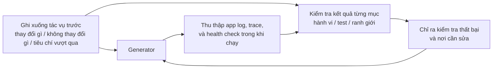

[English Version →](../../../en/lectures/lecture-11-why-observability-belongs-inside-the-harness/) | [中文版本 →](../../../zh/lectures/lecture-11-why-observability-belongs-inside-the-harness/)

> Ví dụ mã nguồn: [code/](https://github.com/walkinglabs/learn-harness-engineering/blob/main/docs/vi/lectures/lecture-11-why-observability-belongs-inside-the-harness/code/)
> Dự án thực hành: [Dự án 06. Harness Đầy đủ (Capstone)](./../../projects/project-06-runtime-observability-and-debugging/index.md)

# Bài 11. Làm Cho Runtime của Agent Có thể Quan sát Được

## Bài giảng này Giải quyết Vấn đề Gì?

Bạn yêu cầu một agent triển khai một tính năng. Nó chạy 20 phút, sửa đổi một loạt tệp, sau đó nói với bạn "xong, nhưng hai test đang thất bại." Bạn hỏi tại sao chúng thất bại — "không chắc, có thể là vấn đề timing." Bạn hỏi nó đã thay đổi những đường dẫn quan trọng nào — "để tôi nhìn vào mã..."

Đây không phải về việc agent thiếu năng lực. Đó là về việc harness của bạn không cung cấp đủ khả năng quan sát. **Không có khả năng quan sát, agent đưa ra quyết định trong sự không chắc chắn, đánh giá trở thành phán xét chủ quan, và thử lại trở thành lang thang mù quáng.** Cả OpenAI và Anthropic đều định nghĩa độ tin cậy là một vấn đề bằng chứng — harness phải phơi bày hành vi runtime và các tín hiệu đánh giá ở dạng có thể hướng dẫn quyết định tiếp theo.

## Các Khái niệm Cốt lõi

- **Quan sát runtime**: Các tín hiệu cấp hệ thống — log, trace, sự kiện process, health check. Trả lời "hệ thống đã làm gì."
- **Quan sát quá trình**: Khả năng hiển thị vào các artifact quyết định harness — kế hoạch, rubric tính điểm, tiêu chí chấp nhận. Trả lời "tại sao thay đổi này nên được chấp nhận."
- **Task trace**: Bản ghi đường dẫn quyết định hoàn chỉnh từ khi bắt đầu tác vụ đến khi hoàn thành, tương tự như request tracing trong hệ thống phân tán. Mỗi bước agent thực hiện, với ngữ cảnh, được ghi lại.
- **Sprint contract**: Thỏa thuận ngắn hạn được thương lượng trước khi bắt đầu lập trình — chỉ định phạm vi tác vụ, tiêu chuẩn xác minh và các ngoại lệ. Công cụ cốt lõi cho quan sát quá trình.
- **Evaluator rubric**: Biến đánh giá chất lượng từ phán xét chủ quan thành tính điểm có cấu trúc dựa trên bằng chứng. Làm cho các evaluator khác nhau tạo ra kết quả tương tự cho cùng một kết quả đầu ra.
- **Quan sát phân lớp**: Quan sát lớp hệ thống và lớp quá trình được thiết kế đồng thời và củng cố lẫn nhau. Tín hiệu runtime giải thích hành vi; artifact quá trình giải thích ý định.

## Quan sát Phân lớp



## Tại sao Điều này Xảy ra

### Chi phí Thực sự của Thiếu Quan sát

Khi một harness thiếu khả năng quan sát, bốn loại vấn đề xuất hiện có hệ thống:

**Không thể phân biệt "đúng" với "trông có vẻ đúng"**: Một hàm trông hoàn hảo trong code review — cú pháp đúng, logic hợp lý. Nhưng ở runtime, một lỗi xử lý edge case tạo ra kết quả không đúng với các đầu vào cụ thể. Chỉ có runtime trace mới có thể tiết lộ rằng đường dẫn thực thi thực tế lệch khỏi kỳ vọng.

**Đánh giá trở thành huyền bí**: Không có rubric tính điểm và tiêu chí chấp nhận, các evaluator (con người hoặc agent) dựa vào các giả định ẩn. Cùng một kết quả đầu ra có thể nhận được đánh giá hoàn toàn khác nhau từ các người đánh giá khác nhau. Đánh giá chất lượng trở thành không thể tái tạo.

**Thử lại trở thành đoán mù**: Khi agent không biết tại sao thứ gì đó thất bại, hướng thử lại là ngẫu nhiên. Nó có thể thử lặp đi lặp lại theo hướng sai — sửa các đường dẫn mã không liên quan trong khi bỏ qua nguyên nhân thất bại thực sự. Mỗi lần thử lại mù quáng tốn token và thời gian.

**Vách đá thông tin bàn giao phiên**: Khi công việc chưa hoàn thành được bàn giao cho phiên tiếp theo, thiếu khả năng quan sát có nghĩa là phiên mới phải chẩn đoán trạng thái hệ thống từ đầu. Quan sát của Anthropic về agent chạy lâu cho thấy việc chẩn đoán thừa này có thể tiêu thụ 30-50% tổng thời gian phiên.

### Kịch bản Claude Code Thực tế

Hãy tưởng tượng một harness sử dụng luồng công việc ba vai "planner-generator-evaluator," thực thi tác vụ "thêm dark mode vào ứng dụng."

**Không có khả năng quan sát**: Planner đưa ra mô tả mơ hồ. Generator triển khai dark mode dựa trên sự mơ hồ đó, nhưng nó không khớp với kỳ vọng ẩn của planner. Evaluator từ chối dựa trên tiêu chuẩn ẩn của riêng họ nhưng không thể nói cụ thể điều gì sai. Generator thử lại mù quáng dựa trên lý do từ chối mơ hồ. Chu kỳ lặp lại 3-4 lần, mất khoảng 45 phút, tạo ra kết quả vừa tạm chấp nhận.

**Với đầy đủ khả năng quan sát**: Planner đưa ra sprint contract — liệt kê các component cần sửa đổi, tiêu chuẩn xác minh cho mỗi cái, và các ngoại lệ (không xử lý print styles). Generator triển khai theo contract. Quan sát runtime ghi lại quá trình tải và áp dụng style của mỗi component. Evaluator sử dụng rubric tính điểm để đánh giá từng chiều một, với các trích dẫn bằng chứng cụ thể. Một lần lặp tạo ra kết quả chất lượng cao, trong khoảng 15 phút.

Khác biệt hiệu quả 3x. Thay đổi duy nhất là khả năng quan sát.

### Tại sao Agent Không thể Tự Giải quyết Điều này

Bạn có thể đang nghĩ: "Agent không thể tự in log của nó sao?" Các vấn đề là:

1. Agent không biết những gì nó không biết — nó sẽ không chủ động ghi lại các tín hiệu mà nó không nhận ra là cần thiết.
2. Các định dạng log không nhất quán — các phiên khác nhau sử dụng các định dạng log khác nhau, làm cho phân tích có hệ thống không thể thực hiện.
3. Quan sát quá trình không thể được giải quyết bằng log — sprint contract và rubric tính điểm là artifact có cấu trúc cần hỗ trợ cấp harness.

## Cách Làm Đúng

### 1. Xây dựng Thu thập Tín hiệu Runtime vào Harness

Đừng dựa vào agent để tự in log của nó. Harness nên tự động thu thập các tín hiệu này:

- **Vòng đời ứng dụng**: Các trạng thái giai đoạn Startup, ready, running, shutdown
- **Thực thi đường dẫn tính năng**: Bản ghi thực thi đường dẫn quan trọng, bao gồm điểm vào, điểm kiểm tra và điểm thoát
- **Luồng dữ liệu**: Bản ghi dữ liệu chảy giữa các component
- **Sử dụng tài nguyên**: Các mẫu sử dụng tài nguyên bất thường (ví dụ: bộ nhớ liên tục tăng)
- **Lỗi và ngoại lệ**: Đầy đủ ngữ cảnh lỗi, không chỉ thông báo lỗi

### 2. Triển khai Sprint Contract

Trước khi mỗi tác vụ bắt đầu, generator và evaluator (có thể là các lần gọi khác nhau của cùng một agent) thương lượng một contract:

```markdown
# Sprint Contract: Hỗ trợ Dark Mode

## Phạm vi
- Sửa đổi component chuyển đổi theme
- Cập nhật biến CSS toàn cục
- Thêm test dark mode

## Tiêu chuẩn Xác minh
- Test hồi quy trực quan vượt qua cho mỗi component
- Test end-to-end luồng chính vượt qua
- Không có flash of unstyled content (FOUC)

## Ngoại lệ
- Không xử lý print styles
- Không xử lý dark mode cho component bên thứ ba
```

### 3. Thiết lập Evaluator Rubric

Biến "tốt hay không" thành tính điểm có thể định lượng:

```markdown
# Rubric Tính điểm

| Chiều | A | B | C | D |
|-------|---|---|---|---|
| Tính đúng đắn mã | Tất cả test vượt qua | Luồng chính vượt qua | Vượt qua một phần | Build thất bại |
| Tuân thủ kiến trúc | Hoàn toàn tuân thủ | Sai lệch nhỏ | Sai lệch rõ ràng | Vi phạm nghiêm trọng |
| Phạm vi test | Luồng chính + edge case | Chỉ luồng chính | Chỉ skeleton | Không có test |
```

### 4. Chuẩn hóa với OpenTelemetry

Tạo một trace cho mỗi phiên harness, một span cho mỗi tác vụ, và sub-span cho mỗi bước xác minh. Sử dụng các thuộc tính chuẩn để chú thích thông tin quan trọng. Theo cách này, dữ liệu quan sát tích hợp với các công cụ chuẩn (Jaeger, Zipkin).

## Trường hợp Thực tế

Một harness sử dụng luồng công việc planner-generator-evaluator, thực thi "thêm hỗ trợ dark mode":

**Phiên bản không quan sát được**: 3-4 vòng thử lại mù quáng, 45 phút, kết quả vừa tạm chấp nhận. Evaluator nói "nó không cảm thấy đúng" nhưng không thể nói cụ thể điều gì. Generator lãng phí nhiều thời gian theo hướng sai.

**Phiên bản quan sát đầy đủ**:
- Sprint contract làm rõ phạm vi, tiêu chuẩn và ngoại lệ
- Runtime trace ghi lại quá trình tải style của mỗi component
- Rubric tính điểm cung cấp đánh giá có cấu trúc từng chiều một
- Một lần lặp tạo ra kết quả chất lượng cao, 15 phút

Cải thiện hiệu quả 3x, chất lượng ổn định hơn, đánh giá có thể tái tạo.

## Những Điểm chính cần Nhớ

- **Khả năng quan sát là thuộc tính kiến trúc harness** — không phải tính năng được thêm vào sau, mà là khả năng cốt lõi phải được xem xét trong quá trình thiết kế.
- **Cả hai lớp quan sát đều cần thiết** — tín hiệu runtime giải thích "điều gì đã xảy ra," artifact quá trình giải thích "tại sao nó được thực hiện theo cách đó."
- **Sprint contract front-load alignment** — ngăn "generator xây dựng thứ gì đó mà evaluator ngay lập tức từ chối vì lý do có thể dự đoán trước."
- **Rubric tính điểm làm cho đánh giá có thể tái tạo** — các evaluator khác nhau tạo ra điểm tương tự cho cùng một kết quả đầu ra.
- **Thiếu khả năng quan sát lãng phí 30-50% thời gian phiên vào chẩn đoán thừa.**

## Đọc thêm

- [Observability Engineering - Charity Majors](https://www.honeycomb.io/blog/observability-engineering-book) — Khung lý thuyết và thực hành cho kỹ thuật quan sát hiện đại
- [Dapper - Google (Sigelman et al.)](https://research.google/pubs/pub36356/) — Thực hành đột phá trong distributed tracing quy mô lớn
- [Harness Design - Anthropic](https://www.anthropic.com/engineering/harness-design-long-running-apps) — Giới thiệu sprint contract và evaluator rubric
- [Site Reliability Engineering - Google](https://sre.google/sre-book/table-of-contents/) — Ứng dụng có hệ thống của khả năng quan sát trong hệ thống production

## Bài tập

1. **Phân tích Khoảng cách Quan sát**: Kiểm toán harness hiện tại của bạn để tìm quan sát lớp hệ thống và lớp quá trình. Tìm các trạng thái hệ thống không thể phân biệt từ các tín hiệu hiện có, và đề xuất bổ sung.

2. **Thực hành Sprint Contract**: Viết một sprint contract cho một tác vụ thực tế. Để agent thực thi theo contract, và so sánh hiệu quả và chất lượng có và không có contract.

3. **Xây dựng Task Trace**: Ghi lại mỗi bước trong các hoạt động của agent trong một tác vụ lập trình hoàn chỉnh. Chú thích với các quy ước ngữ nghĩa OpenTelemetry. Phân tích các điểm nghẽn thông tin trong trace — bước nào thiếu hỗ trợ tín hiệu đủ cho các quyết định.