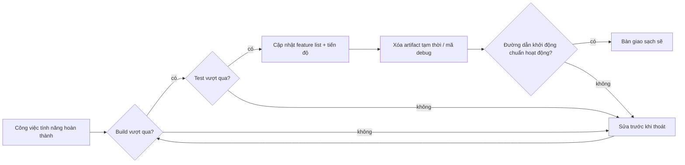
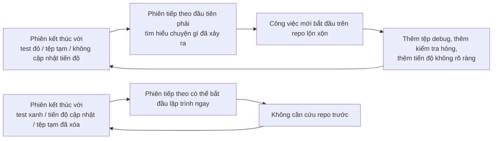

[English Version →](../../../en/lectures/lecture-12-why-every-session-must-leave-a-clean-state/) | [中文版本 →](../../../zh/lectures/lecture-12-why-every-session-must-leave-a-clean-state/)

> Ví dụ mã nguồn: [code/](https://github.com/walkinglabs/learn-harness-engineering/blob/main/docs/vi/lectures/lecture-12-why-every-session-must-leave-a-clean-state/code/)
> Dự án thực hành: [Dự án 06. Harness Đầy đủ (Capstone)](./../../projects/project-06-runtime-observability-and-debugging/index.md)

# Bài 12. Bàn giao Sạch Sẽ ở Cuối Mỗi Phiên

## Bài giảng này Giải quyết Vấn đề Gì?

Agent của bạn chạy cả buổi chiều, sửa đổi 20 tệp, commit mã, phiên kết thúc. Phiên agent tiếp theo bắt đầu và ngay lập tức phát hiện: build bị hỏng, test đang đỏ, các tệp debug tạm thời ở khắp nơi, feature list không được cập nhật, và tiến độ hoàn toàn không rõ ràng. Phiên mới dành 30 phút đầu tiên chỉ để tìm hiểu "phiên cuối thực sự đã làm gì."

Cả OpenAI và Anthropic đều nói rõ ràng: **độ tin cậy dài hạn phụ thuộc vào kỷ luật vận hành, không chỉ là thành công một lần chạy.** Chất lượng trạng thái khi thoát phiên trực tiếp xác định hiệu quả của phiên tiếp theo. Hãy nghĩ về nó giống như các thực hành tốt nhất của Git — mỗi commit nên là một thay đổi nguyên tử, có thể biên dịch, không phải một đống mã làm dở.

## Các Khái niệm Cốt lõi

- **Trạng thái sạch (Clean state)**: Hệ thống thỏa mãn năm điều kiện khi thoát phiên — build vượt qua, test vượt qua, tiến độ được ghi lại, không có artifact lỗi thời, đường dẫn khởi động khả dụng. Thiếu bất kỳ cái nào có nghĩa là phiên không "xong."
- **Tính toàn vẹn phiên (Session Integrity)**: Tương tự như giao dịch cơ sở dữ liệu — hoặc commit đầy đủ và để lại trạng thái sạch, hoặc rollback về trạng thái nhất quán cuối cùng. Không có lựa chọn trung gian.
- **Tài liệu chất lượng (Quality Document)**: Một artifact đang hoạt động liên tục ghi lại xếp loại chất lượng cho mỗi module. Không phải đánh giá một lần, mà là tracker cho thấy liệu codebase có đang trở nên mạnh hơn hay yếu hơn theo thời gian.
- **Vòng lặp dọn dẹp (Cleanup Loop)**: Một phiên bảo trì thường xuyên nhằm giảm entropy có hệ thống trong codebase. Không phải sửa chữa khẩn cấp, mà là vận hành thường xuyên.
- **Đơn giản hóa harness (Harness Simplification)**: Khi năng lực mô hình cải thiện, định kỳ xóa các thành phần harness không còn cần thiết. Một ràng buộc cần thiết ngày hôm nay có thể là overhead không cần thiết ba tháng sau.
- **Dọn dẹp Idempotent**: Các hoạt động dọn dẹp tạo ra cùng kết quả bất kể chúng chạy bao nhiêu lần. Đảm bảo dọn dẹp vẫn an toàn ngay cả trong các kịch bản thất bại-thử lại.

## Năm Chiều của Trạng thái Sạch





## Tại sao Điều này Xảy ra

### Tăng trưởng Entropy là Trạng thái Mặc định

Các quy luật tiến hóa phần mềm của Lehman cho chúng ta biết: các hệ thống trải qua thay đổi liên tục sẽ không thể tránh khỏi tăng độ phức tạp trừ khi được quản lý chủ động. Điều này đặc biệt đúng với AI coding agent — mỗi phiên giới thiệu các thay đổi, và nếu không dọn dẹp khi thoát, nợ kỹ thuật tích lũy theo cấp số nhân.

Dữ liệu thực tế rất rõ ràng. Một dự án được phát triển với agent trong 12 tuần, không có chiến lược dọn dẹp:

- Tuần 1: Tỷ lệ vượt qua build 100%, tỷ lệ vượt qua test 100%, khởi động phiên mới 5 phút
- Tuần 4: Build 95%, test 92%, khởi động 15 phút
- Tuần 8: Build 82%, test 78%, khởi động 35 phút
- Tuần 12: Build 68%, test 61%, khởi động 60+ phút

Cùng dự án với chiến lược dọn dẹp:

- Tuần 1: 100%, 100%, 5 phút
- Tuần 12: 97%, 95%, 9 phút

Sau 12 tuần: tỷ lệ vượt qua build khác nhau 29 điểm phần trăm, thời gian khởi động phiên mới khác nhau 85%. Đây không phải lý thuyết — đây là sự khác biệt được quan sát.

### Năm Chiều của Trạng thái Sạch

Trạng thái sạch không chỉ là "mã được biên dịch." Đó là năm chiều được đánh giá cùng nhau:

**Chiều Build**: Mã có build không có lỗi không? Đây là cơ bản nhất — phiên tiếp theo không nên phải sửa lỗi build trước tiên.

**Chiều Test**: Tất cả test có vượt qua không? Bao gồm cả test tồn tại trước phiên — phiên có trách nhiệm không làm hỏng chức năng hiện có. Và nó phải được xác minh trong CI, không chỉ "hoạt động trên máy của tôi."

**Chiều Tiến độ**: Tiến độ hiện tại có được ghi lại trong một artifact có thể đọc bởi máy không? Các subtask đã hoàn thành với tiêu chí vượt qua của chúng, các subtask đang tiến hành nhưng chưa hoàn thành với trạng thái hiện tại, các subtask chưa bắt đầu. Bản ghi tiến độ tốt giảm 60-80% thời gian chẩn đoán khởi động phiên.

**Chiều Artifact**: Có các artifact tạm thời hoặc mơ hồ lỗi thời không? Debug log, tệp tạm, mã bị comment out, marker TODO — tất cả những thứ này tăng tải nhận thức cho phiên tiếp theo.

**Chiều Khởi động**: Đường dẫn khởi động chuẩn có khả dụng không? Phiên tiếp theo có thể bắt đầu làm việc mà không cần can thiệp thủ công không? Khởi tạo môi trường, tải codebase, thu thập ngữ cảnh, lựa chọn tác vụ — các đường dẫn này không được bị hỏng.

### "Dọn dẹp sau" Có nghĩa là Không bao giờ Dọn dẹp

Cái bẫy tâm lý phổ biến nhất là "không có thời gian dọn dẹp trong phiên này, tôi sẽ làm lần sau." Nhưng phiên agent tiếp theo không biết bạn đã để lại gì — nó thấy một mớ mã và trạng thái không chắc chắn. Nó sẽ dành nhiều thời gian để suy ra "phần nào của mã này là có chủ ý và phần nào là tạm thời."

Tệ hơn, mỗi phiên có mục tiêu tác vụ riêng của mình. Phiên mới ở đó để làm công việc mới, không phải dọn dẹp mớ bòng bong của phiên trước. Nó sẽ bỏ qua sự hỗn loạn và bắt đầu công việc mới trên đó, giới thiệu thêm hỗn loạn trên đỉnh hỗn loạn. Đây là vòng phản hồi tích cực của entropy.

## Cách Làm Đúng

### 1. Trạng thái Sạch như Yêu cầu Hoàn thành

Định nghĩa rõ ràng trong harness: **hoàn thành phiên = tác vụ vượt qua xác minh VÀ kiểm tra trạng thái sạch vượt qua.** Thiếu bất kỳ cái nào có nghĩa là phiên không hoàn thành. Viết trong CLAUDE.md:

```
## Danh sách Kiểm tra Thoát Phiên
- [ ] Build vượt qua (npm run build)
- [ ] Tất cả test vượt qua (npm test)
- [ ] Feature list đã được cập nhật
- [ ] Không có mã debug còn lại (console.log, debugger, TODO)
- [ ] Đường dẫn khởi động chuẩn khả dụng (npm run dev)
```

### 2. Chiến lược Dọn dẹp Hai Chế độ

Kết hợp hai chế độ dọn dẹp:

**Dọn dẹp tức thì (ở cuối mỗi phiên)**: Dọn dẹp các artifact tạm thời được tạo trong phiên, cập nhật trạng thái feature list, đảm bảo build và test vượt qua. Đây là dọn dẹp "tính tham chiếu."

**Dọn dẹp định kỳ (hàng tuần)**: Quét toàn hệ thống — xử lý các vấn đề cấu trúc tích lũy, cập nhật tài liệu chất lượng, chạy test benchmark để phát hiện trôi dạt. Đây là dọn dẹp "tracing."

### 3. Duy trì Tài liệu Chất lượng

Tài liệu chất lượng là một artifact đang hoạt động liên tục tính điểm mỗi module:

```markdown
# Tài liệu Chất lượng

## Module Xác thực Người dùng (Chất lượng: A)
- Xác minh vượt qua: Có
- Agent có thể hiểu: Có
- Độ ổn định test: Ổn định
- Ranh giới kiến trúc: Tuân thủ
- Quy ước mã: Được tuân theo

## Module Thanh toán (Chất lượng: C)
- Xác minh vượt qua: Một phần (payment callback chưa được test)
- Agent có thể hiểu: Khó (logic trải rộng trên 3 tệp)
- Độ ổn định test: Không ổn định (2 test flaky)
- Ranh giới kiến trúc: Có vi phạm
- Quy ước mã: Được tuân theo một phần
```

Các phiên mới đọc tài liệu này và biết ngay nơi ưu tiên. Sửa module có điểm thấp nhất trước.

### 4. Định kỳ Đơn giản hóa Harness

Một hiểu biết quan trọng từ Anthropic: **mỗi thành phần harness tồn tại vì mô hình không thể thực hiện điều gì đó một cách đáng tin cậy. Nhưng khi các mô hình cải thiện, các giả định này trở nên lỗi thời.** Một ràng buộc cần thiết ba tháng trước có thể là overhead không cần thiết ngày hôm nay.

Thực hành được khuyến nghị: Mỗi tháng, chọn một thành phần harness, tạm thời vô hiệu hóa nó, và chạy các tác vụ benchmark. Nếu kết quả không giảm sút, hãy xóa vĩnh viễn. Nếu có, hãy khôi phục hoặc thay thế bằng một thay thế nhẹ hơn.

### 5. Các Hoạt động Dọn dẹp Phải là Idempotent

Script dọn dẹp phải an toàn để chạy lặp đi lặp lại:

```bash
# Các hoạt động dọn dẹp idempotent
rm -f /tmp/debug-*.log  # -f đảm bảo không có lỗi khi tệp không tồn tại
git checkout -- .env.local  # Khôi phục về trạng thái đã biết
npm run test  # Xác minh dọn dẹp không làm hỏng gì
```

## Trường hợp Thực tế

Một ứng dụng Electron được phát triển với agent trong 12 tuần, so sánh hai cách tiếp cận:

**Không có chiến lược dọn dẹp** (nhóm kiểm soát): Tuần 12, tỷ lệ vượt qua build 68%, tỷ lệ vượt qua test 61%, khởi động phiên mới 60+ phút, artifact lỗi thời 103.

**Với chiến lược dọn dẹp** (nhóm thực nghiệm): Kiểm tra trạng thái sạch đầy đủ ở cuối mỗi phiên + vòng lặp dọn dẹp hàng tuần. Tuần 12, tỷ lệ vượt qua build 97%, tỷ lệ vượt qua test 95%, khởi động phiên mới 9 phút, artifact lỗi thời 11.

Đến tuần 12, tỷ lệ vượt qua build của nhóm thực nghiệm cao hơn 29 điểm phần trăm, tỷ lệ vượt qua test cao hơn 34 điểm, và thời gian khởi động phiên mới thấp hơn 85%.

## Những Điểm chính cần Nhớ

- **Trạng thái sạch là điều kiện cần thiết cho hoàn thành phiên** — không phải dọn dẹp tùy chọn, mà là một phần của "định nghĩa hoàn thành."
- **Tất cả năm chiều đều bắt buộc** — build, test, tiến độ, artifact, khởi động — mỗi cái phải được kiểm tra rõ ràng.
- **Tài liệu chất lượng làm cho sức khỏe codebase có thể theo dõi** — bạn chỉ có thể sửa những gì bạn biết đang suy giảm.
- **Định kỳ đơn giản hóa harness** — khi năng lực mô hình cải thiện, hãy xóa các ràng buộc không còn cần thiết.
- **"Dọn dẹp sau" bằng với không bao giờ dọn dẹp** — tăng trưởng entropy là mặc định; chỉ có dọn dẹp chủ động mới chống lại nó.

## Đọc thêm

- [Clean Code - Robert C. Martin](https://www.goodreads.com/book/show/3735293-clean-code) — Các nguyên tắc có hệ thống về sự sạch sẽ của mã
- [Harness Engineering - OpenAI](https://openai.com/index/harness-engineering/) — Khả năng tái tạo như một yêu cầu thiết kế harness cốt lõi
- [Effective Harnesses - Anthropic](https://www.anthropic.com/engineering/effective-harnesses-for-long-running-agents) — Vai trò quan trọng của thoát phiên sạch cho độ tin cậy dài hạn
- [Programs, Life Cycles, and Laws of Software Evolution - Lehman](https://ieeexplore.ieee.org/document/1702314) — Các quy luật tiến hóa phần mềm chứng minh độ phức tạp hệ thống tất yếu tăng mà không có bảo trì chủ động

## Bài tập

1. **Danh sách Kiểm tra Trạng thái Sạch**: Thiết kế một danh sách kiểm tra thoát phiên cho codebase của bạn bao phủ tất cả năm chiều. Áp dụng nó qua 5 phiên liên tiếp và ghi lại vi phạm theo từng chiều.

2. **So sánh Benchmark**: Sử dụng một bộ tác vụ cố định với hai biến thể harness (có/không có yêu cầu trạng thái sạch). So sánh tỷ lệ hoàn thành, số lần thử lại và tỷ lệ thoát lỗi.

3. **Thực hành Đơn giản hóa Harness**: Chọn một thành phần harness, tạm thời vô hiệu hóa nó, và chạy các tác vụ benchmark. So sánh kết quả có và không có nó. Quyết định có giữ, xóa hay thay thế.